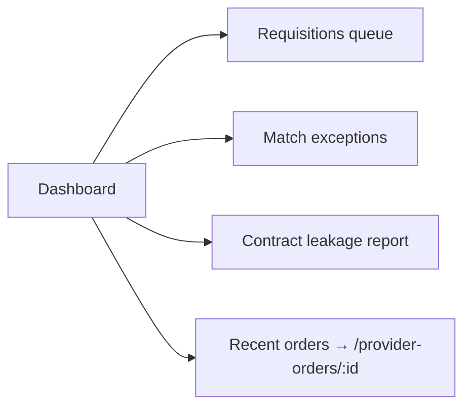

# Dashboard

## What it does

The Dashboard is the landing page every signed-in user sees at `/dashboard`. It rolls up the headline metrics for your tenant — orders, spend, vendor count, hospital count — plus three procurement KPIs (requisitions waiting on you, recent match exceptions, contract leakage year-to-date) and a five-row preview of the most recent orders. It is intentionally lightweight so it loads quickly and links out to the deeper pages.

## Who uses it

Every persona sees a dashboard, but the four headline cards are role-aware:

| Persona | 4th headline card |
|---|---|
| **Hospital** | Orders This Month |
| **Vendor** | My Hospitals |
| **Admin** | Active Hospitals |
| **Provider / Super-Vendor** | Active Hospitals |

## The page

The Dashboard lives at the top of every sidebar as **Dashboard**. It opens to:

1. **Welcome banner** — `Welcome back, {name}` on the left; `Create Order` (primary) and `View All Orders` buttons on the right.
2. **Top stat row** — four `StatCard` tiles: **Total Orders**, **Total Spend** (formatted as USD), the vendor count, and the role-specific 4th card.
3. **Procurement KPIs** — three click-through tiles wired up in Session 11:
   - **Requisitions awaiting my approval** → links to `/requisitions` (orange when > 0, green when 0)
   - **Match exceptions (7d)** → links to `/match-exceptions` (red when > 0)
   - **Contract leakage YTD** → links to `/reporting/contract-leakage` (red when > 0)
4. **Recent Orders** card — last five orders with **Order ID**, **Patient Name**, **Status** (color-coded badge), **Vendor**, **Hospital**, **Priority** and **Date Created**. Click any row to open the order detail page; `View All →` in the card header goes to `/provider-orders`.

## Actions you can take

| Action | What it does | Permission |
|---|---|---|
| **Create Order** | Opens the new-order wizard at `/create-order` | `orders: WRITE` |
| **View All Orders** | Goes to `/provider-orders` | `orders: READ` |
| Click a stat tile | Drills into the matching report | — |
| Click a recent-order row | Opens `/provider-orders/{id}` | `orders: READ` |

🛈 **Why the procurement KPIs are separate from the headline row** — they're a recent enterprise-procurement addition (Session 11). Splitting them keeps the original four-tile row stable for existing users while flagging the three biggest "needs my attention" items.

## Workflow

The Dashboard itself has no state machine, but it surfaces the entry points to all of them. The three procurement KPIs each link into their own workflow:

## Common tasks

- [Create and submit a requisition](../workflows/02-create-and-submit-requisition.md)
- [Resolve a 3-way match exception](../workflows/05-resolve-match-exception.md)
- [Detect contract leakage](../workflows/10-detect-contract-leakage.md)

## Permissions

The Dashboard renders for anyone with a valid session. The procurement KPI fetch silently returns `0` if the user lacks the underlying permission (e.g. a vendor user can't see requisitions awaiting them — they get `0`). The recent-orders table is filtered by tenant on the server.

## Behind the scenes

- **API endpoints**:
  - `GET /api/reports/executive-summary` — the four headline numbers.
  - `GET /api/orders?limit=5&page=1` — recent orders table.
  - `GET /api/requisitions?approverId=&status=SUBMITTED` — count for the first KPI.
  - `GET /api/three-way-match/exceptions` — count filtered to the last 7 days client-side.
  - `GET /api/reports/contract-leakage?startDate=&endDate=` — YTD leakage total.
- **Component**: `web/src/features/dashboard/pages/Dashboard.tsx`.
- All four card values are formatted client-side; the dollar amounts use `Intl.NumberFormat('en-US', { style: 'currency', currency: 'USD' })`.

## Related

- [Orders](./02-orders.md)
- [Requisitions](./03-requisitions.md)
- [3-Way Matching](./08-three-way-match.md)
- [Contract Leakage](./15-contract-leakage.md)
