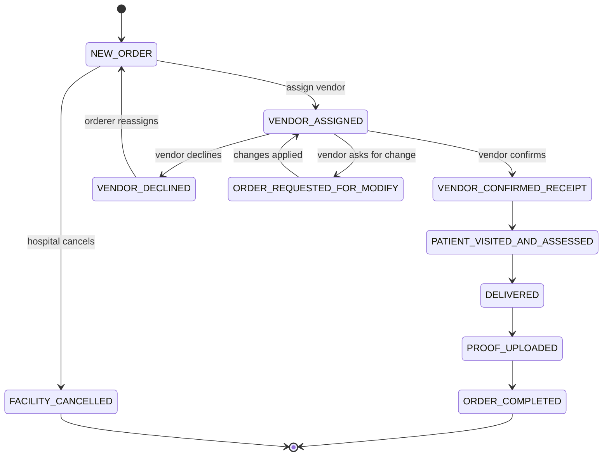

# Orders

## What it does

Orders are the central transactional record in Curavend — every patient supply request, every vendor fulfillment, every shipment, and every invoice traces back to an order. The order itself moves through a strict 8-step state machine (the **order sub-status**) from creation to completion, with explicit divergence paths for vendor decline, facility cancellation, and modification requests.

## Who uses it

| Persona | What they see |
|---|---|
| **Hospital** | Orders for their hospital (all facilities, all departments) |
| **Vendor** | Orders assigned to their vendor org |
| **Provider** | Orders for their provider org |
| **Admin** | Every order across every tenant |

## The page

**Sidebar →** Orders (or "Orders" under Operations). Route is `/provider-orders`. The detail page is `/provider-orders/{id}`.

### List view (`/provider-orders`)
- **Filter bar**: search by patient / order ID, status dropdown, vendor, hospital, facility, department, physician, date range.
- **Columns** (re-orderable, resizable, savable as a filter preset):
  - **Order ID** (the minted identifier, e.g. `BGH-2026-000123`)
  - **Patient First Name** / **Last Name**
  - **Status** — color-coded badge (see state machine below)
  - **Vendor**, **Hospital**, **Priority**
  - **Date Created**
- **Filter Presets**: save the current filter/column/sort combo with a star icon; switch between presets from the **⭐** menu.
- **Actions**: bulk export, single-order **View** and a kebab menu with cancel / modify / reassign.

### Detail view (`/provider-orders/{id}`)
Tabbed layout:
- **Overview** — patient, vendor, hospital/facility/department, priority, dates, order items with HCPC code + qty + unit price + price source (CONTRACT / GPO / FEE_SCHEDULE / MEDICARE / MANUAL).
- **Shipments** — 1:N shipment list with carrier (USPS / UPS / FEDEX / DHL / ONTRAC / OTHER / NONE), tracking number, ship & delivery dates.
- **Contacts** — orderer / ship-to / bill-to / clinician.
- **History** — every status transition, who did it, when.
- **Chat** — websocket-backed chat room scoped to this order.
- **Files** — POD images, signatures, attachments (R2-backed).

## Actions you can take

| Action | What it does | Required permission |
|---|---|---|
| **Create Order** | Opens the wizard at `/create-order` | `orders: WRITE` |
| **View** | Opens the order detail page | `orders: READ` |
| **Assign vendor** (NEW_ORDER) | Sets `vendorId`, moves to `VENDOR_ASSIGNED` | `orders: WRITE` |
| **Vendor confirms receipt** | Moves to `VENDOR_CONFIRMED_RECEIPT` | vendor on the order |
| **Patient visited & assessed** | Records the encounter | `orders: WRITE` |
| **Mark delivered** | Records `DELIVERED` + shipment row | vendor on the order |
| **Upload POD** | Stores proof to R2, moves to `PROOF_UPLOADED` | vendor on the order |
| **Complete order** | Moves to `ORDER_COMPLETED`, auto-creates invoice | vendor / admin |
| **Vendor decline** | Branches to `VENDOR_DECLINED` (orderer reassigns) | vendor |
| ⚠ **Cancel order** | Branches to `FACILITY_CANCELLED` — terminal | `orders: FULL` |
| **Request modification** | Moves to `ORDER_REQUESTED_FOR_MODIFY` | hospital |

## Workflow

🛈 **Why "sub-status" vs "status"** — the high-level `status` is just `PENDING / IN_PROGRESS / COMPLETED / CANCELLED`, kept around for back-compat. The 8 sub-statuses above are the real workflow. The UI shows sub-status everywhere.

## Common tasks

- [Create and submit a requisition](../workflows/02-create-and-submit-requisition.md) (orders are usually spawned from requisitions)
- [Record a goods receipt for a delivered order](../workflows/04-record-goods-receipt.md)
- [Resolve a 3-way match exception](../workflows/05-resolve-match-exception.md)

## Permissions

The order list and detail respect the `orders` resource permission (NONE / READ / WRITE / FULL). Tenant scoping is enforced server-side via `assertOrderAccess()` — hospitals can only see their `hospitalId`, vendors their `vendorId`, etc. Admins see everything.

PHI consent is enforced on every GET that returns patient data — if a user hasn't accepted the PHI consent terms, `403` with "PHI access requires acknowledgment of the PHI consent terms."

## Behind the scenes

- **API**: `/api/orders` (list, create, get, update, transition), `/api/orders/:id/items`, `/api/orders/:id/history`.
- **DB tables**: `orders`, `order_items`, `order_history`, `order_shipments`, `order_contacts`, `order_stickers`.
- **Order number minting**: `mintOrderNumber()` formats `{HOSPITAL_PREFIX}-{YEAR}-{6digit}` (e.g. `BGH-2026-000123`). Atomic INSERT…ON CONFLICT in `sequences`.
- **Pricing cascade**: at order-item create time, `getContractRatesBulk()` runs a 4-tier lookup: **Contract → GPO → Fee Schedule → Medicare → Manual** (see [Contracts & Pricing](./10-contracts-pricing.md)).
- **Multi-vendor split**: if a requisition contains lines from multiple preferred vendors, conversion spawns one order per vendor with the same `parentOrderId` ("sibling orders").
- **ERP push**: configurable per-vendor sync (HTTP_POST / WEBHOOK_POST / EDI_850 stub / MANUAL) fires on `VENDOR_CONFIRMED_RECEIPT` by default.
- **PHI audit**: every order view is logged to `phi_access_log` with `eventType=VIEW`, `resourceType=ORDER`.

## Related

- [Requisitions](./03-requisitions.md)
- [Goods Receipts](./07-goods-receipts.md)
- [Invoices](./09-invoices.md)
- [Contracts & Pricing](./10-contracts-pricing.md)
- [Prior Authorizations](./06-prior-auths.md)
