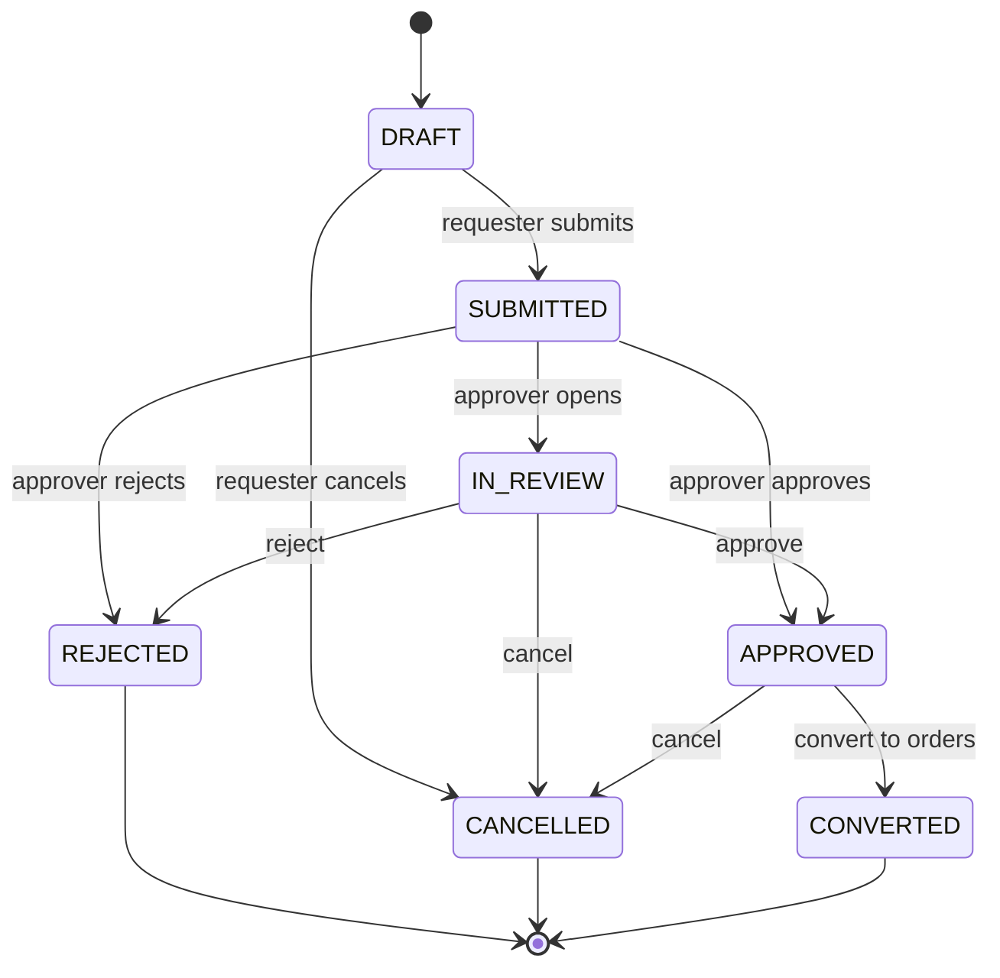
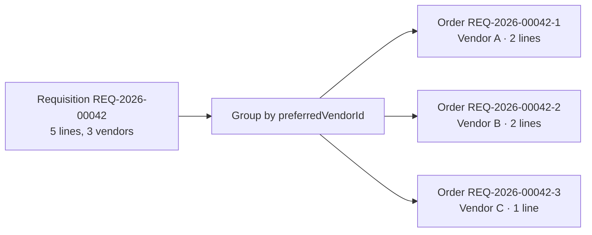

# Requisitions

## What it does

Requisitions are pre-order purchase requests that route through approval before becoming actual orders. This is the enterprise procurement pattern made famous by Ariba and Coupa — a clinician or buyer drafts a cart of needed items, an approver vets it (against formulary, budget, prior-auth rules), and only then does it get split by preferred vendor and converted to one or more orders that hit vendor ERPs.

Each requisition follows a 7-state machine and is sequence-numbered per hospital as `REQ-YYYY-NNNNN`.

## Who uses it

| Persona | Why |
|---|---|
| **Hospital** clinicians / buyers | Draft and submit requisitions |
| **Hospital** managers / department heads | Approve / reject requisitions in their queue (rule-engine routed) |
| **Admin** | Audit any requisition |

## The page

**Sidebar →** Requisitions. Route is `/requisitions`.

- **Top KPI row** — 6 stat cards: Draft, Submitted, In Review, Approved, Converted, Rejected/Cancelled.
- **Filter bar** — status dropdown + free-text search on requisition number / requester.
- **Table columns** — Requisition #, Status (color-coded), Priority, Requester, Department, Est. Total $, Submitted, Approver.
- **Create button** opens a drawer with header fields (department, priority, need-by date, justification) and an inline line editor (HCPC search, quantity, unit-of-measure, preferred vendor).
- **Detail drawer** opens on row click. Tabs:
  - **Overview** — header fields + state-aware action buttons (`Submit`, `Approve`, `Reject`, `Cancel`, `Convert to orders`).
  - **Items** — line table with formulary flags (off-formulary, requires prior-auth).
  - **History** — full audit timeline of every transition + comment.

🛈 **Why a separate model from orders** — splitting requisitions from orders mirrors how enterprise ERPs work. One requisition can fan out to multiple orders (one per vendor); a single order is never partially approved. This decoupling also keeps approval routing out of the order code path.

## Actions you can take

| Action | What it does | Allowed when |
|---|---|---|
| **New Requisition** | Opens the drawer in DRAFT | always (with `requisitions: WRITE`) |
| **Add line** | Adds an item; auto-tags off-formulary + needs-PA via formulary lookup | DRAFT |
| **Submit** | Moves to `SUBMITTED`, runs the approval rule engine to pick an approver | DRAFT |
| **Approve** | Moves to `APPROVED` | SUBMITTED / IN_REVIEW (if you're the assigned approver) |
| **Reject** | Moves to `REJECTED` with required reason | SUBMITTED / IN_REVIEW |
| ⚠ **Cancel** | Moves to `CANCELLED` (terminal) | any non-terminal state, by requester or admin |
| **Convert to orders** | Groups lines by `preferredVendorId`, spawns one order per vendor (numbered `{REQ#}-{N}`) | APPROVED → moves to `CONVERTED` |
| **Comment** | Adds an entry to the history timeline | any state |

## Workflow

### Conversion fan-out

## Common tasks

- [Create and submit a requisition](../workflows/02-create-and-submit-requisition.md)
- [Approve a requisition and convert it to orders](../workflows/03-approve-requisition-and-convert.md)
- [Set up approval routing rules](../workflows/06-set-up-approval-rules.md)

## Permissions

| Action | Resource & level |
|---|---|
| View requisitions | `requisitions: READ` |
| Create / edit lines | `requisitions: WRITE` |
| Approve / reject | `requisitions: WRITE` AND match the rule-engine-assigned approver |
| Convert to orders | `requisitions: FULL` |
| Cancel any non-terminal | `requisitions: FULL` (or the original requester for their own DRAFT) |

Approver routing is computed at submit time by `pickPrimaryApprover('REQUISITION', …)` using the **Approval Rules** engine. See [Approvals](./05-approvals.md) for the rule fields.

## Behind the scenes

- **API endpoints**: `GET/POST /api/requisitions`, `GET/PATCH /api/requisitions/:id`, `POST /api/requisitions/:id/items`, `POST /api/requisitions/:id/submit | approve | reject | cancel | convert | comment`.
- **DB tables**: `requisitions` (header, sequence-numbered), `requisition_items`, `requisition_history` (audit log). Migration `0012_requisitions.sql` + `0013_orders_requisition_link.sql`.
- **`orders.requisition_id`** column links each spawned order back to its source.
- **`estimatedTotalUsd`** is auto-recomputed on every line change (qty × unit price from the formulary).
- **Templates**: see `requisition_templates` table + `POST /:id/instantiate` for reusable carts.

## Related

- [Formulary / Item Master](./04-formulary.md)
- [Approvals](./05-approvals.md)
- [Orders](./02-orders.md)
- [Prior Authorizations](./06-prior-auths.md)
