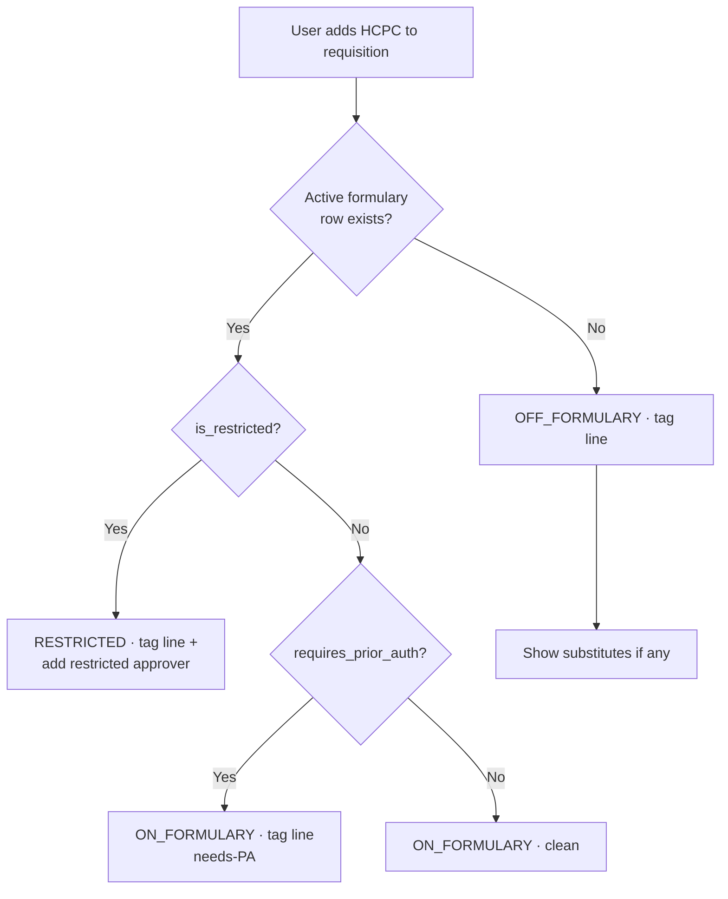
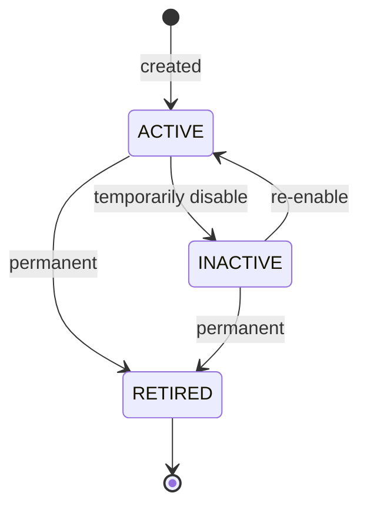

# Formulary / Item Master

## What it does

The Formulary is your hospital's approved-item whitelist — a curated list of HCPC codes that buyers can request via [Requisitions](./03-requisitions.md). For each item you set the preferred vendor, the secondary vendor, a max unit price guardrail, par level, reorder quantity, and flags for whether the item requires prior authorization or is restricted. You can also rank acceptable **substitutes** so requesters get an automatic fallback when the preferred item is unavailable.

Curavend evaluates a requested HCPC against the formulary at three moments: (1) when a line is added to a requisition (decision is shown inline), (2) when the requisition is submitted (the rule engine can trigger extra approvers if any off-formulary lines are present), and (3) when a requisition is converted to orders (substitutes can be swapped in automatically if configured).

## Who uses it

- **Hospital** materials managers and supply-chain admins — author and maintain the list.
- **Admins** — manage org-wide formularies across all hospitals in their account.
- Everyone else hits it implicitly through the requisition workflow.

## The page

**Sidebar →** Admin → Formulary. Route is `/admin/formulary`.

Two-pane layout:

- **Left**: **Scope picker** — Org-wide tile, then one tile per facility. Click to switch scope. A facility-specific row overrides an org-wide row for that facility.
- **Right**: filterable table of formulary items in scope.
  - **Columns**: HCPC, description, status (ACTIVE / INACTIVE / RETIRED), preferred vendor, secondary vendor, max unit price ($), par level, flags (PA, restricted).
  - **Filters**: search by HCPC / description, status filter (defaults to ACTIVE).
  - **Add item** button — opens a modal with PA & restricted toggles.
  - **Bulk import** button — opens a textarea for CSV-style paste (HCPC, description, preferred vendor, etc.).
  - **Row click** opens a **detail drawer** with two tabs: **Overview** and **Substitutes** (ranked, drag-to-reorder).

## Actions you can take

| Action | What it does | Permission |
|---|---|---|
| **Add Item** | Creates a new formulary row in current scope | `formulary: WRITE` |
| **Bulk Import** | Paste-import many rows at once | `formulary: WRITE` |
| **Edit** (row) | Update preferred vendor, price cap, par, flags | `formulary: WRITE` |
| **Add substitute** | Adds a ranked alternate HCPC for an item | `formulary: WRITE` |
| ⚠ **Retire** | Sets status `RETIRED` — item disappears from requisition picker | `formulary: FULL` |
| **Resolve HCPC** | API-only — returns `ON_FORMULARY` / `OFF_FORMULARY` / `RESTRICTED` + substitutes for a given HCPC | `formulary: READ` |

## Workflow

### Decision logic at requisition-line-add

### Item lifecycle

🛈 **Why per-facility overrides** — large IDNs need a single corporate catalog, but each hospital wants to swap in their preferred vendor or set a stricter price cap. Org-wide rows are the default; facility rows override only for that facility.

## Common tasks

- [Build a formulary with substitutes](../workflows/07-create-formulary-with-substitutes.md)
- [Create and submit a requisition](../workflows/02-create-and-submit-requisition.md) (uses the formulary)

## Permissions

| Role | Default |
|---|---|
| `ACCOUNT_MANAGER` / `ACCOUNT_MANAGER_USER` (admin) | `formulary: FULL` (fast-path) |
| `FACILITY_ACCOUNT_MANAGER` (hospital admin) | `formulary: FULL` (fast-path) |
| `FACILITY_USER` | `formulary: READ` (unless granted) |
| Vendor / Provider users | no access by default |

## Behind the scenes

- **API endpoints**:
  - `GET /api/formulary` — list, filterable by `hospitalId`, `facilityId`, `status`.
  - `POST /api/formulary` — create.
  - `PATCH /api/formulary/:id`, `DELETE /api/formulary/:id`.
  - `POST /api/formulary/bulk-import` — array upsert.
  - `GET /api/formulary/resolve?hcpcCode=L1832` → `{decision, item, substitutes}`.
  - `GET/POST/DELETE /api/formulary/:id/substitutes`.
- **DB tables** (migration `0011_formulary.sql`):
  - `formulary_items` — `hospitalId`, optional `facilityId`, `hcpcCode`, `description`, `status`, `preferredVendorId`, `secondaryVendorId`, `maxUnitPriceCents`, `parLevel`, `reorderQuantity`, `requiresPriorAuth`, `isRestricted`.
  - `formulary_substitutes` — `formularyItemId`, `substituteHcpcCode`, `priority` (rank).

## Related

- [Requisitions](./03-requisitions.md)
- [Approvals](./05-approvals.md)
- [Prior Authorizations](./06-prior-auths.md)
- [Contracts & Pricing](./10-contracts-pricing.md)
