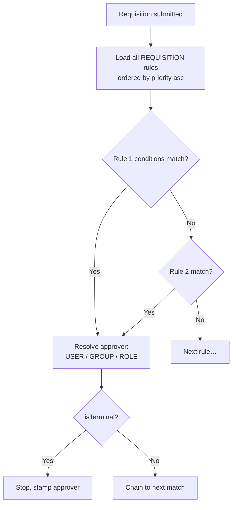

# Approvals

## What it does

The Approvals Queue is a single triage view for everything that's waiting on you to decide — orders that need a vendor assigned, vendor change requests, account sign-up requests, contracts in review, and (via routing rules) requisitions assigned to you. It's the "inbox" of the platform.

A companion feature, **Approval Rules**, lets admins declaratively configure who approves what — e.g. "any requisition > $10K in the cardiology department goes to the CFO." Rules are evaluated at submit time and the resolved approver is stamped onto the entity.

## Who uses it

| Persona | What appears |
|---|---|
| **Hospital** admins | Orders needing vendor assignment / modification |
| **Vendor** admins | Orders awaiting your receipt confirmation |
| **Provider** admins | Orders for their provider's hospitals |
| **Admin** | Pending user signups + every order awaiting any decision + contracts in review |

## The page

**Sidebar →** Approvals. Route is `/approvals`. **Approval Rules** lives at `/admin/approval-rules` (admin-only).

### Queue (`/approvals`)
- **Segmented filter** at the top: `All / Orders / Users / Contracts` with counts per segment.
- **Table** with columns: Entity (color-coded tag: blue order, purple user, cyan contract), Identifier, Current state (e.g. `Needs vendor`, `Awaiting vendor confirm`, `Account pending`, `Contract review`), Created, Requester, **Actions**.
- **Inline actions** per row: **Approve** (green ✓), **Reject** (red ✕), **View** (eye).
- **Bulk select** with row checkboxes — bulk-approve / bulk-reject the selection.
- **Vendor picker modal** auto-opens when approving a `NEW_ORDER` row (you must pick which vendor to assign).

### Approval Rules (`/admin/approval-rules`)
- **Tabs**: one tab per trigger type (`REQUISITION`, `CONTRACT`, `ORDER`).
- **Rule table**: priority, conditions summary, approver, terminal flag.
- **Create/Edit drawer**: all condition fields + approver picker (USER / GROUP / ROLE) + terminal flag.
- **Preview drawer**: paste a sample object (e.g. fake requisition) → shows the resolved approver chain.

## Actions you can take

| Action | What it does | Permission |
|---|---|---|
| **Approve** (order) | Moves order along its state machine (assign vendor or accept modification) | `orders: WRITE` + assignment match |
| **Reject** (order) | Requires reason; moves to declined state | `orders: WRITE` |
| **Approve** (user signup) | Activates the user, sends welcome email | `ADMIN` |
| **Reject** (user signup) | Marks signup `DECLINED` | `ADMIN` |
| **Approve** (contract) | Moves contract from `PENDING_APPROVAL` → `APPROVED` | `contracts: WRITE`, not the drafter |
| **Reject** (contract) | Moves contract → `REJECTED` with reason | `contracts: WRITE`, not the drafter |
| **Create rule** | New approval routing rule | `ADMIN` |
| **Preview rule** | Dry-run resolve against a sample object | `ADMIN` |

## Workflow

### Routing rule resolution

### Condition fields (JSON on each rule)

| Field | Effect |
|---|---|
| `amountGteUsd` / `amountLtUsd` | Total $ threshold |
| `facilityId` | Restrict to one facility |
| `departmentId` | Restrict to one department |
| `priority[]` | Match `LOW / NORMAL / HIGH / URGENT` |
| `containsOffFormulary` | Triggers if any line is off-formulary |
| `containsRestricted` | Triggers if any restricted item |
| `containsPriorAuth` | Triggers if any line needs PA |
| `categoryAny[]` | Match if any line is in these categories |

## Common tasks

- [Set up approval routing rules](../workflows/06-set-up-approval-rules.md)
- [Approve a requisition and convert it to orders](../workflows/03-approve-requisition-and-convert.md)

## Permissions

The queue itself only shows items you have permission to act on (server-side filter). Approval Rules CRUD is admin-only. Anyone listed in a rule's `approver.id` can decision matched entities regardless of their global permission level — the rule grants the implicit authority for that single decision.

## Behind the scenes

- **API endpoints**:
  - `GET /api/approvals/queue?type=all|order|user|contract` — unified queue + counts.
  - `POST /api/approvals/:type/:id/approve` / `…/reject`.
  - `GET/POST/PUT/DELETE /api/approval-rules` — CRUD for rules.
  - `POST /api/approval-rules/preview` — dry-run resolver.
- **Service**: `services/approvalRuleEngine.ts` exports `resolveApprovers()` and `pickPrimaryApprover()`. Rules sorted by `priority` asc; first match wins unless `isTerminal=0` chains.
- **DB tables**: `approval_rules` (one row per rule, JSON `conditions` + JSON `approver`).
- **Approver descriptor**: `{type: USER|GROUP|ROLE, id, requireAll?}`.

## Related

- [Requisitions](./03-requisitions.md)
- [Orders](./02-orders.md)
- [Groups & Permissions](./19-permissions-groups.md)
- [User Management](./18-user-management.md)
