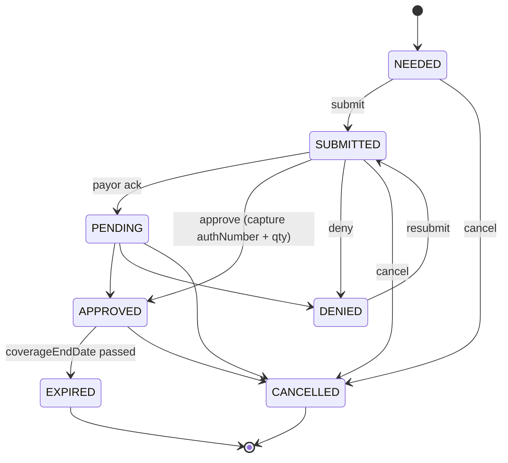

# Prior Authorizations

## What it does

Prior Authorizations (PAs) are the payor-side approval workflow that most DME and biologics items require before they can be dispensed. Curavend tracks each PA through a 7-state machine — from `NEEDED` (we know we need one) through `SUBMITTED` and `PENDING` to a terminal `APPROVED`, `DENIED`, `EXPIRED`, or `CANCELLED`. Every transition is appended to an audit timeline, and once approved the auth number + approved quantity are stored on the PA and surfaced on any linked order.

This was the largest competitive gap closed against Parachute Health in Session 10.

## Who uses it

- **Hospital** PA coordinators / billing staff — submit and track PAs.
- **Provider** offices — view PAs for their patients.
- **Admin** — audit any PA.

## The page

**Sidebar →** Prior Auths. Route is `/prior-auths`.

- **6-stat dashboard** along the top: Needed · Submitted · Pending · Approved · Denied · Expiring in 30d.
- **Filter bar** — status dropdown, payor filter, free-text search (patient / auth # / HCPC).
- **Table columns** — PA #, Status (color-coded with icon), Patient, Payor, HCPC, Coverage window, Submitted date.
- **Create button** opens a drawer with: patient name/ID, payor + member ID, HCPC code, ICD-10 code, coverage start/end, clinical note.
- **Row click** opens a detail drawer with:
  - **Header** — current status with a row of `Move to X` buttons (only the legal next states for the current state are enabled).
  - **Auth fields** — Auth Number + Quantity Approved (prompted on the `APPROVED` transition).
  - **Documents** — attached supporting docs (R2-stored).
  - **Timeline tab** — every state transition with timestamp, user, and notes.

## Actions you can take

| Action | What it does | Allowed from states |
|---|---|---|
| **Create PA** | New PA in `NEEDED` | always (`prior-auths: WRITE`) |
| **Move to Submitted** | Stamps `submittedAt`, advances workflow | `NEEDED` |
| **Move to Pending** | Payor has acknowledged | `SUBMITTED` |
| **Move to Approved** | Prompts for **Auth Number** + **Quantity Approved** | `SUBMITTED`, `PENDING` |
| **Move to Denied** | Captures denial reason | `SUBMITTED`, `PENDING` |
| **Resubmit** | Re-opens from `DENIED` → `SUBMITTED` | `DENIED` only |
| **Move to Expired** | Manual or via daily cron when `coverageEndDate` passes | `APPROVED` |
| ⚠ **Cancel** | Terminal — marks `CANCELLED` with reason | any non-terminal |
| **Attach document** | Uploads to R2, links to PA | any state |

## Workflow

🛈 **Why DENIED can only go back to SUBMITTED** — that's the actual real-world flow: once denied, you fix the clinical justification, attach new docs, and re-submit. Going straight DENIED → APPROVED would skip the resubmission audit trail.

## Common tasks

- [Process a prior authorization](../workflows/08-process-prior-authorization.md)
- [Create and submit a requisition](../workflows/02-create-and-submit-requisition.md) (PA-required lines surface here)

## Permissions

| Role | Default |
|---|---|
| Hospital admins | `prior-auths: FULL` |
| Hospital users with PA duty | `prior-auths: WRITE` (granted) |
| Vendor / Provider users | `prior-auths: READ` on their own scope |
| Admin | `prior-auths: FULL` (fast-path) |

## Behind the scenes

- **API endpoints**:
  - `GET/POST /api/prior-auths`.
  - `GET/PATCH /api/prior-auths/:id`.
  - `POST /api/prior-auths/:id/transition` — body `{toStatus, authNumber?, quantityApproved?, denialReason?, notes?}`. Transition matrix enforced server-side; illegal transitions → `409`.
  - `POST /api/prior-auths/:id/documents` — multipart upload to R2.
  - `GET /api/prior-auths/summary` — the 6-stat dashboard payload.
- **DB tables** (migration `0009_prior_auths.sql`):
  - `prior_auths` — header, payor link, patient, HCPC, ICD-10, coverage window, auth #, qty approved.
  - `prior_auth_history` — append-only audit log of transitions.
- **Order linkage**: `orders.prior_auth_id` foreign key — set when the PA was driven from a requisition line.
- **Daily cron**: walks `APPROVED` rows where `coverageEndDate < now` and flips to `EXPIRED`.

## Related

- [Payors & Eligibility](./12-payors-eligibility.md)
- [Formulary / Item Master](./04-formulary.md) (`requires_prior_auth` flag triggers PA needed)
- [Requisitions](./03-requisitions.md)
- [Orders](./02-orders.md)
