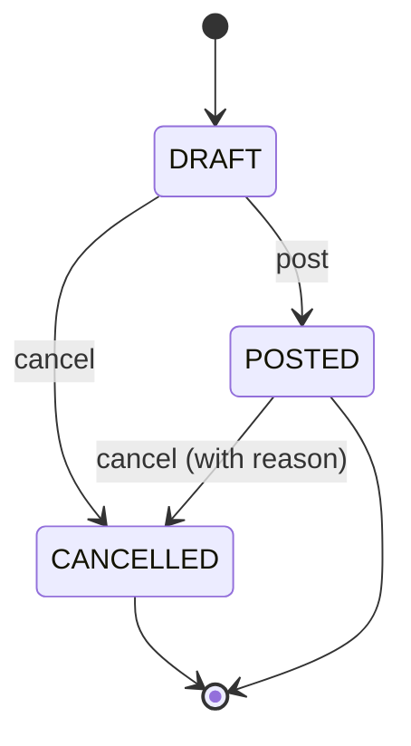

# Goods Receipts

## What it does

A Goods Receipt Note (GRN) records what physically arrived against an order — quantity received, quantity rejected, lot / serial / expiration, and the condition of each line. GRNs feed the [3-Way Match](./08-three-way-match.md) engine that reconciles invoice ↔ PO ↔ receipt, so accurate GRNs are essential for catching short-shipments, damaged goods, and price/quantity variances before paying a vendor.

GRNs follow a simple 3-state lifecycle (`DRAFT → POSTED → CANCELLED`) and each line carries one of 6 condition codes.

## Who uses it

- **Hospital** receiving / dock staff — create and post GRNs when shipments arrive.
- **Hospital** materials managers — review and resolve damaged / wrong-item lines.
- **Vendor** users — read-only view of receipts against their orders.
- **Admin** — audit any GRN.

## The page

**Sidebar →** Goods Receipts. Route is `/goods-receipts`.

- **Filter bar** — status filter (DRAFT / POSTED / CANCELLED), free-text search on GRN # / packing slip / tracking.
- **Table columns**: GRN # (e.g. `GRN-2026-00017`), Status tag, Order ID, Vendor, Carrier, Received date, Posted date.
- **Create button** opens a drawer:
  - **Either** pick an open order from the dropdown → lines are auto-seeded from that order's items, **or** start with empty lines and add manually (for unmatched deliveries).
  - Header fields: carrier (`USPS / UPS / FEDEX / DHL / ONTRAC / OTHER / NONE`), tracking #, packing slip #, received date.
- **Detail drawer** (row click) tabs:
  - **Overview** — header + Post / Cancel buttons.
  - **Lines** — table of HCPC, ordered qty, received qty, rejected qty, lot/serial, expiration, condition tag.
  - **Photos** — damage documentation images (R2-backed).

## Actions you can take

| Action | What it does | State |
|---|---|---|
| **Create GRN** | New DRAFT GRN (with or without an order link) | always (`goods-receipts: WRITE`) |
| **Add line** | Append a line to a DRAFT | DRAFT |
| **Edit line** | Change qty / lot / condition | DRAFT |
| **Upload photo** | Attach damage proof | DRAFT or POSTED |
| **Post** | Commits the receipt — locks lines, triggers downstream 3-way match | DRAFT → POSTED |
| ⚠ **Cancel** | Marks the GRN void — also blocks 3-way match against its lines | DRAFT or POSTED → CANCELLED |

## Workflow

### GRN lifecycle

### Line condition codes

| Code | Meaning |
|---|---|
| `GOOD` | Received in good condition (the default) |
| `DAMAGED` | Damaged packaging / product — photo required |
| `EXPIRED` | Past expiration date on receipt |
| `WRONG_ITEM` | Different HCPC than ordered |
| `SHORT_SHIPPED` | Received less than ordered |
| `OVERSHIPPED` | Received more than ordered |

🛈 **Why a separate "Cancel" on POSTED** — sometimes a GRN is posted in error against the wrong order. Cancelling lets you re-create the right GRN without polluting the original audit trail. The cancelled rows stay queryable but are excluded from 3-way match.

## Common tasks

- [Record a goods receipt for a delivered order](../workflows/04-record-goods-receipt.md)
- [Resolve a 3-way match exception](../workflows/05-resolve-match-exception.md)

## Permissions

| Role | Default |
|---|---|
| `FACILITY_ACCOUNT_MANAGER` | `goods-receipts: FULL` |
| Hospital users on the receiving team | `goods-receipts: WRITE` (granted) |
| Vendor users | `goods-receipts: READ` on own scope |
| Admin | `goods-receipts: FULL` (fast-path) |

## Behind the scenes

- **API endpoints**:
  - `GET/POST /api/goods-receipts`.
  - `GET/PATCH /api/goods-receipts/:id`.
  - `POST /api/goods-receipts/:id/lines`, `PATCH /lines/:lineId`, `DELETE /lines/:lineId`.
  - `POST /api/goods-receipts/:id/post`, `POST /api/goods-receipts/:id/cancel`.
- **DB tables** (migration `0014_goods_receipts_and_matching.sql`):
  - `goods_receipts` — sequence-numbered, status, carrier/tracking/packing slip, photo R2 keys.
  - `goods_receipt_lines` — HCPC, qty ordered/received/rejected, lot/serial/expiration, condition.
- **Auto-seed**: posting `POST /api/goods-receipts` with just `{orderId}` (no lines) clones the order items into draft lines with `quantityReceived = quantityOrdered`.
- **Downstream**: every POST triggers an optional 3-way match recompute for any invoice that references the same order.

## Related

- [Orders](./02-orders.md)
- [3-Way Matching](./08-three-way-match.md)
- [Invoices](./09-invoices.md)
