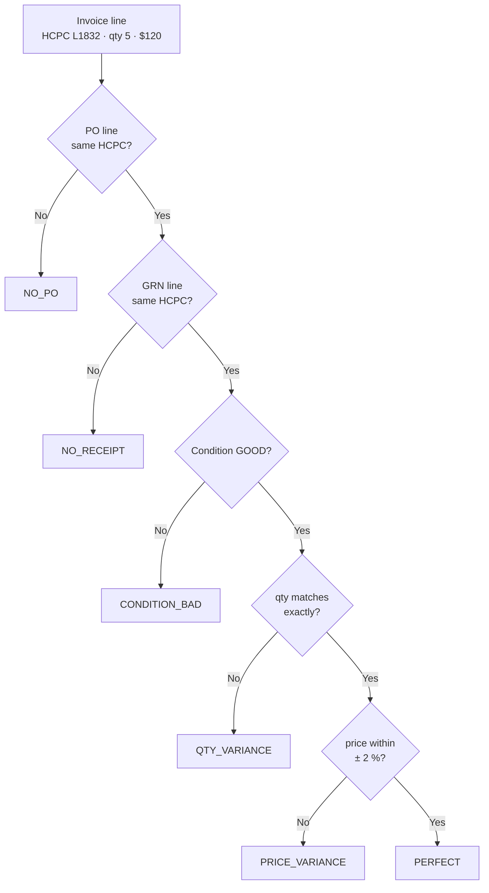
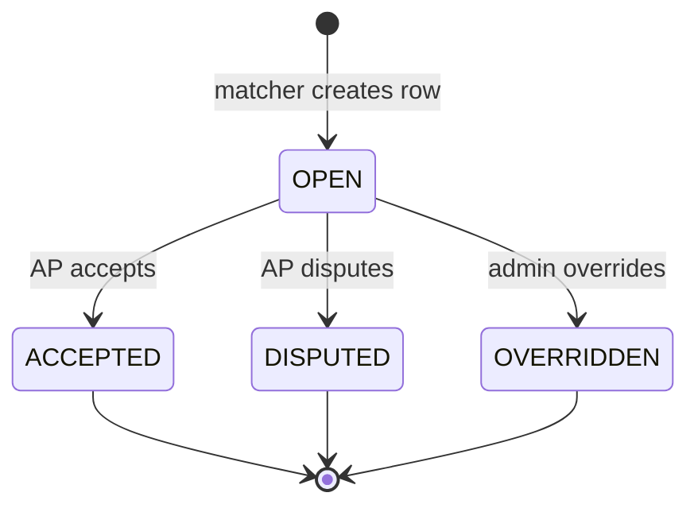

# 3-Way Matching

## What it does

3-way matching is the accounts-payable safety net: for every invoice line a vendor sends you, Curavend cross-checks it against the originating PO (order items) and the goods receipt (GRN lines) for the same HCPC. The result is one of seven match statuses ranging from `PERFECT` (everything lines up) through quantity / price variances all the way to `NO_RECEIPT` or `NO_PO`. Exceptions land in a triage queue where AP staff can **Accept**, **Dispute**, or **Override** them — every decision audited and immutably linked to its source records.

This is the difference between paying every vendor invoice on autopilot vs. catching the 5–15 % that have a real discrepancy.

## Who uses it

- **Hospital** AP / finance staff — run matches and resolve exceptions.
- **Hospital** materials managers — investigate the goods-receipt side.
- **Admin** — audit and override.

## The page

**Sidebar →** Match Exceptions. Route is `/match-exceptions`. The matcher itself can also be triggered programmatically via `POST /api/three-way-match/run/:invoiceId`.

- **Top bar** — filter by match status (or **All**), **Run match on invoice** button, **Refresh**.
- **Run-on-invoice modal** — pick an invoice from a searchable dropdown → kicks the matcher and reports per-status counts (`PERFECT=12, QTY_VARIANCE=2, NO_RECEIPT=1`).
- **Table columns** grouped as:
  - **Invoice** — Invoice #, line HCPC, qty, unit price.
  - **PO** — Order #, ordered qty, unit price.
  - **Received** — GRN #, received qty, condition.
  - **Variance** — qty delta, $ delta, % delta.
  - **Status** — color-coded tag.
  - **Resolution** — Accept ✓ / Dispute ✕ inline action.

## Actions you can take

| Action | What it does | Permission |
|---|---|---|
| **Run match on invoice** | Re-runs the matcher (idempotent — clears prior matches first) | `goods-receipts: WRITE` |
| **Accept** | Marks resolution `ACCEPTED` — variance is OK to pay | `goods-receipts: WRITE` |
| **Dispute** | Marks `DISPUTED` with notes — blocks payment, triggers vendor follow-up | `goods-receipts: WRITE` |
| **Override** | Marks `OVERRIDDEN` with notes — admin force-approves | `ADMIN` |

## Workflow

### Matcher logic per invoice line

### The 7 match statuses

| Status | Meaning | Color |
|---|---|---|
| `PERFECT` | Invoice = PO = GRN, condition GOOD, price within tolerance | green |
| `QTY_VARIANCE` | Quantities don't match exactly | orange |
| `PRICE_VARIANCE` | Unit price outside ± 2 % of PO | red |
| `NO_RECEIPT` | Invoice + PO present, no GRN | gold |
| `NO_PO` | Invoice present, no PO line for this HCPC | magenta |
| `CONDITION_BAD` | GRN line is DAMAGED/EXPIRED/WRONG_ITEM | red |
| `AMBIGUOUS` | Multiple PO or GRN lines match — needs human disambiguation | purple |

### Resolution lifecycle

🛈 **Why the matcher is idempotent** — invoices can be re-issued after a vendor credit, and GRNs can land late. Re-running the match clears the prior `three_way_matches` rows for that invoice and rebuilds — no manual cleanup required.

## Common tasks

- [Resolve a 3-way match exception](../workflows/05-resolve-match-exception.md)
- [Record a goods receipt for a delivered order](../workflows/04-record-goods-receipt.md)

## Permissions

The queue is tenant-scoped: hospital users only see exceptions for their `hospitalId` (joined through the invoice). Admins see everything. Only `goods-receipts: WRITE` (or `ADMIN`) can change a resolution.

## Behind the scenes

- **API endpoints**:
  - `POST /api/three-way-match/run/:invoiceId` — runs the matcher, returns `{total, byStatus}`.
  - `GET /api/three-way-match/invoice/:invoiceId` — matches for a specific invoice.
  - `GET /api/three-way-match/exceptions?matchStatus=` — tenant-scoped exception queue.
  - `POST /api/three-way-match/:matchId/resolve` — body `{resolution, notes?}`.
- **Service**: `services/threeWayMatchService.ts` — exports `runThreeWayMatch(invoiceId)`. Single function does the join + classification.
- **Tolerances** (hard-coded):
  - Qty: **exact match required**.
  - Price: **± 2 %** of the PO unit price.
- **DB table**: `three_way_matches` (migration `0014_goods_receipts_and_matching.sql`). One row per `(invoiceId, invoiceLineId)` — re-run clears + reinserts.

## Related

- [Goods Receipts](./07-goods-receipts.md)
- [Invoices](./09-invoices.md)
- [Orders](./02-orders.md)
- [Contract Leakage](./15-contract-leakage.md)
