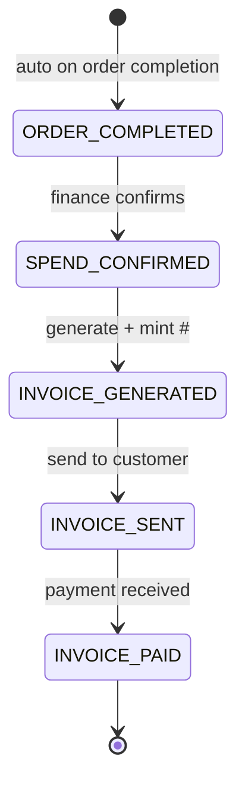

# Invoices

## What it does

Invoices are the billing records Curavend creates after an order is completed. Each invoice carries line items, all monetary fields in cents (`subtotalCents`, `taxTotalCents`, `discountTotalCents`, `shippingCents`, `grandTotalCents`), tax-engine audit metadata, and optional Stripe linkage. Invoices walk a 5-state lifecycle from `ORDER_COMPLETED` through `INVOICE_SENT` to `INVOICE_PAID`.

A typical flow: order is marked **Completed** → encounter submission auto-creates an invoice in `ORDER_COMPLETED` → finance reviews and confirms spend → invoice is generated, sent to the customer, paid.

## Who uses it

- **Vendor** AR / finance — generate, send, and track invoices.
- **Hospital** AP — view invoices owed and dispute via 3-way match.
- **Admin** — audit any invoice across tenants.

## The page

**Sidebar →** Billing. Routes are `/billing` (list) and `/billing/:id` (detail).

### List (`/billing`)
- **Filter bar** — status filter, vendor, hospital, date range, free-text search.
- **Columns**: Invoice # (e.g. `INV-2026-001234`), Status (color-coded), Vendor, Hospital, Order #, Subtotal, Tax, **Grand Total**, Issued date, Due date.
- **Bulk export** to CSV / PDF.

### Detail (`/billing/:id`)
- **Header card** — status, grand total, due date, payment status; action buttons (`Generate`, `Send`, `Mark Paid`, `Download PDF`).
- **Lines table** — HCPC, description, qty, unit price, line total, price source tag (CONTRACT / GPO / FEE_SCHEDULE / MEDICARE / MANUAL).
- **Totals breakdown** — subtotal, discounts, tax (with jurisdiction code & tax-engine audit triplet `provider/calculationId/calculatedAt`), shipping, **grand total**.
- **Linked PO** — customer purchase-order number with click-through.
- **3-way match section** — surfaces any open variances from the matcher with a `Resolve` link.
- **History** — every status change with user + timestamp.

## Actions you can take

| Action | What it does | State |
|---|---|---|
| **Generate** | Moves `SPEND_CONFIRMED → INVOICE_GENERATED`, mints `INV-YYYY-NNNNNN`, calculates tax | SPEND_CONFIRMED |
| **Confirm spend** | Moves `ORDER_COMPLETED → SPEND_CONFIRMED` (finance approval gate) | ORDER_COMPLETED |
| **Send** | Moves to `INVOICE_SENT` — emails the customer, fires `invoice.sent` queue event | INVOICE_GENERATED |
| **Mark paid** | Moves to `INVOICE_PAID`, records `paymentDate` | INVOICE_SENT |
| **Download PDF** | Renders an invoice PDF via Browser Rendering | any state |
| ⚠ **Void** | Marks invoice void with reason — terminal | any non-paid state |
| **Run 3-way match** | Triggers the matcher for this invoice | any state |

## Workflow

🛈 **Why cents integers everywhere** — floating-point cents lead to rounding bugs in financial reports. Every monetary field on `invoices` and `invoice_items` is `INTEGER`. The frontend formats with `Intl.NumberFormat` at display time.

## Common tasks

- [Resolve a 3-way match exception](../workflows/05-resolve-match-exception.md)
- [Detect contract leakage](../workflows/10-detect-contract-leakage.md)

## Permissions

| Role | Default |
|---|---|
| `VENDOR_ACCOUNT_MANAGER` | full on own invoices |
| `FACILITY_ACCOUNT_MANAGER` | read on hospital's invoices |
| Admin | full on all |

## Behind the scenes

- **API endpoints**: `GET/POST /api/invoices`, `GET/PATCH /api/invoices/:id`, `POST /api/invoices/:id/send`, `POST /api/invoices/:id/mark-paid`, `GET /api/invoices/:id/pdf`.
- **Service**: `InvoiceService` — auto-creates an invoice on order completion via `createInvoiceFromOrder()`.
- **DB tables**: `invoices`, `invoice_items`.
  - Money: `subtotalCents`, `taxTotalCents`, `discountTotalCents`, `shippingCents`, `grandTotalCents`.
  - Tax: `taxProvider`, `taxCalculationId`, `taxCalculatedAt`, `jurisdictionCode`.
  - Stripe (unused until secrets set): `stripeInvoiceId`, `stripePaymentIntentId`.
  - FX (defaults USD): `currencyCode`, `fxRate`.
- **Number minting**: `mintInvoiceNumber()` → `INV-{YEAR}-{6digit}` atomic via `sequences` table.
- **Tax engine**: `InternalTaxEngine` reads `sales_tax_rates` keyed by `jurisdictionCode` (`US-XX`). Always-exempt tax codes: `PH050100` (medical equipment), `PH050200` (Rx devices), `PH010000` (Rx drugs), `DME`. Strategy pattern allows swap to Avalara / TaxJar / Vertex later.
- **Queue events**: `invoice.created`, `invoice.sent`, `invoice.paid` → notifications + customer emails + ERP push.

## Related

- [Orders](./02-orders.md)
- [3-Way Matching](./08-three-way-match.md)
- [Contracts & Pricing](./10-contracts-pricing.md)
- [Contract Leakage](./15-contract-leakage.md)
