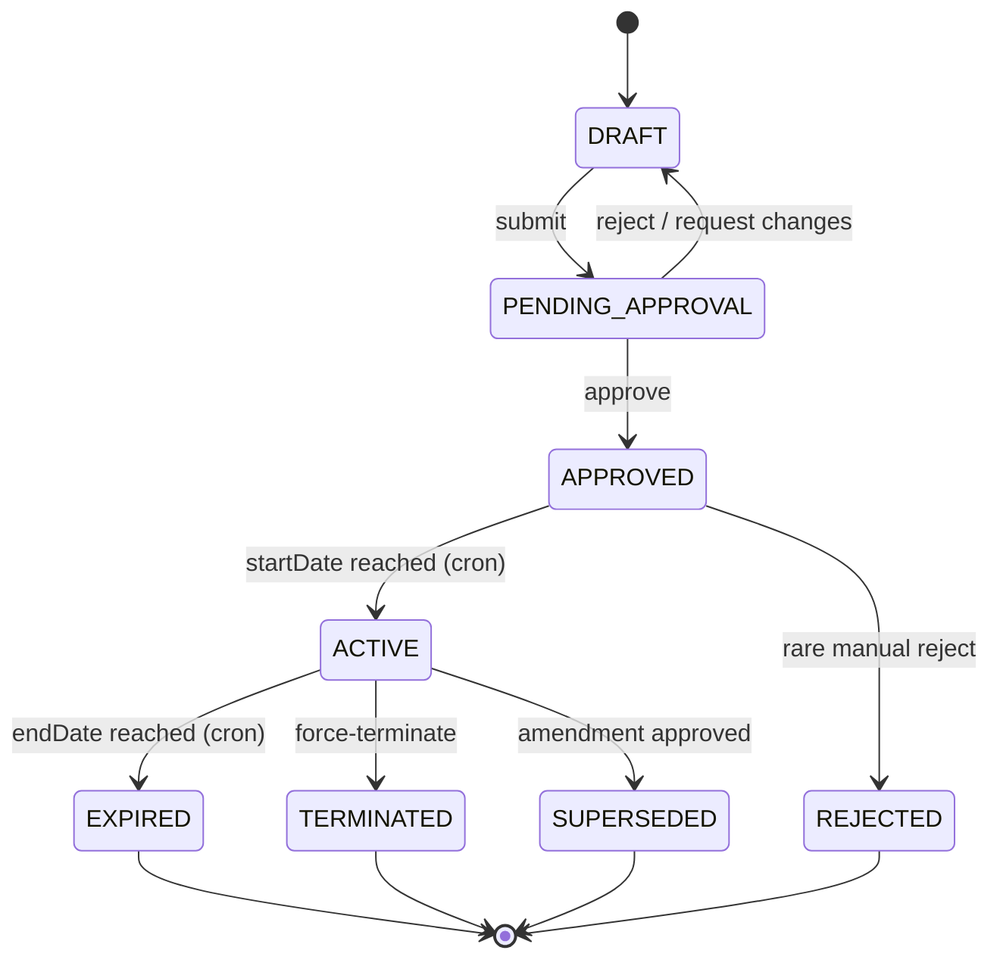
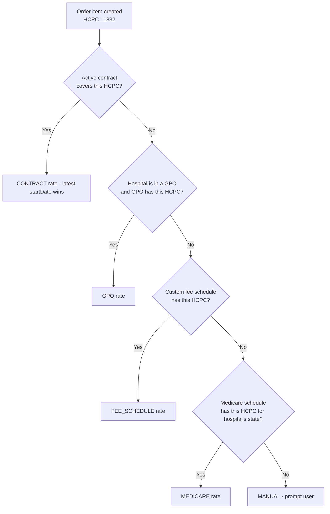

# Contracts & Pricing

## What it does

Contracts are the bilateral agreements between a hospital and a vendor that fix prices for specific HCPC codes for a date range. Curavend evaluates the right price at every order-item-create using a **4-tier cascade**: Contract → GPO → Fee Schedule → Medicare → Manual. The first tier with a hit wins. This way you never overpay just because a contract wasn't loaded, and you never underpay (relative to Medicare) by accident.

Contracts also follow their own multi-step approval lifecycle: `DRAFT → PENDING_APPROVAL → APPROVED → ACTIVE → EXPIRED | TERMINATED | REJECTED | SUPERSEDED`. Amendments clone the parent into a new DRAFT child; on amendment approval the parent moves to `SUPERSEDED`.

## Who uses it

- **Hospital** contract managers — draft and submit contracts.
- **Hospital** signers — approve contracts (cannot approve their own drafts).
- **Vendor** AR — view active contracts that govern their rates.
- **Admin** — audit and oversee the lifecycle.

## The page

**Sidebar →** Contracts. Routes are `/contracts` (list) and `/contracts/:id` (detail), plus `/contracts/new` for the wizard.

### List (`/contracts`)
- **Filter bar** — status, vendor, hospital, item-category, date range, free-text search.
- **Columns**: Contract # / name, Status (color-coded), Vendor, Hospital, Item categories, Start date, End date, Revision #.

### Detail (`/contracts/:id`)
- **Header**: name, status, parties, dates, item categories (DME / orthotics / biologics / wound care / etc.), action buttons (`Submit`, `Approve`, `Reject`, `Request changes`, `Amend`, `Terminate`).
- **Tabs**:
  - **Items** — HCPC, unit price, UOM, effective window.
  - **Revisions** — every immutable snapshot saved on submission.
  - **History** — full audit log with reviewer comments.
  - **Files** — signed PDF, supporting docs.

### Add Contract Wizard (`/contracts/new`)
Multi-step: parties → categories → date window → line items (or bulk import) → review → save as DRAFT.

## Actions you can take

| Action | What it does | Permission / state |
|---|---|---|
| **Create draft** | New contract in `DRAFT` | `contracts: WRITE` |
| **Submit** | Moves to `PENDING_APPROVAL`, snapshots an immutable revision | drafter, `contracts: WRITE` |
| **Approve** | Moves to `APPROVED`; cron later flips to `ACTIVE` on start date | a non-drafter with `contracts: WRITE` |
| **Reject** | Returns to `DRAFT` with reviewer comments | non-drafter, `contracts: WRITE` |
| **Request changes** | Returns to `DRAFT` with change requests | non-drafter, `contracts: WRITE` |
| **Amend** | Clones into new DRAFT child with `parentContractId` set | `contracts: WRITE` |
| ⚠ **Terminate** | Force-moves to `TERMINATED` early | `contracts: FULL` |

## Workflow

### Contract lifecycle

### Pricing cascade (4-tier + manual)

🛈 **Why drafter cannot approve own submission** — segregation of duties, enforced server-side in `lib/contractTransitions.ts`. `approveContract`, `rejectContract`, and `requestContractChanges` all throw if `submittedByUserId === currentUserId`.

🛈 **Why amendments make a child** — the parent contract's immutable revision is preserved for audit. The new child carries the changes; on approval the parent becomes `SUPERSEDED` (not deleted) and the child becomes `ACTIVE`.

## Common tasks

- [Set up GPO membership for a hospital](../workflows/15-set-up-gpo-membership.md)
- [Detect contract leakage](../workflows/10-detect-contract-leakage.md)

## Permissions

| Role | Default |
|---|---|
| Hospital contracting team | `contracts: WRITE` |
| Hospital execs (signers) | `contracts: FULL` |
| Vendor account managers | `contracts: READ` on own |
| Admin | `contracts: FULL` |

## Behind the scenes

- **API endpoints**: `GET/POST /api/contracts`, `GET/PATCH /api/contracts/:id`, `POST /api/contracts/:id/items` (bulk), `POST /api/contracts/:id/submit | approve | reject | amend | terminate`.
- **DB tables**: `contracts`, `contract_items`, `contract_revisions` (immutable snapshots), `contract_history`.
- **Pricing service**: `lib/contractPricing.ts` exports `getContractRatesBulk()` — single query joining `contracts × contract_items` for an array of HCPC codes; avoids N+1 at order-create.
- **GPO tier**: `getGpoRate` + `getGpoRatesBulk` in same file. See [GPO Contracts](./11-gpo-contracts.md).
- **Daily cron** `contractLifecycle`:
  - `APPROVED → ACTIVE` when `startDate ≤ today`.
  - `ACTIVE → EXPIRED` when `endDate < today`.
  - 30 / 14 / 7-day expiring-soon reminders.
  - Uses sentinel `'cron-contract-lifecycle'` as `changedByUserId`.

## Related

- [GPO Contracts](./11-gpo-contracts.md)
- [Contract Leakage](./15-contract-leakage.md)
- [Invoices](./09-invoices.md)
- [Orders](./02-orders.md)
