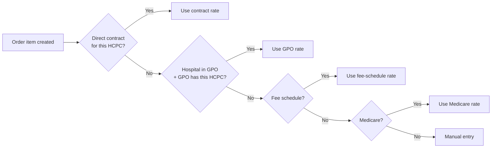

# GPO Contracts

## What it does

GPO Contracts let you take advantage of a Group Purchasing Organization's negotiated rates (Vizient, Premier, HealthTrust, Intalere, Capstone, or Other). When a hospital is a member of a GPO, every requested HCPC is first checked against any direct **Contract**, and if no direct contract covers the item, it falls through to the **GPO** rate — *before* falling through to fee schedules, Medicare, or manual entry.

This is the second of four tiers in the 4-tier pricing cascade and was the largest pricing-gap closed against Vizient / GHX in Session 10.

## Who uses it

- **Admin** — author the master GPO and contract-item tables (most GPOs are platform-managed).
- **Hospital** admins — set their hospital's GPO membership + member ID.
- Everyone else benefits implicitly via the pricing cascade.

## The page

**Sidebar →** Admin → GPO Contracts. Route is `/admin/gpo-contracts`.

Two-column layout:
- **Left sidebar** — GPO list. Tile per GPO with name, kind tag (`Vizient`, `Premier`, etc.), and item count. Click to switch focus.
- **Right pane** — contract items for the selected GPO.
  - **Columns**: HCPC, description, vendor, unit price, effective start, effective end, status.
  - **Filter bar** — HCPC search, vendor filter, active-only toggle.
  - **Add item** button → single-row modal.
  - **Bulk import** button → textarea for CSV-style paste.

Seeded GPOs out of the box: **Vizient**, **Premier**, **HealthTrust** (Session 10).

## Actions you can take

| Action | What it does | Permission |
|---|---|---|
| **Add GPO** | Creates a new `gpo_organization` row | `ADMIN` |
| **Edit GPO** | Rename, change kind | `ADMIN` |
| **Add item** | Adds a HCPC × vendor × price row to the GPO | `ADMIN` |
| **Bulk import** | Multi-row paste (CSV) | `ADMIN` |
| ⚠ **Deactivate item** | Sets effective end = today; item drops out of pricing | `ADMIN` |
| **Set hospital GPO membership** | On `/hospitals/:id` — sets `gpoOrganizationId` + `gpoMemberId` | `ADMIN` |

## Workflow

### Where the GPO tier lives in pricing

🛈 **Why hospitals are linked to a single GPO** — multi-GPO membership is rare in practice; the data model uses a single `gpoOrganizationId` column on `hospitals`. If you need multi-GPO support, add fee schedules as the fallback tier.

## Common tasks

- [Set up GPO membership for a hospital](../workflows/15-set-up-gpo-membership.md)

## Permissions

GPO master data is admin-only — these rates affect every tenant on the platform, so they're centrally curated. Hospital admins can set their own membership but cannot edit GPO rate tables.

## Behind the scenes

- **API endpoints**:
  - `GET /api/gpo/organizations`, `POST /api/gpo/organizations`, `PATCH /:id`.
  - `GET /api/gpo/items?gpoOrganizationId=…`, `POST /api/gpo/items` (single + bulk), `PATCH /:itemId`.
  - Hospital membership set via `PATCH /api/hospitals/:id` with `{gpoOrganizationId, gpoMemberId}`.
- **DB tables** (migration `0007_gpo_pricing.sql`):
  - `gpo_organizations` — name, `kind` (Vizient / Premier / HealthTrust / Intalere / Capstone / Other).
  - `gpo_contract_items` — `gpoOrganizationId`, `hcpcCode`, `vendorId`, `unitPriceCents`, `effectiveStart`, `effectiveEnd`.
  - `hospitals.gpoOrganizationId`, `hospitals.gpoMemberId` columns added.
- **Pricing**: `lib/contractPricing.ts` exports `getGpoRate(hospitalId, hcpcCode)` + `getGpoRatesBulk()`. Filters by hospital's GPO + active effective window.

## Related

- [Contracts & Pricing](./10-contracts-pricing.md)
- [Contract Leakage](./15-contract-leakage.md)
- [Multi-Site Spend](./14-multi-site-spend.md)
