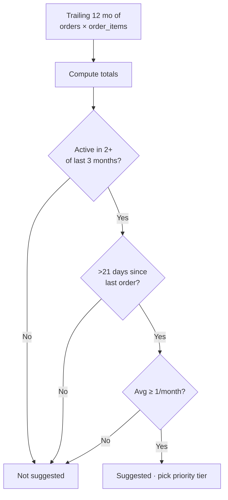

# Demand Forecasting

## What it does

The Forecasting page projects what your hospital will need to order over the next 30 days based on a trailing-12-month demand model. For every HCPC you've ordered in the last year it computes total volume, trailing-3-month volume, trend %, days since last ordered, and a projected next-30-day quantity. Items that look like they're due for a reorder get a **Suggested** flag and a priority tier (`NORMAL`, `HIGH`, `CRITICAL`).

It's a starter forecasting model — pure SQL, no ML — designed to surface obvious gaps without requiring training data or a separate inference service.

## Who uses it

- **Hospital** materials managers — scan suggestions, drive proactive reorders.
- **Hospital** buyers — bulk-add suggested items to a new requisition.
- **Admin** — sanity-check tenant demand patterns.

## The page

**Sidebar →** Reporting → Forecast. Route is `/reporting/forecast`.

- **4 summary stat cards** along the top:
  - Total HCPCs ordered in last 12 months
  - HCPCs suggested for reorder
  - Critical-priority count
  - Average days since last order
- **Filter bar** — search HCPC / description, priority filter, "Suggested only" toggle.
- **Table columns**:
  - HCPC, description
  - Total 12-mo qty, total 3-mo qty
  - Trailing-3 monthly average
  - Trend % (3-mo avg vs 12-mo avg)
  - Days since last ordered
  - Projected next-30-day qty
  - Suggestion flag + priority tier
- **Row actions**: **Add to requisition** (opens a quick-add modal pre-filled with the projected qty).

## Actions you can take

| Action | What it does | Permission |
|---|---|---|
| **View forecast** | Loads the table | `requisitions: READ` (or `orders: READ`) |
| **Get monthly series for HCPC** | Drawer with the trailing-12-month bar chart | same |
| **Add to requisition** | Creates a new DRAFT requisition pre-filled with the suggested line | `requisitions: WRITE` |

## Workflow

### Suggestion logic per (HCPC, hospital)

### Priority tier rules

| Tier | Condition |
|---|---|
| `CRITICAL` | > 45 days since last + avg ≥ 5/mo |
| `HIGH` | > 30 days since last + avg ≥ 2/mo |
| `NORMAL` | everything else suggested |

🛈 **Why a SQL-only model** — the platform doesn't ship with a training pipeline and most hospitals have noisy demand. Heuristic suggestions get 80 % of the value with 0 % of the operational overhead. Swap for a real forecast (Prophet / ARIMA / ML) later by replacing the `/api/forecasting/demand` query.

## Common tasks

- [Create and submit a requisition](../workflows/02-create-and-submit-requisition.md) (suggestions feed straight into a new requisition)

## Permissions

Read-only for anyone with hospital scope. Click-through to "Add to requisition" requires `requisitions: WRITE`. Admins see forecasts for any hospital they filter by.

## Behind the scenes

- **API endpoints**:
  - `GET /api/forecasting/demand?hospitalId=…` — returns the forecast rows.
  - `GET /api/forecasting/monthly-series/:hcpcCode` — bar-chart drawer payload.
- **Computation**: pure SQL on `orders × order_items` joined on `created_at` windows. No materialized views; recomputed on every fetch (page-level caching planned).
- **Tenant scoping**: hospitals see their own; admins can filter by `hospitalId`.

## Related

- [Requisitions](./03-requisitions.md)
- [Multi-Site Spend](./14-multi-site-spend.md)
- [Formulary / Item Master](./04-formulary.md)
