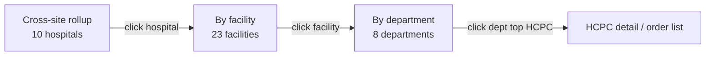

# Multi-Site Spend

## What it does

The Multi-Site Spend dashboard rolls up procurement spend across every facility and department in a multi-hospital IDN. It surfaces the headline KPIs (total spend, invoice count, order count, exception count) for a date range, then breaks the same numbers down three ways: cross-site rollup, by-facility (with drill-down), and by-department (with facility filter). Spend numbers are tied to invoiced amounts (not just ordered), and the exception column flags facilities with open 3-way match exceptions.

It's the answer to "show me where the money goes" for any account-level decision maker.

## Who uses it

- **Admin** at multi-hospital accounts — IDN-wide rollup.
- **Hospital** finance / supply chain executives — own-hospital breakdowns.
- Vendors and providers do **not** have access (tenant-scoped).

## The page

**Sidebar →** Reporting → Multi-Site Spend. Route is `/reporting/multi-site-spend`.

- **Date range picker** at the top (defaults to YTD).
- **4 KPI cards**:
  - Total spend ($)
  - Invoice count
  - Order count
  - Match exception count
- **3 tabs**:
  1. **Cross-site rollup** — one row per hospital. Columns: hospital, total spend, invoice count, order count, exception flag (red if any open). Click a row → tab switches to **By facility** filtered to that hospital.
  2. **By facility** — one row per facility. Columns: facility, hospital (when admin), city/state, total spend, order count, exception count. Click → drills into **By department** for that facility.
  3. **By department** — one row per department within a chosen facility. Columns: department name, total spend, order count, top-3 HCPCs.

## Actions you can take

| Action | What it does | Permission |
|---|---|---|
| **Change date range** | Refetches all four KPIs + tab data | always |
| **Click cross-site row** | Drill to **By facility** for that hospital | always |
| **Click facility row** | Drill to **By department** for that facility | always |
| **Filter by facility** (Dept tab) | Restricts dept rollup | always |
| **Export CSV** | Downloads current tab | reporting access |

## Workflow

### Drill-down navigation

🛈 **Why three tabs instead of expand-rows** — the underlying queries are different aggregates (`hospital_id`, `facility_id`, `department_id`) and at scale you want each to be a separate fetch. Tabs let you lazy-load only the slice you're looking at.

## Common tasks

- [Run a multi-site spend report](../workflows/09-run-multi-site-spend-report.md)
- [Detect contract leakage](../workflows/10-detect-contract-leakage.md) (complementary view)

## Permissions

Tenant-scoped: hospital users see only their own hospital's data (cross-site rollup degenerates to a single-row view). Admins can filter by any `hospitalId`. Vendor / provider users get a 403 on the underlying endpoints.

## Behind the scenes

- **API endpoints** (4 new in Session 11):
  - `GET /api/reports/spend-by-facility?startDate=&endDate=&hospitalId=`
  - `GET /api/reports/spend-by-department?startDate=&endDate=&hospitalId=&facilityId=`
  - `GET /api/reports/multi-site-rollup?startDate=&endDate=`
  - (KPIs are pulled from the rollup endpoint.)
- **Computation**: raw-SQL aggregates joining `invoices × invoice_items × orders × hospital_facilities × hospital_departments × three_way_matches`. No views — every request recomputes.
- **Exception flag**: counts `three_way_matches.resolution IS NULL` joined to the invoice's hospital/facility.

## Related

- [Contract Leakage](./15-contract-leakage.md)
- [Vendor Scorecard](./17-vendor-scorecard.md)
- [Invoices](./09-invoices.md)
- [3-Way Matching](./08-three-way-match.md)
