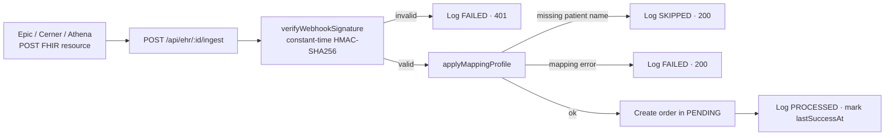

# EHR Connections

## What it does

EHR Connections is the multi-vendor FHIR adapter that lets any major EHR send patient orders directly into Curavend. Out of the box it supports Epic, Cerner, Athena, Meditech, eClinicalWorks (eCW), Allscripts, and a generic FHIR R4 mode for everything else. Each connection has its own webhook URL with per-connection HMAC-SHA256 signing, an optional JSON mapping profile that re-shapes incoming resources to Curavend's canonical order, and a full ingest log of every payload (success or failure).

This closes the Redox / Particle Health gap — you don't need a middleware vendor to integrate with anything besides Epic.

## Who uses it

- **Admin** — creates and manages connections (this is platform-level configuration).
- **Hospital** IT teams — receive the webhook URL + secret to give to their EHR integration team.

## The page

**Sidebar →** Admin → EHR Connections. Route is `/admin/ehr-connections`.

Two-pane layout:
- **Left sidebar** — list of configured connections. Tile per connection: hospital, vendor (Epic / Cerner / Athena / Meditech / eCW / Allscripts / Generic-FHIR-R4), status pill (active / disabled), last success timestamp.
- **Right pane** — tabs for the selected connection:
  - **Overview** — connection name, vendor, hospital, auth mode (HMAC + optional OAuth), enabled toggle.
  - **Webhook URL** — copyable URL + signing-secret env-ref + curl example + setup notes per vendor.
  - **Mapping profile** — JSON editor (`subject.display`, `code.coding[0].code`, etc.) with a per-vendor default.
  - **Recent ingests** — last 50 payloads with status tag (PROCESSED / FAILED / SKIPPED), inbound size, error message if any.

## Actions you can take

| Action | What it does | Permission |
|---|---|---|
| **Add connection** | Creates a new `ehr_connections` row for a hospital + vendor | `ADMIN` |
| **Generate webhook URL** | Returns `https://…/api/ehr/:connectionId/ingest` + signing secret env-ref | `ADMIN` |
| **Edit mapping profile** | JSON-path remap of FHIR fields → Curavend order shape | `ADMIN` |
| **Disable** | Disables the connection — webhook starts returning `403` | `ADMIN` |
| ⚠ **Delete** | Removes the connection — webhook becomes a `404` | `ADMIN` |
| **Re-ingest payload** | Re-runs a previously logged payload against current mapping | `ADMIN` |

## Workflow

### Inbound webhook flow

🛈 **Why the webhook is public (JWT-bypass)** — EHRs send unauthenticated webhooks; bearer tokens would require token-management on their side. The endpoint regex `^/api/ehr/[A-Za-z0-9-]+/ingest$` is in `PUBLIC_PATTERNS` so it skips JWT middleware, but it enforces per-connection HMAC. No HMAC = `401`.

🛈 **Why store the secret as an env-ref** — the actual HMAC key lives in Cloudflare Worker secrets. The DB only holds the *name* of the env-var to look up (e.g. `EHR_HMAC_HOSP123`). This means a DB leak doesn't expose the signing key.

## Common tasks

- [Configure an EHR feed](../workflows/13-configure-ehr-feed.md)

## Permissions

Admin-only on both the config UI and the audit log. The webhook endpoint itself is HMAC-protected per-connection; no JWT required.

## Behind the scenes

- **API endpoints**:
  - `GET/POST /api/ehr/connections`, `GET/PATCH /api/ehr/connections/:id`.
  - `POST /api/ehr/:connectionId/ingest` — **public** (HMAC-protected), the webhook.
  - `GET /api/ehr/connections/:id/ingest-log?limit=50`.
- **DB tables** (migration `0010_ehr_connections.sql`):
  - `ehr_connections` — hospitalId, vendor, auth mode, env-refs, mapping profile JSON, lastSuccessAt / lastErrorAt.
  - `ehr_ingest_log` — connectionId, payload (truncated), status (PROCESSED / FAILED / SKIPPED), error, durationMs.
- **Service**: `services/ehrAdapter.ts`:
  - `applyMappingProfile(resource, profile)` — JSON-path walker.
  - `DEFAULT_MAPPINGS[vendor]` — per-vendor preset.
  - `verifyWebhookSignature(rawBody, header, secret)` — constant-time HMAC-SHA256.
- **Auth bypass**: regex added to `PUBLIC_PATTERNS` in `middleware/auth.ts`.

## Related

- [Orders](./02-orders.md)
- [User Management](./18-user-management.md)
