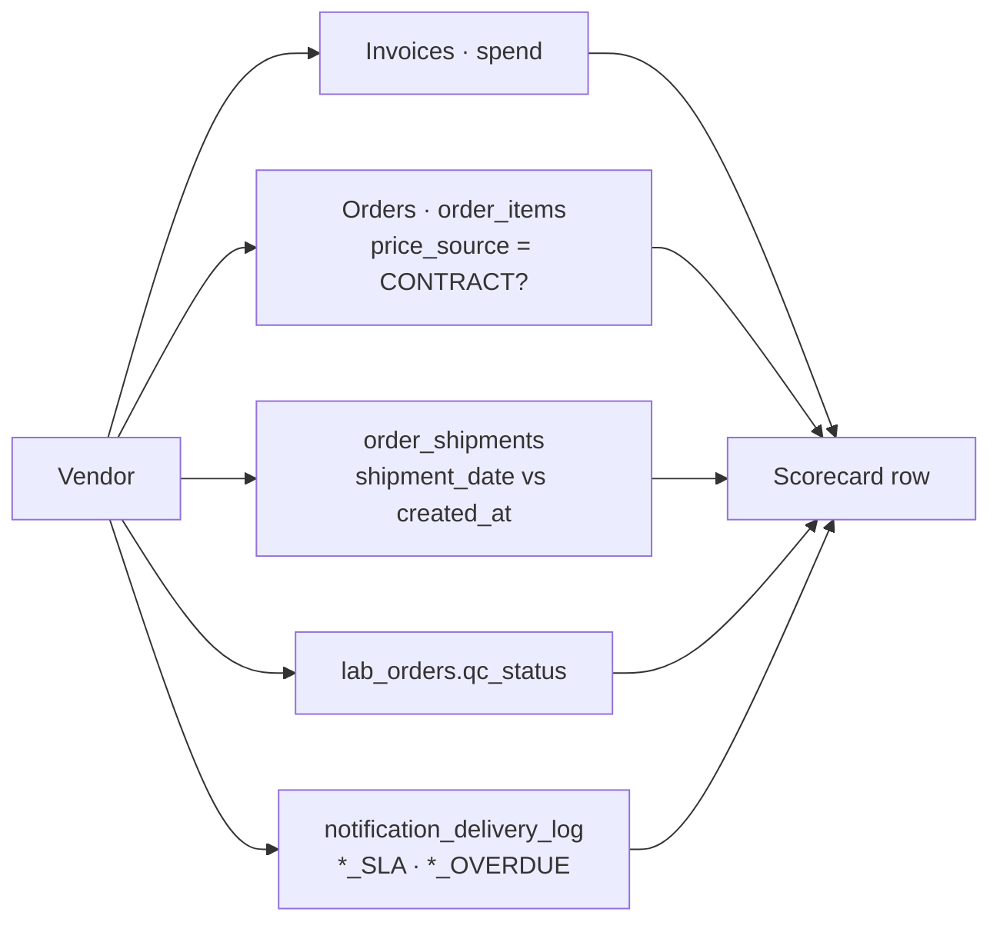

# Vendor Scorecard

## What it does

The Vendor Scorecard ranks every vendor your hospital does business with on the metrics that actually matter: on-time delivery, response time, QC pass rate, contract compliance, SLA breaches, plus the baseline 5 (order count, spend, average order value, etc.). Each metric column is color-coded green / yellow / red against a sensible threshold so problems jump off the page. It's the data you bring to a quarterly vendor review.

Session 10 expanded the original 5-column scorecard to **10 columns** by adding the 5 quality / compliance metrics.

## Who uses it

- **Hospital** procurement / supply chain leadership.
- **Admin** for IDN-wide vendor comparisons.

## The page

**Sidebar →** Reporting → Vendor Scorecard. Route is `/reporting/vendor-scorecard` (it lives in `Reports.tsx` as the `scorecardColumns` view).

- **Date range picker** at the top.
- **Table** — one row per vendor.

### Column reference

| Column | Source | Green / Yellow / Red |
|---|---|---|
| **Vendor** | `vendors.name` | — |
| **Invoice count** | `COUNT(invoices)` | — |
| **Spend ($)** | `SUM(invoices.grandTotalCents)` | — |
| **Order count** | `COUNT(orders)` | — |
| **Avg order $** | `spend / order_count` | — |
| **On-time %** | `order_shipments.actual_delivery_date ≤ promised` | ≥ 95 / 85–95 / < 85 |
| **Avg response (h)** | `order_shipments.shipment_date − created_at` | ≤ 24 / 24–72 / > 72 |
| **QC pass %** | `lab_orders.qc_status='PASS'` | ≥ 98 / 92–98 / < 92 |
| **Contract compliance %** | `order_items.price_source='CONTRACT'` | ≥ 80 / 60–80 / < 60 |
| **SLA breaches** | `notification_delivery_log WHERE event_type LIKE '%_SLA' OR '%_OVERDUE'` | 0 / 1–4 / ≥ 5 |

- **Row click** opens the vendor profile / order history.
- **Export CSV** for offline analysis.

## Actions you can take

| Action | What it does | Permission |
|---|---|---|
| **Change date range** | Refetches all metrics | always |
| **Sort by column** | Click column header | always |
| **Export CSV** | Downloads the table | reporting access |
| **Click vendor row** | Opens `/vendors/:id` profile | `vendors: READ` |

## Workflow

### Where each metric comes from

🛈 **Why SLA breaches come from the delivery log** — every notification fired by the SLA monitor cron is recorded in `notification_delivery_log`. Counting those by vendor gives you the breach count without a separate metrics table.

🛈 **Why contract compliance is `price_source='CONTRACT'`** — every order line records which tier of the pricing cascade it used. Lines that landed on the `CONTRACT` tier mean the buyer benefitted from the negotiated rate. Lines that landed on FEE_SCHEDULE / MEDICARE / MANUAL mean the contract didn't cover them (a gap to fix).

## Common tasks

- [Detect contract leakage](../workflows/10-detect-contract-leakage.md)
- [Onboard a new vendor](../workflows/01-onboard-a-vendor.md)

## Permissions

Tenant-scoped: hospital users see their own vendors. Admins see all. Vendors do not see their own scorecard from the hospital's view (they have a separate vendor-side view of their own KPIs).

## Behind the scenes

- **API endpoint**: `GET /api/reports/vendor-scorecard?startDate=&endDate=&hospitalId=`.
- **Computation**: single CTE-heavy SQL query that pulls:
  - `order_shipments.shipment_date` / `actual_delivery_date` for on-time + response.
  - `lab_orders.qc_status` for QC pass.
  - `order_items.price_source` for contract compliance.
  - `notification_delivery_log` rows matching `%_SLA` or `%_OVERDUE` event types for breaches.
- **Frontend**: `web/src/features/reporting/pages/Reports.tsx` — the `scorecardColumns` array.
- **Color-coding**: thresholds hard-coded per column in the columns array — adjust there if you need different bands.

## Related

- [Contract Leakage](./15-contract-leakage.md)
- [Multi-Site Spend](./14-multi-site-spend.md)
- [Notifications](./20-notifications.md) (SLA breach source)
- [Orders](./02-orders.md)
