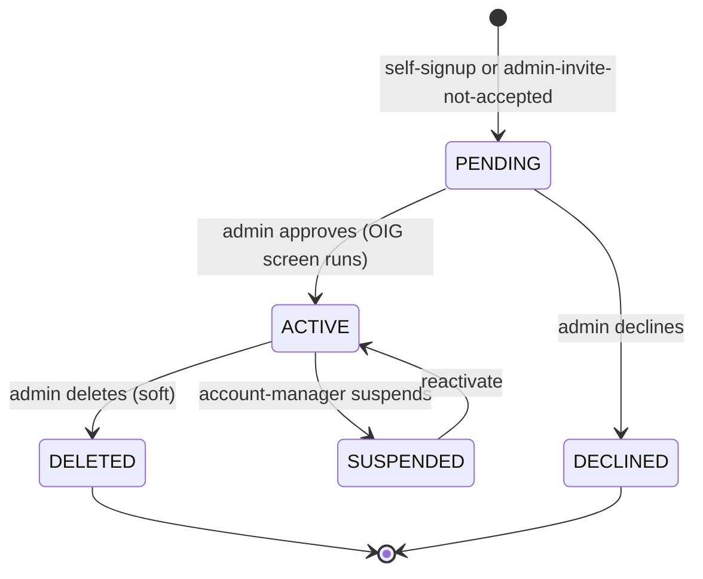

# User Management

## What it does

User Management is where admins create, invite, suspend, role-change, and approve users. The platform supports six user types (`ADMIN`, `HOSPITAL`, `VENDOR`, `PROVIDER`, `SUPER_VENDOR`, `LAB`) and nine roles spread across them, with multi-tenant memberships so the same email can belong to multiple hospitals or vendors. The **User Approval Queue** is the gate for self-signup — any user who registers themselves lands in `PENDING` and an admin has to approve them before they can sign in.

## Who uses it

- **Admin** — full management across all tenants.
- **Hospital** / **Vendor** / **Provider** account managers — create users within their own tenant.
- **Lab** account managers — manage users within their lab.

## The page

**Sidebar →** Settings → Users (full management) and Admin → User Approval Queue (signups).

### `/settings` (User Management card)
- **Table** of users in your tenant: name, email, role, status (ACTIVE / PENDING / SUSPENDED / DECLINED), last login, MFA status (TOTP / Email OTP / none), OIG status (CLEARED / EXCLUDED).
- **Add User** button → drawer with fields:
  - First/last name, email
  - User type (auto-set to your tenant type)
  - Role (filtered to that type)
  - **Groups** multi-select (see [Permissions & Groups](./19-permissions-groups.md))
  - Send invite email toggle
- **Row actions**: View, Edit, Reset password (sends email), Suspend / Reactivate, Delete (soft).
- **Memberships sub-section** — for users with `userMemberships` rows, shows all tenants and a `Switch tenant` link.

### `/admin/user-approval-queue` (admin-only)
- **Table** of all `PENDING` self-signups across the platform.
- Columns: name, email, requested user type, requested role, tenant they're trying to join, signup date.
- Row actions: **Approve** (activates the user, sends welcome email, runs OIG screen), **Decline** (marks `DECLINED` with reason).

## Actions you can take

| Action | What it does | Permission |
|---|---|---|
| **Add User** | Creates a user; optionally sends invite email | account-manager role |
| **Edit User** | Update name, role, groups | account-manager role |
| **Reset password** | Emails password-reset link | account-manager role |
| ⚠ **Suspend** | Sets status `SUSPENDED` — user can't sign in | account-manager role |
| ⚠ **Delete** | Soft-deletes user | `ADMIN` |
| **Approve signup** | Activates a PENDING user | `ADMIN` |
| **Decline signup** | Marks DECLINED with reason | `ADMIN` |
| **Attach to tenant** | Adds a membership to another hospital/vendor | `ADMIN` |
| **Detach from tenant** | Removes a membership | `ADMIN` |
| **Switch tenant** | Re-issues JWT for the chosen membership | the user themselves |

## Workflow

### User signup → approval

### User types & default roles

| User type | Roles |
|---|---|
| `ADMIN` | `ACCOUNT_MANAGER`, `ACCOUNT_MANAGER_USER` |
| `HOSPITAL` | `FACILITY_ACCOUNT_MANAGER`, `FACILITY_USER` |
| `VENDOR` | `VENDOR_ACCOUNT_MANAGER`, `VENDOR_USER` |
| `PROVIDER` | `PROVIDER_EXECUTIVE_ADMIN`, `PROVIDER_USER` |
| `SUPER_VENDOR` | `SUPER_VENDOR` |
| `LAB` | `LAB_ACCOUNT_MANAGER`, `LAB_ACCOUNT_MANAGER_USER` |

🛈 **Why multi-membership** — many real users sit at multiple hospitals (a corporate buyer, a regional manager). The `userMemberships` table lets one email log in once and switch tenant context without separate accounts. Switching rewrites the legacy `users.hospitalId/vendorId/…` columns and reissues the JWT.

🛈 **OIG screening** — every approved user is checked against the OIG LEIE exclusion list (refreshed monthly via cron). Users flagged `EXCLUDED` cannot transact and surface to admins for review.

## Common tasks

- [Grant a user fine-grained permissions](../workflows/14-grant-user-permissions.md)
- [Onboard a new vendor](../workflows/01-onboard-a-vendor.md)
- [Onboard a new hospital](../workflows/12-onboard-a-hospital.md)
- [Onboard a new lab](../workflows/11-onboard-a-lab.md)

## Permissions

| Capability | Required |
|---|---|
| List users in own tenant | account-manager role |
| Edit users in own tenant | account-manager role |
| List users across tenants | `ADMIN` |
| Approve/decline signups | `ADMIN` |
| Manage memberships | `ADMIN` |

## Behind the scenes

- **API endpoints**:
  - `GET/POST /api/users`, `GET/PATCH/DELETE /api/users/:id`.
  - `POST /api/users/:id/memberships`, `DELETE /api/users/:id/memberships/:tenantId`.
  - `GET /api/users/:id/groups`, group multi-select pre-fill.
  - `POST /api/admin/user-signups/:id/approve | decline`.
  - `POST /api/users/:id/reset-password`, `POST /api/users/:id/suspend | reactivate`.
- **DB tables**: `users`, `userMemberships`, `email_otp_codes`, `oig_exclusion_list`.
- **Auth**: JWT (HS256, jose) — `ACCESS_TOKEN_EXPIRY=15m`, refresh `7d`, MFA token `5m`. bcrypt SALT_ROUNDS=10 (note: seeded admin uses 12-round hash).
- **MFA**: TOTP (via `otpauth`) and Email OTP (10-min TTL, bcrypted, rate-limited to 5 attempts).
- **PHI consent**: `users.hasAgreedToPHIAccess` baked into JWT claims at login.

## Related

- [Groups & Permissions](./19-permissions-groups.md)
- [Notifications](./20-notifications.md)
- [Approvals](./05-approvals.md)
