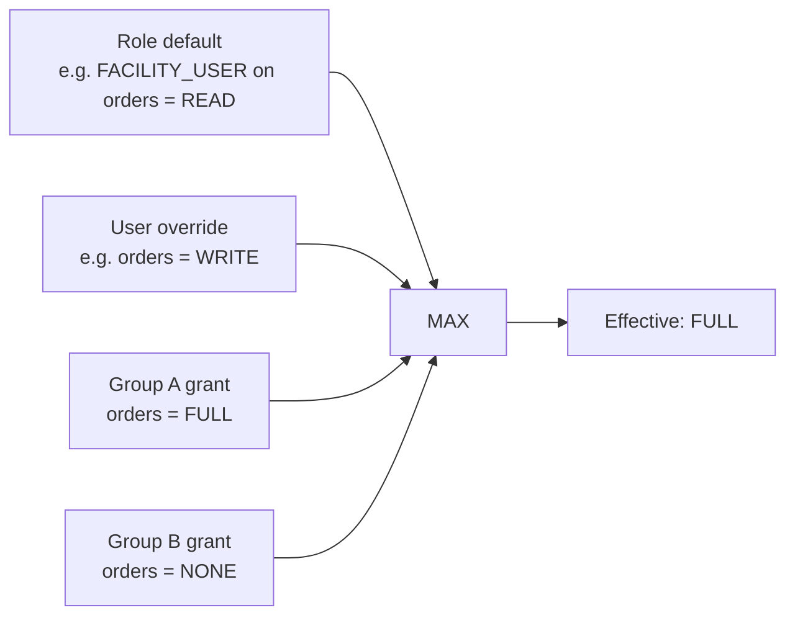

# Permissions & Groups

## What it does

Curavend's access control has three layers stacked on top of each other:

1. **Role defaults** — every role has a built-in baseline (e.g. `FACILITY_ACCOUNT_MANAGER` is auto-FULL on everything).
2. **User-specific overrides** — admins can grant or restrict a user on any of 11 resources at one of 4 levels.
3. **Group grants** — users belong to one or more groups; each group has its own permission matrix; the effective level for a user is the **MAX** of (role default, user override, all their groups' grants).

User Groups also serve as a notification target — you can route a notification to "the Procurement Team" instead of listing individual emails.

## Who uses it

- **Admin** — manages permissions across all tenants.
- **Account managers** (hospital / vendor / lab / provider) — manage permissions within their own tenant.

## The page

Two related pages:

- **Settings → User Groups** card (`/settings`) — group CRUD + members + permissions per group.
- **User Management → Edit User drawer** (`/settings` → user row → Permissions tab) — per-user permission matrix.
- **Admin → Approval Rules** also references groups (as approver targets).

### Group management
- **Group table**: name, member count, system-default badge, created date.
- **Add Group** button → name + description.
- **Detail drawer** has 3 tabs:
  - **Members** — add/remove users.
  - **Permissions** — the same matrix UI as the per-user view.
  - **Notifications** — link this group as a recipient on notification preferences.

### Permissions matrix (used in both places)
- 11 rows × 4 columns of radio buttons.
- Rows: the 11 resources (see below).
- Columns: `NONE / READ / WRITE / FULL`.
- Each row is a radio group; selecting a level saves immediately via the adapter.

## Actions you can take

| Action | What it does | Permission |
|---|---|---|
| **Create group** | New `user_groups` row in your tenant | account-manager role |
| **Add member** | Adds a user to the group | account-manager role |
| **Set group permission** | Updates a row in `user_group_permissions` | account-manager role |
| **Set user permission** | Updates a row in `user_permissions` (override) | account-manager role |
| ⚠ **Delete group** | Hard-deletes group + grants; system-default groups return `409` | account-manager role |
| **Use group as approver** | Pick GROUP in Approval Rules drawer | `ADMIN` |
| **Use group as notification recipient** | Pick GROUP type on `notification_preferences` | account-manager role |

## Workflow

### Effective permission computation

### Resources & levels

**11 PERMISSION_RESOURCES**:
- `facilities`
- `departments`
- `physicians`
- `orders`
- `vendors`
- `vendor-locations`
- `vendor-coverage`
- `contracts`
- `requisitions`
- `formulary`
- `goods-receipts`

**4 PERMISSION_LEVELS**: `NONE → READ → WRITE → FULL`.

### Fast-path roles (skip DB lookup, auto-FULL)
- `ADMIN` user type — any role.
- `ACCOUNT_MANAGER`, `VENDOR_ACCOUNT_MANAGER`, `FACILITY_ACCOUNT_MANAGER`.

🛈 **Why max-of instead of override-wins** — group grants are additive. A user can be in two groups: one with `orders = WRITE`, one with `orders = NONE`. The effective level is `WRITE` — being in a "no-orders" group never strips a permission you got from another group. To deny, set a user-specific override to `NONE`.

🛈 **System-default groups** — every hospital and vendor tenant is seeded with one "Procurement Team" group. These cannot be deleted (return `409`). They give brand-new tenants a working notification target out of the box.

🛈 **Why the new resources (`requisitions`, `formulary`, `goods-receipts`)** — those were added in Session 11 when enterprise procurement features shipped. They use the same matrix UI; the resource list was extended.

## Common tasks

- [Grant a user fine-grained permissions](../workflows/14-grant-user-permissions.md)
- [Set up approval routing rules](../workflows/06-set-up-approval-rules.md) (groups are approver targets)

## Permissions

Account-manager roles can author groups and permissions within their own tenant. Admins can do it across tenants. Cross-tenant access on a group returns `403`.

## Behind the scenes

- **API endpoints**:
  - `GET/POST /api/user-groups`, `GET/PATCH/DELETE /api/user-groups/:id`.
  - `POST/DELETE /api/user-groups/:id/members`.
  - `GET/PUT /api/user-groups/:id/permissions`.
  - `GET /api/user-groups/:id/effective-recipients` — flatten to user list.
  - `GET/PUT /api/user-permissions/:userId`.
- **DB tables**:
  - `user_permissions` — per-user explicit grants.
  - `user_groups` — group definitions, tenant-scoped.
  - `user_group_members` — many-to-many.
  - `user_group_permissions` — per-group permission map.
- **Service**: `services/groupResolver.ts` — `listGroupsForUser`, `resolveGroupPermissions` (MAX), `resolveGroupRecipients`, `explainGroupContributions`.
- **Middleware**: `middleware/requirePermission.ts` — `computeEffectivePermissions(userId)` returns the full 11-resource map; cached per request.
- **Component**: `web/src/features/hospitalManagement/components/PermissionsMatrix.tsx` accepts an `adapter` prop (`load` / `save`) so the same UI edits both user and group permission maps.

## Related

- [User Management](./18-user-management.md)
- [Approvals](./05-approvals.md)
- [Notifications](./20-notifications.md)
