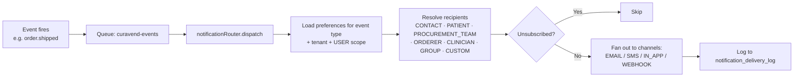

# Notifications

## What it does

Curavend's notification system delivers the right message to the right person on the right channel at the right time — with per-tenant preferences and global unsubscribe support. It supports 4 channels (`EMAIL`, `SMS`, `IN_APP`, `WEBHOOK`) across 13+ event types (order status changes, invoice events, contract expiry, chat messages, stock alerts, SLA breaches). Recipients aren't hard-coded users — they're **roles** (`CONTACT`, `PATIENT`, `PROCUREMENT_TEAM`, `ORDERER`, `CLINICIAN`, `CUSTOM`, `GROUP`) resolved at send time, so reassigning a user automatically reroutes their notifications.

The in-app inbox is the small bell icon in the top nav; per-user and per-tenant preferences live in `/notification-preferences`.

## Who uses it

- **Every user** — receives notifications and adjusts their own preferences.
- **Hospital / vendor account managers** — adjust tenant-wide default preferences.
- **Admin** — global event configuration and delivery-log inspection.

## The page

Two related pages:

- **Top-nav bell icon** — in-app inbox dropdown with the last 10 unread; "View all" → `/notifications`.
- **Avatar dropdown → Notification Preferences** — `/notification-preferences`, the rules editor.

### Preferences page (`/notification-preferences`)
- **Tabs / accordions** per event type (e.g. `ORDER_CREATED`, `ORDER_SHIPPED`, `INVOICE_SENT`, `CHAT_NEW_MESSAGE`, `CONTRACT_EXPIRING`, `STOCK_LOW`, `ORDER_AWAITING_APPROVAL_SLA`, …).
- For each event row: scope (HOSPITAL / VENDOR / PROVIDER / USER), recipient type (CONTACT / PATIENT / PROCUREMENT_TEAM / ORDERER / CLINICIAN / CUSTOM / GROUP), channel toggles (EMAIL / SMS / IN_APP / WEBHOOK), enabled flag.
- **Add rule** to create a new preference row.
- **Unsubscribe** — global per-email opt-out (CAN-SPAM compliance).

### Inbox (`/notifications`)
- Table of every in-app notification: type icon, title, body, related entity (order / invoice / contract), timestamp, read/unread state.
- **Mark all read** button; click any row to navigate to the linked entity.

## Actions you can take

| Action | What it does | Permission |
|---|---|---|
| **Mark read** | Updates `notifications.readAt` | user-self |
| **Mark all read** | Bulk mark read | user-self |
| **Edit preference** | Updates a `notification_preferences` row | account-manager role for tenant-scope, user-self for USER-scope |
| **Add preference rule** | New row | same |
| **Add GROUP recipient** | Pick GROUP + `recipient_group_id` — fans out to all members at send time | account-manager role |
| ⚠ **Unsubscribe** | Email-wide opt-out (`unsubscribes` table) | user-self |

## Workflow

### Send path

### Recipient resolution

| Recipient type | Resolves to |
|---|---|
| `CONTACT` | The `orderContacts` row matching the configured contact kind (orderer / ship-to / bill-to / clinical) |
| `PATIENT` | The patient on the order (email/SMS from patient record) |
| `PROCUREMENT_TEAM` | All hospital users with `FACILITY_ACCOUNT_MANAGER` role |
| `ORDERER` | `orders.createdBy` user |
| `CLINICIAN` | The physician on the order |
| `GROUP` | Every active member of the configured `recipient_group_id` |
| `CUSTOM` | Explicit email/SMS list on the preference row |

🛈 **Why recipients are roles, not users** — when a procurement manager goes on leave, you don't want to manually re-route 12 notification rules. Resolving at send time means rotating staff is automatic.

🛈 **Why a delivery log** — `notification_delivery_log` lets you debug "why didn't I get the email?" and powers the SLA-breach counts on the [Vendor Scorecard](./17-vendor-scorecard.md).

## Common tasks

- [Grant a user fine-grained permissions](../workflows/14-grant-user-permissions.md) (groups feed notifications)

## Permissions

User-scope preferences are user-editable. Tenant-scope (HOSPITAL/VENDOR/PROVIDER) preferences require an account-manager role for that tenant. Admins can edit any scope.

## Behind the scenes

- **API endpoints**:
  - `GET /api/notifications` — inbox.
  - `PATCH /api/notifications/:id/read`, `POST /api/notifications/read-all`.
  - `GET/POST/PUT/DELETE /api/notification-preferences`.
  - `POST /api/unsubscribes/:token` — public unsubscribe link.
- **Services**:
  - `services/notificationService.ts` — low-level send (email via Resend, SMS stub, in-app DB insert, webhook HTTP POST).
  - `services/notificationRouter.ts` — `dispatch(eventType, payload)`, `resolveRecipients()` including `GROUP` fan-out.
- **DB tables**:
  - `notifications` — in-app inbox rows.
  - `notification_preferences` — scope, eventType, recipientType, channels, optional `recipient_group_id`.
  - `notification_delivery_log` — one row per dispatch attempt (used for SLA breach counts + 30-min dedup).
  - `unsubscribes` — global per-email opt-outs.
- **Queue**: `curavend-events` (Cloudflare Queue) with 8 producer event types: `order.created/status_changed/shipped/delivered`, `chat.new_message`, `invoice.created/sent/paid`.
- **SLA monitor**: `cron/orderSlaMonitor.ts` runs in the daily 08:00 UTC block; 5 SLA event types — `ORDER_AWAITING_APPROVAL_SLA`, `ORDER_FULFILLMENT_STALLED_SLA`, `ORDER_NO_SHIPMENT_SLA`, `LAB_ORDER_WORKFLOW_FAILED`, `LAB_ORDER_APPROVAL_OVERDUE`. 30-min dedup via `notification_delivery_log`. One email per hospital with N rows.

## Related

- [Groups & Permissions](./19-permissions-groups.md)
- [User Management](./18-user-management.md)
- [Vendor Scorecard](./17-vendor-scorecard.md)
- [Orders](./02-orders.md)
