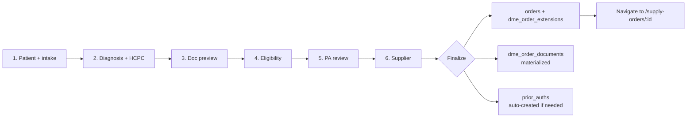

# DME Order Wizard

## What it does

The **DME Order Wizard** is a guided 6-step intake form for Durable Medical Equipment orders. It collects every piece of clinical, payor, and supplier information CMS requires for a DME claim — in a fixed order, with real-time validation against the LCD coverage rules and the CMS Required Prior Authorization HCPC list — so by the time the order is created, the document packet is already known, the prior authorization is auto-filed if needed, and the supplier is locked in.

It replaces the generic "New Order" flow for any HCPC that falls under DMEPOS (durable medical equipment, prosthetics, orthotics, and supplies).

🛈 **Why a wizard?** A standard order page would let the user save garbage in any field at any time. DME claims are denied for missing data — the wizard refuses to advance unless each step is valid, and front-loads the LCD + PA + formulary lookups so an off-coverage code is caught at minute one, not at billing.

## Who uses it

| Persona | Why |
|---|---|
| **Hospital** intake / supply-chain staff | Create DME orders for inpatient discharge or home setup |
| **Provider** prescribers | Order DME directly from the provider portal |
| **Admin** | Spot-fix or create DME orders on behalf of a tenant |

## The page

**Sidebar →** New DME Order (under Procurement, gated on Hospital / Provider / Admin). Route is `/create-dme-order`.

The page renders an Ant `Steps` control across the top and a content panel below. Each step has its own form; **Next** is disabled until validation passes. **Back** is always allowed (state is preserved per step).

### Step 1 — Patient + DME intake

- Patient demographics (name, DOB, MRN), height/weight (used by some LCDs — e.g. bariatric beds).
- **Care setting** — `HOME` / `SNF` / `HOSPICE` / `OTHER` (drives the LCD `SETTING` criterion in step 2).
- **Mobility status** — `AMBULATORY` / `WHEELCHAIR` / `BEDBOUND`.
- **Length of need (months)**, **rental type** (purchase / capped rental / monthly), **estimated start date**, **face-to-face evaluation date**.
- **Clinical indication** — free text shown to the prescriber later.

### Step 2 — Diagnosis & HCPC lines

- One or more ICD-10 diagnosis codes (typeahead against the `icd10_codes` table).
- One or more HCPC line items (typeahead against `hcpc_codes`, with description preview).
- **On blur of each HCPC** the wizard fires three lookups in parallel:
  - `POST /api/lcd/check` → returns `MEETS` / `DOES_NOT_MEET` / `NEEDS_CLINICAL_REVIEW` / `UNKNOWN` (badge color green / red / orange / gray).
  - `GET /api/lcd/pa-required?hcpc=…` → purple badge **CMS PA required — will auto-create**.
  - `GET /api/formulary/resolve?hcpcCode=…` → `ON_FORMULARY` / `OFF_FORMULARY` / `RESTRICTED` badge with substitute suggestions.

### Step 3 — Documents preview

A read-only checklist of required documents resolved from the chosen HCPC × payor kind. Same data the [DME Document Packet](./22-dme-document-packet.md) will render after finalization, shown here so the user knows what they'll need to collect.

### Step 4 — Eligibility check

Payor picker (from the [Payors & Eligibility](./12-payors-eligibility.md) catalog), member ID, group ID. Clicking **Run check** posts to `POST /api/payors/:id/eligibility-check` and shows the stubbed 270/271 response (active / inactive / copay / deductible).

### Step 5 — Prior Auth review

Lists every HCPC line that was flagged as PA-required (CMS list, payor contract `requires_prior_auth`, or formulary `requires_prior_auth`). The user can review the auto-PA preview text and add a clinical note before finalize.

### Step 6 — Supplier picker

Vendors who carry the HCPCs are listed, with a green **DMEPOS-accredited** badge for those who have a current accreditation row in `vendor_dmepos_compliance` (see [DMEPOS Compliance](./26-dmepos-compliance.md)). The user picks one and clicks **Finalize**.

## Actions you can take

| Action | What it does | Allowed when |
|---|---|---|
| **Next / Back** | Move between steps | Next only when step's form is valid |
| **Add HCPC line** | Adds a row; fires LCD + PA + formulary lookups on blur | Step 2 |
| **Run eligibility** | Calls the payor's 270/271 stub | Step 4 (payor + member ID present) |
| **Finalize** | Creates the order + sidecar + doc packet + auto-PA | Step 6 |
| ⚠ **Cancel wizard** | Drops all in-memory state (no draft is saved) | always |

## Workflow

## Common tasks

- [Create a DME order end-to-end](../workflows/16-create-dme-order-end-to-end.md)
- [Upload the DME document packet](../workflows/17-upload-dme-document-packet.md)
- [Generate the DME claim bundle](../workflows/18-generate-dme-claim-bundle.md)

## Permissions

| Action | Resource & level |
|---|---|
| Open the wizard | `orders: WRITE` AND role in (Hospital / Provider / Admin) |
| Finalize (create order + PA) | `orders: WRITE` AND `requisitions: WRITE` (if PA auto-create fires) |
| Pick a supplier outside your contracted vendor list | `orders: FULL` |

## Behind the scenes

- **Page**: `packages/web/src/features/supplyOrderDetail/pages/CreateDmeOrder.tsx`.
- **APIs called per step**:
  - Step 2: `/api/lcd/check`, `/api/lcd/pa-required`, `/api/formulary/resolve`.
  - Step 4: `/api/payors/:id/eligibility-check`.
  - Step 6 (finalize): `POST /api/orders` → `POST /api/dme-documents/extension/:orderId` → `POST /api/dme-documents/materialize/:orderId` → `POST /api/prior-auths` (only if any line is PA-flagged).
- **DB tables touched**: `orders`, `dme_order_extensions` (1:1 sidecar — avoids the SQLite column ceiling on `orders`), `dme_order_documents`, `prior_auths`, `eligibility_checks`.
- **The sidecar pattern** keeps DME-specific fields (LON, mobility, F2F date, clinical indication, `cms_pa_required`) on `dme_order_extensions` so the wide `orders` table doesn't grow further.

## Related

- [DME Document Packet](./22-dme-document-packet.md)
- [LCD Coverage Checker](./23-lcd-coverage-checker.md)
- [CMS PA-Required HCPC List](./24-cms-pa-required-list.md)
- [Prior Authorizations](./06-prior-auths.md)
- [Formulary / Item Master](./04-formulary.md)
- [Hospital persona](../personas/hospital.md)
