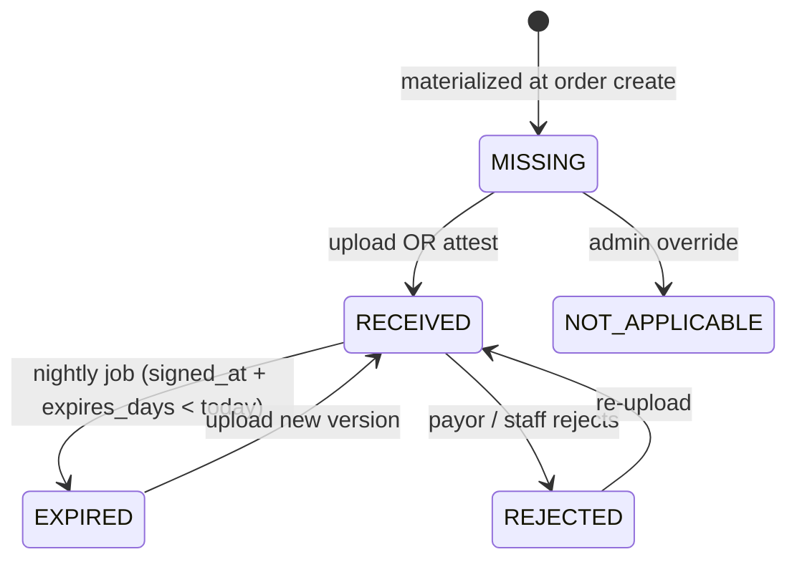

# DME Document Packet

## What it does

The **DME Document Packet** is a per-order checklist of required clinical and administrative documents — the things a payor expects to see in the chart before they pay a DME claim. For every order created via the [DME Order Wizard](./21-dme-order-wizard.md), Curavend looks at each HCPC line and the payor on the order, resolves the matching required-document rules, and materializes a row for every document the chart needs to contain. Staff then upload PDFs, attest that paper-only docs are on file, or reject documents that came back bad.

The packet is the source of truth for "is this order claim-ready" — its status feeds the [Claim Bundle](./25-dwo-claim-bundle.md) generator and the order's overall readiness indicator.

## Who uses it

| Persona | Why |
|---|---|
| **Hospital** intake / discharge planners | Upload Face-to-Face notes, sleep studies, oximetry reports |
| **Hospital** billing | Verify the packet is complete before submitting the claim |
| **Provider** | Upload a signed DWO or CMN before the order ships |
| **Admin** | Manage the underlying requirement catalog (which docs are needed per HCPC × payor) |

## The page

The packet renders **inside the order detail page** at `/supply-orders/:id`, as a dedicated section labelled **DME Document Packet**. It is rendered by the `DmeDocPacket.tsx` component and only appears for orders that have a `dme_order_extensions` sidecar row (i.e. orders created via the DME wizard).

- **Header strip** — overall progress bar (received / required), a status alert (e.g. *"3 documents missing — packet not claim-ready"*), and three header buttons: **DWO PDF**, **Claim bundle**, **Add ad-hoc doc**.
- **Row per required document** — columns are: doc type tag, status badge, signed date, expires date, signed-by, notes, and action buttons.
- Each row's action button changes by status:
  - `MISSING` → **Upload**, **Attest** (no file — for paper-only items)
  - `RECEIVED` → **View**, **Replace**, **Reject**
  - `EXPIRED` → **Upload new**
  - `REJECTED` → **Re-upload** with previous rejection reason visible
  - `NOT_APPLICABLE` → no actions; row is shown collapsed

## Document types

| Type | Typical HCPCs | Required by |
|---|---|---|
| `DWO` | Detailed Written Order — all DME | Medicare, most payors |
| `SWO` | Standard Written Order | All payors |
| `CMN` | Certificate of Medical Necessity (legacy oxygen, etc.) | Medicare for specific codes |
| `FACE_TO_FACE` | Face-to-face evaluation note (≤ 6 months pre-order) | PMD, hospital beds, etc. |
| `SLEEP_STUDY` | Polysomnography | CPAP / BiPAP (E0601, E0470) |
| `OXIMETRY` | Overnight pulse oximetry | Oxygen (E1390, E0431) |
| `LMN` | Letter of Medical Necessity | Most commercial PAs |
| `PROGRESS_NOTES` | Clinical chart notes | Most LCDs |
| `PHOTO` | Wound photo, custom-fit photo | NPWT (E2402), custom orthotics |
| `AOB` | Assignment of Benefits | All |
| `DELIVERY_TICKET` | Vendor's delivery slip | Vendor-side |
| `PROOF_OF_DELIVERY` | Patient-signed POD | All — required for billing |
| `OTHER` | Ad-hoc | Anything custom |

## Actions you can take

| Action | What it does | Allowed when |
|---|---|---|
| **Upload** | Posts a file to R2 (`curavend-uploads/dme-orders/{orderId}/…`), stamps `blob_key`, `signed_at`, `signed_by`, and computes `expires_at` from the requirement's `expires_days` | row is `MISSING` / `EXPIRED` / `REJECTED` (with `orders: WRITE`) |
| **Attest** | Marks the row `RECEIVED` *without* a file (use for paper-only items kept in the patient chart). Requires `signed_at` + `signed_by` + an attestation note. | same as Upload |
| **Reject** | Flips status to `REJECTED` with a required reason | row is `RECEIVED` (with `orders: WRITE`) |
| **View** | Generates a short-lived R2 download URL | row is `RECEIVED` and has a `blob_key` |
| **Add ad-hoc doc** | Inserts a new row with type `OTHER` (or any catalog type), not driven by the requirement table | always (with `orders: WRITE`) |
| ⚠ **Delete row** | Hard-deletes the row (audit log keeps the trail) | admin only |
| **DWO PDF** | Renders the DWO via Browser Rendering and opens it in a new tab | always (data must be present in the wizard sidecar) |
| **Claim bundle** | Merges DWO + every `RECEIVED` doc + PA approval letters + POD into one PDF | once all rows are `RECEIVED` (warns otherwise) |

## Workflow

## Common tasks

- [Upload a DME document packet](../workflows/17-upload-dme-document-packet.md)
- [Generate a DME claim bundle](../workflows/18-generate-dme-claim-bundle.md)

## Permissions

| Action | Resource & level |
|---|---|
| View the packet | `orders: READ` |
| Upload / attest / reject | `orders: WRITE` |
| Delete a row | `orders: FULL` |
| Edit the requirement catalog | Admin only — `/admin/dme-documents` |

## Behind the scenes

- **Component**: `packages/web/src/features/supplyOrderDetail/components/DmeDocPacket.tsx`.
- **Service**: `packages/api/src/services/dmeDocumentService.ts`.
  - `resolveDocumentRequirements({hcpcCode, payorKind})` queries `dme_document_requirements`, deduplicates by document type (a HCPC can have multiple matching rules — keep the one with the longest validity window), and filters by payor kind.
  - `materializeOrderDocuments(orderId)` is **idempotent** — re-running it after the wizard adds new HCPCs only inserts the missing rows.
- **Routes**: `packages/api/src/routes/dmeDocuments.ts` mounts `/api/dme-documents/*`.
  - `POST /materialize/:orderId`, `GET /:orderId`, `POST /:orderId/upload`, `POST /:orderId/attest`, `POST /:orderId/reject`, `POST /:orderId/ad-hoc`, `DELETE /:rowId`, admin catalog CRUD at `/requirements`.
- **DB tables**: `dme_document_requirements` (catalog), `dme_order_documents` (per-order materialized rows).
- **Expiration**: computed at upload time as `signed_at + requirement.expires_days`. A nightly cron flips `RECEIVED → EXPIRED` for rows past their date.
- **R2**: files live at `dme-orders/{orderId}/{rowId}/{filename}`.

## Related

- [DME Order Wizard](./21-dme-order-wizard.md)
- [DWO + Claim Bundle](./25-dwo-claim-bundle.md)
- [LCD Coverage Checker](./23-lcd-coverage-checker.md)
- [Orders](./02-orders.md)
- [Hospital persona](../personas/hospital.md)
