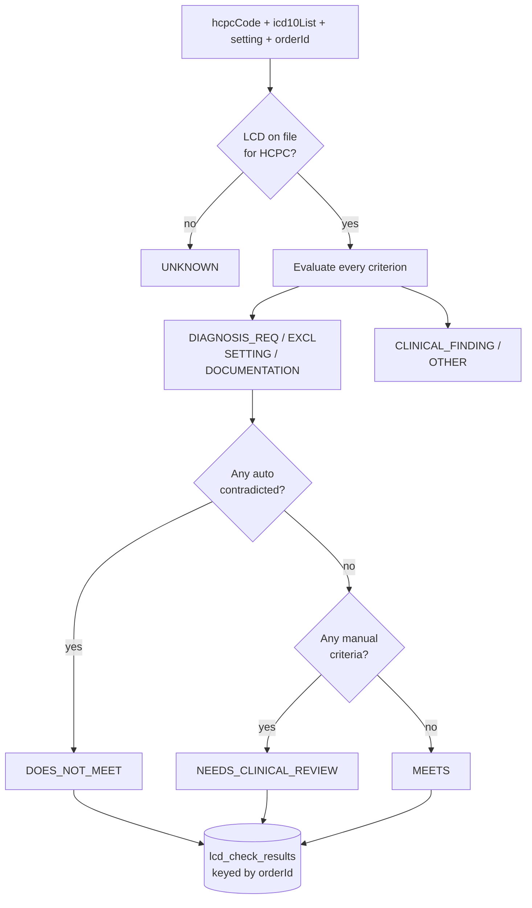

# LCD Coverage Checker

## What it does

The **LCD Coverage Checker** evaluates a proposed DME line — HCPC, ICD-10 codes, care setting, attached docs — against the Medicare Local Coverage Determination (LCD) that applies to that code. It returns one of four decisions and the per-criterion breakdown that drove it:

| Decision | Meaning |
|---|---|
| `MEETS` | Every required criterion evaluated to true → safe to bill Medicare |
| `DOES_NOT_MEET` | At least one required criterion was contradicted (e.g. excluded diagnosis present) → Medicare will deny |
| `NEEDS_CLINICAL_REVIEW` | Some criterion type (typically `CLINICAL_FINDING`) cannot be evaluated automatically — a clinician must verify the chart |
| `UNKNOWN` | No LCD on file for this HCPC, or insufficient data → no opinion |

It's wired into Step 2 of the [DME Order Wizard](./21-dme-order-wizard.md) so that the moment a HCPC is entered, the badge appears next to it. Result rows are also cached against the `orderId` so the wizard or order detail page can re-display without re-running the evaluator.

🛈 **Why front-load coverage?** Medicare DME denials are expensive — the supplier delivers, then bills, then the claim is denied, then the supplier eats the cost or the patient gets balance-billed. Catching `DOES_NOT_MEET` at order intake saves a 30-day rework loop.

## Who uses it

| Persona | Why |
|---|---|
| **Hospital / Provider** ordering DME | Avoid placing an order Medicare will deny |
| **Admin** | Ingest new LCDs from CMS publications, audit the criteria catalog |

## The page

The checker runs **inline inside the wizard** (no standalone page). The catalog management page lives at `/admin/lcd-ingest` (admin-only).

The admin page (`LcdIngest.tsx`) shows:
- **LCD list** — each seeded LCD with its CMS document number, title, applicable HCPCs, and criterion count.
- **Detail panel** — every criterion row: type, ICD-10 list, citation, severity.
- **Ingest tab** — paste a CSV or JSON blob (one criterion per row); the backend upserts and reports row counts.

## Criterion types

| Type | Auto-evaluated? | What it checks |
|---|---|---|
| `DIAGNOSIS_REQUIRED` | Yes | At least one ICD-10 in the row's `icd10_codes` array is on the order |
| `DIAGNOSIS_EXCLUDED` | Yes | None of the listed ICD-10 codes are on the order |
| `SETTING` | Yes | Order's care setting matches (`HOME`, `SNF`, etc.) |
| `DOCUMENTATION` | Yes | The named document type is `RECEIVED` in the order's packet |
| `CLINICAL_FINDING` | **No** — defers to manual review | E.g. "AHI ≥ 15 on diagnostic sleep study" — requires reading the report |
| `OTHER` | No | Defers to manual review |

## Seeded LCDs

| LCD | Title | HCPCs covered |
|---|---|---|
| `L33718` | CPAP and BiPAP | E0601, E0470, related supplies |
| `L33797` | Home Oxygen | E1390, E1391, E0431, E1392, E0434 |
| `L33789` | Power Mobility Devices (PMD) | K0813-K0891 family |
| `L33821` | Hospital Beds and Accessories | E0260, E0265, E0277, E0193 |
| `L33829` | Negative Pressure Wound Therapy | E2402 |

More LCDs can be added via the admin ingester.

## Actions you can take

| Action | What it does | Allowed when |
|---|---|---|
| (auto on HCPC blur) | Fires `POST /api/lcd/check` and renders the badge | wizard step 2 |
| **View criteria** (admin) | Opens the criterion list for an LCD | admin |
| **Ingest CSV / JSON** (admin) | Upserts criteria into `lcd_documents` + `lcd_coverage_criteria` | admin |
| ⚠ **Delete LCD** (admin) | Removes the LCD doc and cascade-deletes criteria | admin (criterion-level orphans on cached results are kept for audit) |

## Workflow

## Common tasks

- See [Create a DME order end-to-end](../workflows/16-create-dme-order-end-to-end.md) for the user-side experience of getting an `MEETS` or `DOES_NOT_MEET` decision.
- Admin: paste a new CMS LCD on the `/admin/lcd-ingest` page using the JSON schema shown in the page's help drawer.

## Permissions

| Action | Resource & level |
|---|---|
| Get a check decision | `orders: READ` (called by the wizard on the user's own draft) |
| Manage the LCD catalog | Admin role only |

## Behind the scenes

- **Service**: `packages/api/src/services/lcdService.ts`.
  - `evaluateLcdCoverage({hcpcCode, icd10List, setting, orderId})` runs the per-criterion evaluator and returns `{decision, citations, byCriterion}`.
  - `ingestLcdJson(payload)` bulk-upserts into `lcd_documents` + `lcd_coverage_criteria`.
- **Routes**: `packages/api/src/routes/lcd.ts`.
  - `POST /api/lcd/check`, `GET /api/lcd/documents`, `GET /api/lcd/documents/:id/criteria`, `POST /api/lcd/ingest`.
- **DB tables**:
  - `lcd_documents` — one row per CMS LCD (number, title, effective dates).
  - `lcd_coverage_criteria` — one row per criterion (type, icd10_codes JSON, citation text).
  - `lcd_check_results` — cached `{orderId, hcpcCode, decision, payload}` so a re-render doesn't re-evaluate.
- **Admin page**: `packages/web/src/features/admin/pages/LcdIngest.tsx`.
- **Deferred**: there is no public machine-readable CMS LCD feed. The ingester is ready; loading the data is currently a one-time manual job per LCD.

## Related

- [DME Order Wizard](./21-dme-order-wizard.md)
- [CMS PA-Required HCPC List](./24-cms-pa-required-list.md)
- [Prior Authorizations](./06-prior-auths.md)
- [DME Document Packet](./22-dme-document-packet.md)
