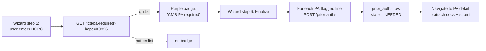

# CMS PA-Required HCPC List

## What it does

CMS publishes a [Required Prior Authorization list](https://www.cms.gov/research-statistics-data-and-systems/monitoring-programs/medicare-ffs-compliance-programs/prior-authorization-initiatives) of DMEPOS HCPC codes for which a supplier **must** submit a prior authorization request to the DME MAC before delivering the item — or the claim is automatically denied. Curavend mirrors that list as a first-class table (`cms_pa_required_hcpcs`) and uses it in two places:

1. **In the [DME Order Wizard](./21-dme-order-wizard.md)**, Step 2: each HCPC line is checked on blur. If it's on the list, a purple badge appears: *"CMS PA required — will auto-create"*.
2. **At wizard finalization (Step 6)**, every flagged line spawns a `prior_auths` row automatically in state `NEEDED`, pre-populated with the patient, payor, member ID, HCPC, ICD-10 codes, and clinical indication from the wizard. The user is then dropped into the [Prior Auth detail page](./06-prior-auths.md) to attach docs and submit.

This means a hospital staffer never has to remember which codes need a PA — the platform does.

## Who uses it

| Persona | Why |
|---|---|
| **Hospital / Provider** ordering DME | Get the warning + auto-PA without looking up the list |
| **Admin** | Add or remove codes when CMS updates the list |

## The page

There is no standalone page. The list is managed by an admin via API endpoints (a UI tab is on the roadmap). The PA badge appears inside the [wizard](./21-dme-order-wizard.md).

## Seeded codes (25)

| Family | Codes | Notes |
|---|---|---|
| **Power Mobility Devices** | `K0856`-`K0864`, `K0868`-`K0871`, `K0877`-`K0880`, `K0884`-`K0885` | Group 3 PWCs, multiple-power-option models |
| **Pressure-reducing beds & support surfaces** | `E0193`, `E0277`, `E0371`, `E0372`, `E0373` | Air-fluidized beds, alternating-pressure mattresses |
| **Lumbar-sacral orthoses** | `L0648`, `L0650`, `L0651` | Custom-fitted LSO braces |

This is a starting set covering the high-volume DMEPOS PA categories. The full CMS list shifts periodically — admins should diff against the CMS publication quarterly.

## Actions you can take

| Action | What it does | Allowed when |
|---|---|---|
| (auto on HCPC blur) | Purple "CMS PA required" badge in the wizard | wizard step 2 |
| (auto on Finalize) | Spawns one `prior_auths` row per flagged line in state `NEEDED` | wizard step 6 |
| `GET /api/lcd/pa-required` | Returns the full list (used by the wizard) | any authenticated user |
| `POST /api/lcd/pa-required` (admin) | Adds an HCPC to the list | admin |
| ⚠ `DELETE /api/lcd/pa-required/:hcpc` (admin) | Removes a code — existing PA rows are NOT cancelled, just no new ones spawn | admin |

## Workflow

## Common tasks

- [Create a DME order end-to-end](../workflows/16-create-dme-order-end-to-end.md) — see how the auto-PA fires from the wizard.
- [Process a prior authorization](../workflows/08-process-prior-authorization.md) — what to do with the row once it's created.

## Permissions

| Action | Resource & level |
|---|---|
| Read the list (used by wizard) | any authenticated user |
| Add / remove codes | Admin role only |

## Behind the scenes

- **Table**: `cms_pa_required_hcpcs` — schema in `packages/db/src/schema/cmsLcd.ts`. Columns: `hcpc_code` (PK), `category`, `cms_publication_date`, `notes`, `is_active`.
- **Route**: `packages/api/src/routes/lcd.ts` — endpoints `GET/POST/DELETE /api/lcd/pa-required`.
- **Wizard hook**: `CreateDmeOrder.tsx` step 2 fires `GET /api/lcd/pa-required?hcpc=…` on blur.
- **Auto-create trigger**: `CreateDmeOrder.tsx` step 6 finalize handler iterates HCPC lines, calls `POST /api/prior-auths` per flagged line, then sets `orders.prior_auth_id` (single back-ref to the primary PA) and links the rest via `prior_auth_history` notes.
- **Mirror discipline**: when CMS publishes a list update, paste the new codes into the admin endpoint. Migration `0016_dme_module.sql` seeded the initial 25.

## Related

- [DME Order Wizard](./21-dme-order-wizard.md)
- [LCD Coverage Checker](./23-lcd-coverage-checker.md)
- [Prior Authorizations](./06-prior-auths.md)
- [Process a prior authorization](../workflows/08-process-prior-authorization.md)
