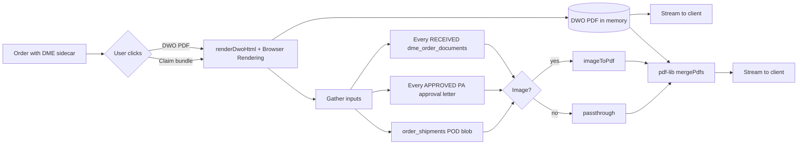

# DWO + Claim Bundle

## What it does

Two related PDF outputs you generate from a DME order:

1. **DWO PDF** (Detailed Written Order) — a single-page CMS-compliant prescription document with all 7 required elements baked in. Used by the prescribing physician for e-signature before the order ships.
2. **Claim Bundle PDF** — a single merged PDF containing the DWO + every `RECEIVED` document from the [DME Document Packet](./22-dme-document-packet.md) + every PA approval letter + the delivery POD. This is the artifact a billing team uploads to the payor's claim portal.

Both render server-side using Cloudflare's Browser Rendering binding (for the DWO HTML → PDF step) and `pdf-lib` (for merging). Images (PNG/JPG wound photos, JPG PODs) are converted to single-page PDFs via `imageToPdf` before being merged.

## Who uses it

| Persona | Why |
|---|---|
| **Provider** prescribers | Download DWO, e-sign, return |
| **Hospital** intake / billing | Generate DWO for physician sign-off; generate the claim bundle for payor submission |
| **Vendor** suppliers | Reference the DWO and POD in their own delivery / billing systems |

## The page

Both PDFs are triggered from the **DME Document Packet** header on the order detail page (`/supply-orders/:id`).

- **DWO PDF** button — always enabled once the wizard sidecar data exists. Opens `/api/dme-bundle/{orderId}/dwo.pdf` in a new tab.
- **Claim bundle** button — enabled when every document row is `RECEIVED` (otherwise warns the user with a confirm dialog listing what's missing). Opens `/api/dme-bundle/{orderId}/claim-bundle.pdf` in a new tab.

🛈 **Why server-side?** Browser-side PDF assembly would expose every signed-doc URL to the client, and pdf-lib is heavy. The Worker reads R2 with its own service binding, merges in memory, and streams the result.

## The 7 CMS-required DWO elements

The DWO HTML template renders all seven mandatory elements per CMS regulations:

| # | Element | Source |
|---|---|---|
| 1 | **Beneficiary name + DOB + Medicare ID** | order patient fields |
| 2 | **Description of item(s) + quantity + HCPC** | order_items rows |
| 3 | **Treating practitioner name + NPI** | order's clinical contact |
| 4 | **Date of the order** | order.createdAt |
| 5 | **Signature line for the practitioner** | rendered as a blank box |
| 6 | **Reason for the item (clinical indication)** | dme_order_extensions.clinicalIndication |
| 7 | **Length of need (months)** | dme_order_extensions.lengthOfNeedMonths |

## What goes into the claim bundle

The merge order is fixed:

1. **DWO** (always — rendered on the fly)
2. **Every `RECEIVED` row** from `dme_order_documents` in document-type sort order — Face-to-Face, sleep study, oximetry, LMN, progress notes, photos, AOB
3. **Every PA approval letter** — pulled from `prior_auths.approval_document_blob_key` for PAs on this order in state `APPROVED`
4. **Delivery POD** — pulled from `order_shipments.proof_of_delivery_blob_key` if present

Images are inlined as single-page A4 PDFs (Letter, 0.5" margin). The final PDF has the order number as filename: `{orderNumber}-claim-bundle.pdf`.

## Actions you can take

| Action | What it does | Allowed when |
|---|---|---|
| **DWO PDF** | GET `/api/dme-bundle/:orderId/dwo.pdf` → opens in new tab | sidecar exists (always, post-wizard) |
| **Claim bundle** | GET `/api/dme-bundle/:orderId/claim-bundle.pdf` → opens in new tab | warns if packet incomplete; admin can force-download anyway |
| **Email DWO** (roadmap) | Send DWO to prescriber's NPI-registered email | not yet implemented |

## Workflow

## Common tasks

- [Generate a DME claim bundle](../workflows/18-generate-dme-claim-bundle.md) — the user-facing recipe.
- [Upload the DME document packet](../workflows/17-upload-dme-document-packet.md) — what to do *before* hitting the Claim bundle button.

## Permissions

| Action | Resource & level |
|---|---|
| Download DWO | `orders: READ` |
| Download claim bundle | `orders: READ` (logs to `phi_access_log` because the bundle contains PHI) |
| Force-download with incomplete packet | `orders: FULL` |

## Behind the scenes

- **Template service**: `packages/api/src/services/dmeDwoTemplate.ts` exports `renderDwoHtml({order, extension, items, prescriber})` returning print-styled HTML for `@page Letter`.
- **Route file**: `packages/api/src/routes/dmeBundle.ts`.
  - `GET /api/dme-bundle/:orderId/dwo.pdf` → calls `renderHtmlToPdf(c.env.BROWSER, html)`.
  - `GET /api/dme-bundle/:orderId/claim-bundle.pdf` → calls the DWO renderer, gathers blob keys, fetches each from R2, normalizes images via `imageToPdf`, merges via `mergePdfs` (pdf-lib).
- **PDF service** (existing): `pdfService.ts` provides `renderHtmlToPdf`, `mergePdfs`, `imageToPdf`.
- **Audit**: every claim-bundle download writes a `phi_access_log` row (`action=DOWNLOAD_CLAIM_BUNDLE`).
- **Bundle size**: tested up to 35 MB on the Worker — Browser Rendering and pdf-lib both stay within the 128 MB Worker memory budget for reasonable DME packets.

## Related

- [DME Document Packet](./22-dme-document-packet.md)
- [DME Order Wizard](./21-dme-order-wizard.md)
- [Prior Authorizations](./06-prior-auths.md)
- [Orders](./02-orders.md)
- [Generate a DME claim bundle](../workflows/18-generate-dme-claim-bundle.md)
