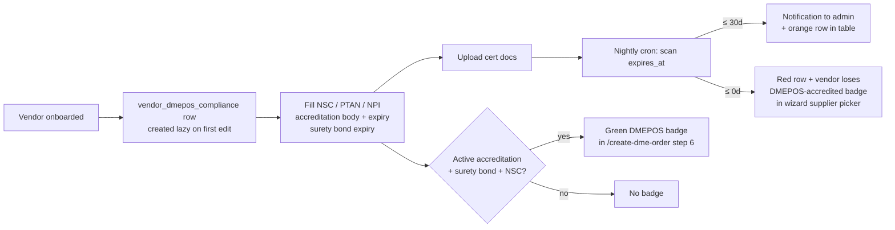

# DMEPOS Compliance Tracker

## What it does

The **DMEPOS Compliance Tracker** is the admin page where Curavend records and monitors every DME supplier's Medicare DMEPOS credentials — the things CMS requires a supplier to hold and renew to be allowed to bill Medicare for durable medical equipment, prosthetics, orthotics, and supplies.

For each vendor it tracks the singleton fields (NSC number, PTAN, NPI, accreditation body + expiry, surety bond expiry) plus a long list of cert documents (CMS Accreditation, Surety Bond, NSC card, PTAN letter, NPI confirmation, Joint Commission / ACHC / BOC accreditation letters, etc.) each with its own expiration date. Expiring or expired credentials raise alerts.

The tracker drives the **DMEPOS-accredited** badge shown on the supplier picker in Step 6 of the [DME Order Wizard](./21-dme-order-wizard.md) — vendors with no accreditation row or with an expired one don't get the badge.

🛈 **Why CMS cares.** A Medicare DME claim from a supplier whose accreditation has lapsed is automatically denied. Catching expiries 30/60/90 days out gives operations time to renew before claims start bouncing.

## Who uses it

| Persona | Why |
|---|---|
| **Admin** | Maintain the compliance roster, upload cert docs, watch expiry alerts |
| **Vendor** (read-only, roadmap) | See their own compliance status on their profile |

## The page

**Sidebar →** Admin → DMEPOS Compliance. Route is `/admin/dmepos-compliance` (admin-only).

- **Top KPI strip** — 4 stat cards: Accredited vendors, Expiring in 30 days, Expired, Missing core IDs.
- **Vendor table** — one row per vendor. Columns: vendor name, accreditation body (`JOINT_COMMISSION` / `ACHC` / `BOC` / `CHAP` / `OTHER`), accreditation expiry (color-coded: red ≤ 0d, orange ≤ 30d, yellow ≤ 90d, green > 90d), surety bond expiry, NSC #, PTAN, NPI, doc-count badge.
- **Detail drawer** opens on row click with two tabs:
  - **Singletons** — editable form for the core fields (NSC, PTAN, NPI, accreditation body, accreditation expiry, surety bond expiry).
  - **Cert documents** — table of `vendor_compliance_docs` with cert-type tag, expiry, file link, upload / replace buttons.

## Cert document types (12)

| Type | What it is |
|---|---|
| `CMS_ACCREDITATION` | CMS-recognized accreditation letter |
| `SURETY_BOND` | $50,000 surety bond per DMEPOS Quality Standards |
| `NSC` | National Supplier Clearinghouse card |
| `PTAN` | Provider Transaction Access Number letter |
| `NPI` | NPPES NPI confirmation |
| `JOINT_COMMISSION` | TJC accreditation |
| `ACHC` | Accreditation Commission for Health Care |
| `BOC` | Board of Certification / Accreditation |
| `CHAP` | Community Health Accreditation Partner |
| `STATE_LICENSE` | State DME license (per state) |
| `INSURANCE_COI` | General liability + product liability COI |
| `OTHER` | Anything else (ad-hoc) |

## Actions you can take

| Action | What it does | Allowed when |
|---|---|---|
| **Edit singletons** | PUT the vendor's row in `vendor_dmepos_compliance` | admin |
| **Upload cert doc** | POST a file to R2 (`vendor-compliance/{vendorId}/…`), insert a `vendor_compliance_docs` row with `cert_type`, `effective_date`, `expires_at` | admin |
| **Replace cert doc** | Insert a new row (the old one stays in audit) | admin |
| ⚠ **Delete cert doc** | Hard-delete; audit log keeps the trail | admin |
| **View file** | Generates a short-lived R2 download URL | admin |
| **Export CSV** | Download the entire compliance roster for renewal planning | admin |

## Workflow

## Common tasks

- Maintaining the roster is part of normal admin work — there's no dedicated workflow doc. Open the page once a week.
- For a brand-new vendor, fill the singletons first; the row is created lazy on first edit (you don't need to "create a compliance record" — touching any field does it).
- When CMS sends a renewal notice, upload the new doc; the old row stays for audit.

## Permissions

| Action | Resource & level |
|---|---|
| View / edit | Admin role only |
| (Roadmap) vendor self-service read | Vendor admin on own row |

## Behind the scenes

- **Page**: `packages/web/src/features/admin/pages/DmeposCompliance.tsx`.
- **Routes**: `packages/api/src/routes/dmeposCompliance.ts`.
  - `GET /api/dmepos-compliance` (admin roster), `GET /:vendorId`, `PUT /:vendorId` (upsert singletons), `POST /:vendorId/docs`, `GET /:vendorId/docs`, `DELETE /docs/:docId`.
- **DB tables**:
  - `vendor_dmepos_compliance` — 1:1 sidecar with `vendors`. Avoids widening the `vendors` table further.
  - `vendor_compliance_docs` — long-form per-cert files with `cert_type`, `effective_date`, `expires_at`, `blob_key`.
- **Wizard integration**: the DME wizard's Step 6 supplier picker joins on `vendor_dmepos_compliance` and renders the badge when `accreditation_expires_at > now()` AND `surety_bond_expires_at > now()` AND `nsc_number IS NOT NULL`.
- **Expiry sweep**: piggy-backs on the existing daily `expiryNotifier` cron (08:00 UTC) — same one that handles contract and user-credential expiries.

## Related

- [DME Order Wizard](./21-dme-order-wizard.md) — supplier picker uses the badge from this table.
- [Onboard a new vendor](../workflows/01-onboard-a-vendor.md) — broader vendor lifecycle; DMEPOS fields are added after the base vendor is created.
- [Contracts & Pricing](./10-contracts-pricing.md)
