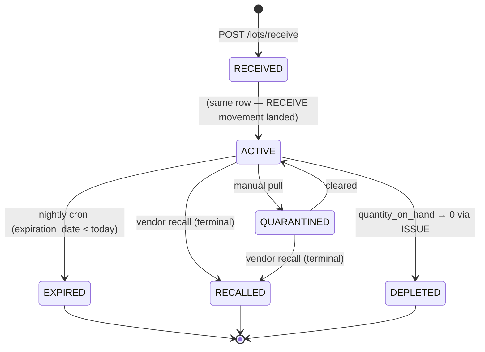

# Lab Inventory

## What it does

**Lab Inventory** is Curavend's per-site, per-lot stock ledger for everything a clinical lab consumes day-to-day — reagents, controls, calibrators, swabs, tubes, pipette tips, plates, PPE, cleaning supplies, and full test kits. Each item from the **lab consumable catalog** can have many physical lots in the warehouse, and each lot is pinned to a kit site, a lot number, an expiration date, and a status.

Inventory drives three things downstream:

1. The **FEFO** (first-expired-first-out) issuance engine that consumes stock when a lab test is run.
2. The [usage-based forecasting + auto-replenishment cron](./28-lab-forecasting.md) that watches reorder points and spins up requisitions automatically.
3. The recall / quarantine workflow that pulls a bad lot from active rotation without losing the audit trail.

## Who uses it

| Persona | Why |
|---|---|
| **Lab** account managers + CSRs | Receive new lots, issue stock against test runs, quarantine suspect material |
| **Hospital** supply chain | See on-hand by site before approving lab requisitions |
| **Admin** | Maintain the consumable catalog, adjust on-hand for cycle counts, view recall history |

See the [Lab persona quick-start](../personas/lab.md) for the bigger picture of how this page fits with **Lab Orders**, **Kit Sites**, and **Lab Groups**.

## The page

Inventory lives at **`/labs/inventory`** and uses a **two-pane** layout. The component is `LabInventoryPage` (`packages/web/src/features/labs/pages/LabInventory.tsx`).

- **Header strip** — title, **Refresh**, **Add item**, **Receive lot**, **Issue (FEFO)** buttons.
- **4 KPI tiles** across the top:
  - **SKUs tracked** — distinct catalog items with at least one lot at the selected site.
  - **Out of stock** — items whose total on-hand has fallen to or below `min_threshold` (red when > 0).
  - **Below reorder point** — items where on-hand ≤ `reorder_point` but still above min (orange).
  - **Lots expiring in 30d** — count of ACTIVE lots whose `expiration_date` is within 30 days.
- **Left pane — Kit sites** — one card per site from `/labs/kit-sites`. Clicking a card scopes the right pane to that site. Active site has a blue border.
- **Right pane — 5 tabs**:
  - **Stock summary** — one row per (consumable × site) with total on-hand, days-to-oldest-expiration, and status pills (OOS RISK / REORDER / EXPIRING). Filters by category + free-text search.
  - **All lots** — every lot at the selected site with lot #, on-hand, expiration, status badge.
  - **Expiring (30d)** — global view across all sites of lots in the 30-day window.
  - **Reorder needed** — pre-filtered summary showing only items at or below `reorder_point` — what the auto-replen cron will act on tonight.
  - **Item master** — the underlying `lab_consumables` catalog with category, hazard class, UOM, min/reorder/max thresholds.

## Actions you can take

| Action | What it does | Allowed when |
|---|---|---|
| **Add item** | Creates a row in `lab_consumables`. Required: `itemCode`, `description`, `category`. Optional: hazard class, storage temp range, UOM, min/reorder/max, units-per-case, preferred vendor, default unit price, requires-lot-tracking. | Lab role (`LAB_ACCOUNT_MANAGER` / `LAB_ACCOUNT_MANAGER_USER`) or Admin |
| **Receive lot** | `POST /lab-inventory/lots/receive`. Picks (item × site × lot #) and either creates a new lot row or tops up an existing one with the same lot #. Stamps `RECEIVE` movement. | Lab or Admin |
| **Issue (FEFO)** | `POST /lab-inventory/issue`. Consumes `quantity` from the oldest non-expired `ACTIVE` lot first; may span multiple lots. Records `ISSUE` movements + decrements `quantity_on_hand`. | Lab or Admin |
| **Transfer** | `POST /lab-inventory/transfer`. Inter-site move; writes paired `TRANSFER_OUT` + `TRANSFER_IN` movements and creates a new lot row at the destination site. | Lab or Admin |
| **Quarantine** | Flips a lot to `QUARANTINED` (pulled from active rotation, on-hand preserved). Reversible. | Lab or Admin |
| ⚠ **Recall** | Flips a lot to `RECALLED` (permanent — vendor / manufacturer notice). Reason required. | Lab or Admin |
| **Adjust** | `POST /lab-inventory/lots/:id/adjust`. Signed quantity delta with mandatory reason (cycle count, breakage, etc.). | `LAB_ACCOUNT_MANAGER` or Admin only |
| **History** | Drawer with the per-lot movement log (`/lab-inventory/movements/lot/:id`). | Anyone with READ |

## Workflow — lot lifecycle

🛈 *Why FEFO and not FIFO?* Lab reagents lose accuracy past expiration even if unopened. Burning down the soonest-to-expire lot first minimizes write-offs. FEFO is enforced in `issueConsumable()` — there is no UI to override which lot to consume from.

## Item categories

| Category | Typical items |
|---|---|
| `REAGENT` | PCR mix, enzyme buffers, stains |
| `CONTROL` | QC controls (positive / negative) |
| `CALIBRATOR` | Instrument calibration material |
| `KIT` | Pre-packaged test kits (multi-component) |
| `SWAB` | NP swabs, throat swabs, dry swabs |
| `TUBE` | EDTA, SST, citrate, transport media |
| `PIPETTE_TIP` | 10 µL / 200 µL / 1000 µL tips |
| `PLATE` | 96-well / 384-well plates |
| `PPE` | Gloves, masks, gowns, face shields |
| `CLEANING` | Bleach, disinfectant wipes |
| `OTHER` | Anything that doesn't fit |

## Common tasks

- [Receive a lab shipment](../workflows/19-receive-lab-shipment.md)
- [Set up a test → consumable recipe](../workflows/20-set-up-test-consumable-map.md)
- [Onboard a new lab](../workflows/11-onboard-a-lab.md)

## Permissions

| Action | Resource & level |
|---|---|
| View inventory + history | Lab role OR Admin |
| Receive / issue / quarantine | Lab role OR Admin |
| Recall | Lab role OR Admin (reason required) |
| Manual adjust | `LAB_ACCOUNT_MANAGER` or Admin only |
| Edit item master | Lab role OR Admin |

## Behind the scenes

- **Component**: `packages/web/src/features/labs/pages/LabInventory.tsx`.
- **Service**: `packages/api/src/services/labInventoryService.ts`.
  - `recordMovement()` — append-only audit row + `quantity_on_hand` patch in a single logical step. Auto-flips `ACTIVE → DEPLETED` when `qty` hits 0.
  - `issueConsumable()` — pulls all `ACTIVE` lots for the (consumable, site) pair, sorts ascending by `expiration_date`, then iteratively decrements until the request is filled. Throws `Insufficient` if total on-hand < requested.
  - `receiveLot()` — upserts on `(consumableId, siteId, lotNumber)` and writes a `RECEIVE` movement. Same function is called by the GRN posting path (see [Goods Receipts](./07-goods-receipts.md)).
  - `getSiteSummary()` aggregates lots per (consumable, site) and computes flags: `belowMin`, `belowReorderPoint`, `hasExpiringSoon` (30d), `hasExpiredLot`.
- **Routes**: `packages/api/src/routes/labInventory.ts` mounts `/api/lab-inventory/*` with consumable CRUD, lot CRUD, issue / transfer / adjust / quarantine / recall, summary, reorder-candidates, expiring, forecast, movement history, and the test-consumables map.
- **DB tables**: `lab_consumables` (item master), `lab_inventory_lots` (per-lot stock), `lab_stock_movements` (append-only audit), `lab_kit_sites` (location list).
- **Movement types**: `RECEIVE`, `ISSUE`, `ADJUST`, `EXPIRE`, `TRANSFER_OUT`, `TRANSFER_IN`, `QUARANTINE`, `RECALL`. Every row records `quantity` (signed) and `quantity_after` for rebuild-from-log.
- **Cron hooks** (daily 08:00 UTC):
  - `handleLabExpiration` — flips `ACTIVE → EXPIRED` for any lot past its `expiration_date` and emits 30/60/90-day window counts.
  - `handleLabAutoReplenishment` — see [Lab forecasting](./28-lab-forecasting.md).
- **GRN integration**: when a goods receipt is posted and a line's `hcpcCode` matches a `lab_consumables.itemCode`, the API auto-calls `receiveLot()` so the new lot shows up in inventory without a second data entry.

## Related

- [Lab Forecasting + Auto-Replenishment](./28-lab-forecasting.md)
- [Order Backorders](./29-backorders.md)
- [Goods Receipts](./07-goods-receipts.md)
- [Requisitions](./03-requisitions.md)
- [Approvals queue](./05-approvals.md)
- [Lab persona](../personas/lab.md)
- Recipes: [Receive a lab shipment](../workflows/19-receive-lab-shipment.md), [Set up test consumable map](../workflows/20-set-up-test-consumable-map.md)
