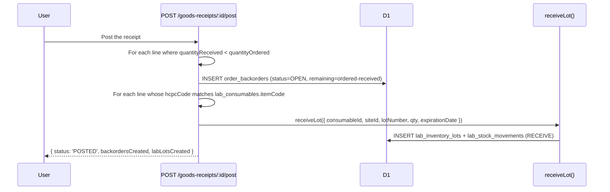
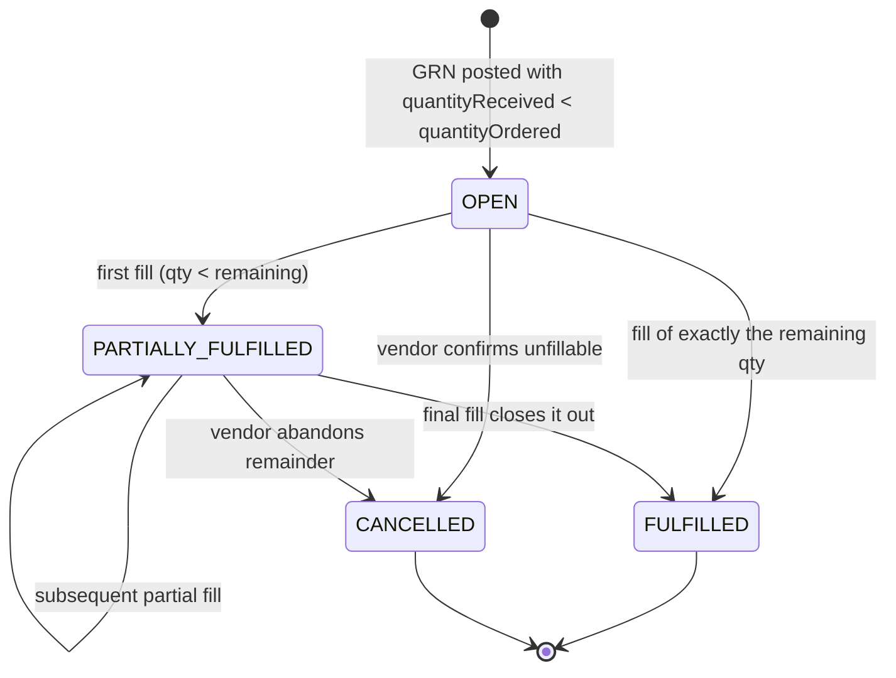

# Order Backorders

## What it does

When a vendor under-delivers — ships 80 of the 100 swabs you ordered — Curavend auto-spawns a **backorder line** on the parent order recording exactly what's still owed. The backorder is the canonical "we are still waiting for X" record: hospitals see it in the order detail, vendors update it with expected fulfillment dates, and partial fills get recorded against it until the remaining quantity hits zero.

The system was built for the [Lab Consumables Replenishment](./27-lab-inventory.md) flow but applies to **any** supply order — DME, biologics, wound care, lab. It hangs off the [Goods Receipts](./07-goods-receipts.md) posting path.

## Who uses it

| Persona | Why |
|---|---|
| **Hospital** receiving + supply chain | See what's still owed, edit expected dates, record partial fills as they trickle in |
| **Vendor** account managers | Update expected fulfillment date + vendor reference (their internal back-order #) |
| **Admin** | Cancel stale backorders, troubleshoot why a line auto-spawned |
| **Lab** managers | Same as hospital — backorders on lab consumables block their FEFO availability |

## The page

Backorders are not their own page — they render as the **Backorders** panel on the **order detail** page (`/supply-orders/:id`) just below the [DME Document Packet](./22-dme-document-packet.md). The panel **auto-hides** when there are no backorder rows for that order.

- **Header strip** — warning icon (red when any are open, green when all are fulfilled), the title **Backorders**, and pills showing `N open` + `M fulfilled` counts.
- **Table columns**:
  - **HCPC / Code** — copied from the goods-receipt line.
  - **Description** — copied from the goods-receipt line.
  - **Ordered** — original PO quantity.
  - **Received** — cumulative quantity received so far (including the originating GRN).
  - **Remaining** — bold + red if > 0, green if 0.
  - **Status** — colour-coded badge (see below).
  - **Expected** — inline date picker; saves on change via `PUT /backorders/:id`. Disabled when status is `FULFILLED` or `CANCELLED`.
  - **Vendor ref** — vendor's own back-order ticket number (free text).
  - **Actions** — **Fill** (primary) and **Cancel** (danger), hidden once the row is terminal.

## Statuses

| Status | Meaning |
|---|---|
| `OPEN` | Auto-spawned by GRN posting; nothing has been received against the backorder line yet. Default for new rows. |
| `PARTIALLY_FULFILLED` | At least one fill recorded but `quantityRemaining > 0`. |
| `FULFILLED` | `quantityRemaining == 0`. Terminal — no further fills or edits. |
| `CANCELLED` | Cancelled by hospital or admin (vendor confirmed they cannot ship). Terminal. |

## Actions you can take

| Action | What it does | Allowed when |
|---|---|---|
| **Fill** | `POST /api/backorders/:id/fulfill` with `{ quantity, notes? }`. Increments `quantityReceived`, decrements `quantityRemaining`. Auto-flips status to `PARTIALLY_FULFILLED` (if remaining > 0) or `FULFILLED` (if remaining == 0). Will reject if the fill would exceed `quantityOrdered`. | Row status is `OPEN` or `PARTIALLY_FULFILLED` |
| **Cancel** | `POST /api/backorders/:id/cancel`. Flips status to `CANCELLED`. | Any non-terminal status |
| **Edit Expected date** | `PUT /api/backorders/:id` with `{ expectedFulfillmentDate }` | Non-terminal |
| **Edit Vendor ref** | `PUT /api/backorders/:id` with `{ vendorReference }` | Non-terminal |
| **Edit Notes** | `PUT /api/backorders/:id` with `{ notes }` | Non-terminal |

⚠ There is **no delete**. A wrongly-spawned backorder should be `CANCELLED` — the audit trail is preserved.

## GRN integration — how a backorder gets born

The auto-spawn happens inside `POST /api/goods-receipts/:id/post`:

The response from the post call includes `backordersCreated` + `labLotsCreated` counts so the UI can show "3 backorders opened, 2 lab lots received" as a toast.

🛈 *Why auto-spawn instead of asking the user?* In the old system, half the time the receiving clerk forgot to log the shortage and the missing inventory was only noticed weeks later during a stock-out. Auto-spawn closes the loop at the moment of receipt.

## Workflow — from PO to backorder closure

## Permissions

| Action | Resource & level |
|---|---|
| View backorders on an order | `orders: READ` |
| Edit expected / vendor ref / notes | `orders: WRITE` |
| Record a fill | `orders: WRITE` |
| Cancel | `orders: WRITE` (admins recommended) |

## Behind the scenes

- **Component**: `packages/web/src/features/supplyOrderDetail/components/BackordersPanel.tsx`.
- **Routes**: `packages/api/src/routes/backorders.ts` mounts `/api/backorders/*`:
  - `GET /` — list (defaults to `status=OPEN`)
  - `GET /order/:orderId` — all backorders for one order
  - `PUT /:id` — patch `expectedFulfillmentDate` / `vendorReference` / `notes`
  - `POST /:id/fulfill` — record a fill; validates `newReceived ≤ quantityOrdered`
  - `POST /:id/cancel`
- **Spawn site**: `packages/api/src/routes/goodsReceipts.ts` → `POST /:id/post`. Iterates `goods_receipt_lines`; for any line where `quantityReceived < quantityOrdered`, inserts an `order_backorders` row.
- **DB table**: `order_backorders` (`id`, `orderId`, `hcpcCode`, `itemCode`, `description`, `quantityOrdered`, `quantityReceived`, `quantityRemaining`, `status`, `expectedFulfillmentDate`, `vendorReference`, `notes`, timestamps).
- **No retry / re-spawn**: subsequent GRNs against the same order *will not* re-create backorders for already-tracked lines. Update the existing one via **Fill** instead.

## Related

- [Goods Receipts](./07-goods-receipts.md) — where backorders are spawned
- [Lab Inventory](./27-lab-inventory.md) — sister auto-receive flow
- [Lab Forecasting + Auto-Replenishment](./28-lab-forecasting.md)
- [Orders](./02-orders.md)
- [3-Way Match](./08-three-way-match.md) — backorders interact with invoice matching
- Recipes: [Record a goods receipt](../workflows/04-record-goods-receipt.md), [Receive a lab shipment](../workflows/19-receive-lab-shipment.md)
