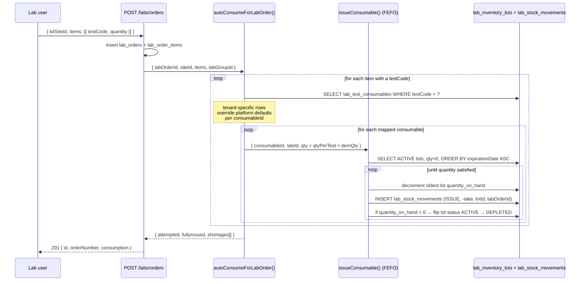
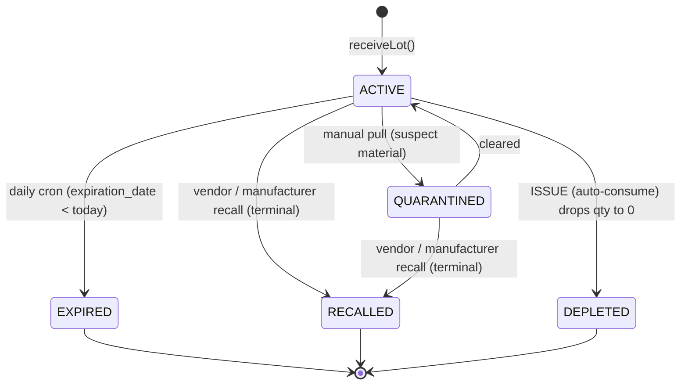

# Lab Auto-Consumption

## What it does

**Auto-consumption** is the silent piece of plumbing that decrements lab inventory the instant a lab order is created. The lab admin doesn't have to remember to "issue" the swab, the VTM, the PCR mix, the pipette tips, or the PPE that the test will burn — Curavend walks the recipe behind the test code, picks lots **FEFO** (first-expired-first-out), writes one `ISSUE` movement per lot it touches, and surfaces any shortages in the lab order's create response so the user can react.

The function lives at `autoConsumeForLabOrder()` in `packages/api/src/services/labInventoryService.ts` and is wired into `POST /labs/orders` in `packages/api/src/routes/labs.ts`.

🛈 *Why is this non-blocking?* A clinical test still has to run even when something on the consumable list is short. Curavend treats inventory as a **warning surface**, not a gate — the lab order succeeds, the shortage is reported, and the [daily auto-replenishment cron](./28-lab-forecasting.md) picks the low-stock signal up the next morning and writes a requisition.

## Who uses it

| Persona | Why |
|---|---|
| **Lab** account managers + CSRs | See the shortage warnings on every new lab order; act on critical-flag shortages immediately |
| **Hospital** supply chain | Trust that on-hand counts at `/labs/inventory` reflect reality without manual issuance |
| **Admin** | Audit any consumption decision via [`/labs/audit`](../workflows/21-audit-stock-movements.md) |

## The page

Auto-consumption has **no page of its own** — it's a service hook. You see its effects in three places:

- **`POST /labs/orders` response** — when a lab order is created, the JSON response includes a `consumption` object with `{ attempted, fullyIssued, shortages[] }`.
- **`/labs/inventory`** — the **All lots** tab shows decremented `quantityOnHand` per lot the moment the order is saved. The **Stock summary** KPI tiles update accordingly.
- **`/labs/audit`** — every underlying `ISSUE` movement is searchable by `relatedLabOrderId` (see [audit recipe](../workflows/21-audit-stock-movements.md)).


## Actions you can take

There are no buttons — auto-consumption is implicit. The actions a user takes are **upstream**:

| Action | What it triggers downstream |
|---|---|
| Create a lab order with a `testCode` + `kitSiteId` | FEFO consumption against every consumable mapped to that test |
| Edit the [test → consumable map](../workflows/20-set-up-test-consumable-map.md) | Future orders consume the new recipe; past orders unchanged |
| Receive a new lot at the kit site | Future FEFO calls will pick the soonest-expiring lot, which may now be this one |
| Quarantine / recall a lot | That lot is skipped by FEFO — it's no longer `ACTIVE` |

## Workflow — auto-consume sequence



🛈 *Tenant vs platform mappings.* `lab_test_consumables` rows can be platform-wide (`labGroupId = null`) or tenant-specific (`labGroupId = '<groupId>'`). The auto-consumer iterates all matches for the `testCode` and **prefers the tenant row when one exists** for the same consumable, so a lab can override the default recipe without forking the catalog.

## Workflow — lot lifecycle (where ISSUE fits)



## Common tasks

- [Set up a test → consumable recipe](../workflows/20-set-up-test-consumable-map.md) — without a recipe, nothing auto-consumes
- [Receive a lab shipment](../workflows/19-receive-lab-shipment.md) — so FEFO has lots to draw from
- [Audit stock movements](../workflows/21-audit-stock-movements.md) — to trace what a specific lab order consumed

## Reading the `consumption` block

The `POST /labs/orders` response includes:

```json
{
  "id": "ord_...",
  "orderNumber": "LAB-2026-049217",
  "consumption": {
    "attempted": 4,
    "fullyIssued": 3,
    "shortages": [
      {
        "testCode": "87635",
        "consumableId": "lc_pcr_mix_5x",
        "consumableCode": "PCR-MM-5X",
        "requested": 25,
        "issued": 10,
        "short": 15,
        "isCritical": true
      }
    ]
  }
}
```

| Field | Meaning |
|---|---|
| `attempted` | How many distinct (consumable × test) issue attempts ran |
| `fullyIssued` | How many of those were fully satisfied from on-hand stock |
| `shortages[].short` | Units we could **not** find a lot for |
| `shortages[].isCritical` | Mirrors the `is_critical` flag from `lab_test_consumables` — surface these prominently in UI |

⚠ *Critical-flag shortages* mean the test cannot reliably be run without that consumable (e.g. the master mix for a PCR). The UI should escalate these to a red alert, not a yellow toast.

## Permissions

| Action | Resource & level |
|---|---|
| Create a lab order (which triggers auto-consume) | `LAB_ACCOUNT_MANAGER` / `LAB_ACCOUNT_MANAGER_USER` or Admin with `lab-orders` WRITE |
| View the resulting movement rows | Anyone with `lab-inventory` READ (Lab / Hospital / Admin) |
| Roll back a bad consumption | Manual `ADJUST` from `/labs/inventory` — Lab Account Manager or Admin only |

## Behind the scenes

- **Service**: `autoConsumeForLabOrder()` in `packages/api/src/services/labInventoryService.ts`.
- **Route hook**: end of `POST /labs/orders` in `packages/api/src/routes/labs.ts` — wrapped in `try / catch` so a consumption failure never breaks the lab order insert.
- **Recipe lookup**: `SELECT * FROM lab_test_consumables WHERE testCode = ?`; in-memory dedupe by `consumableId` with tenant wins over platform-default.
- **Quantity math**: `requested = ceil(qtyPerTest × item.quantity)` — partial units are rounded up because lots are issued in integer UOM (a swab is 1, you can't issue 0.4 of a swab).
- **FEFO**: `issueConsumable()` filters `status = 'ACTIVE' AND quantity_on_hand > 0`, orders by `expiration_date ASC NULLS LAST` then `received_at ASC`, then iteratively decrements. May span multiple lots.
- **Audit rows**: every decrement writes one `lab_stock_movements` row with `movement_type = 'ISSUE'`, `quantity = -take`, `related_lab_order_id = <labOrderId>`, and `quantity_after`. Rebuildable from the log.
- **Auto-deplete**: `recordMovement()` flips `ACTIVE → DEPLETED` when `quantity_on_hand` hits zero so the lot drops out of future FEFO scans.
- **Failure modes**: insufficient stock or any thrown error is **caught** and recorded in the `shortages[]` array — the lab order still returns `201`. The only thing that breaks order creation is a malformed payload upstream of this hook.
- **Cron handoff**: the morning after a shortage, `handleLabAutoReplenishment` (see [forecasting](./28-lab-forecasting.md)) scans `getReorderCandidates()` and writes `SUBMITTED` requisitions for any consumable now at or below reorder point. Auto-consume → low stock → auto-replen is the full closed loop.

## Related

- [Lab Inventory](./27-lab-inventory.md)
- [Lab Forecasting + Auto-Replenishment](./28-lab-forecasting.md)
- [Order Backorders](./29-backorders.md)
- [Lab persona](../personas/lab.md)
- Recipes: [Set up a test → consumable recipe](../workflows/20-set-up-test-consumable-map.md), [Audit stock movements](../workflows/21-audit-stock-movements.md), [Receive a lab shipment](../workflows/19-receive-lab-shipment.md)
