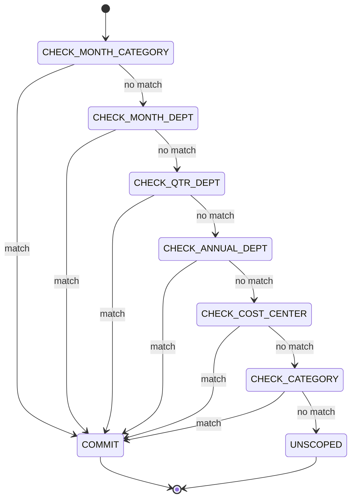
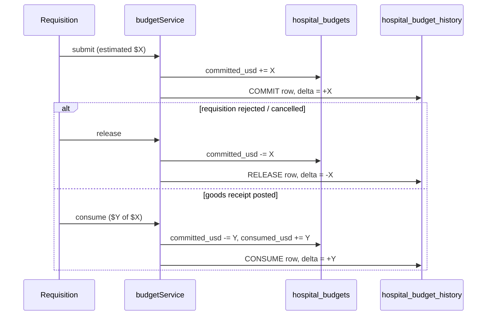

# Hospital Budgets

## What it does

**Hospital Budgets** is Curavend's encumbrance-accounting layer for procurement. A hospital sets an annual (or quarterly / monthly) spending ceiling for a department, cost center, or category, and every requisition that submits against that scope automatically nibbles the budget — first as a **commitment** (the money is set aside while the order is being approved and fulfilled), then as **consumption** (the money is actually gone once the goods arrive).

The page is the operator's view of the underlying ledger. The same numbers drive the [Department Spend](./33-department-spend.md) dashboard and the [GL Ledger](./34-gl-ledger.md).

Three counters per budget row:

- **Amount** — the ceiling set by the hospital (immutable except via **Edit**).
- **Committed** — encumbrance: money set aside by `SUBMITTED` / `IN_REVIEW` / `APPROVED` requisitions that haven't yet posted as receipts.
- **Consumed** — money actually spent (a goods receipt has been posted against the order).
- **Available** = Amount − Committed − Consumed. Goes red when it crosses zero.

## Who uses it

| Persona | Why |
|---|---|
| **Hospital** account managers | Set FY budgets, watch burn, edit ceilings mid-year |
| **Admin** | Set budgets for any hospital, audit encumbrance history, troubleshoot stuck commits |

## The page

Budgets live at **`/admin/budgets`** (route on the **Admin** side; hospital managers see a tenant-scoped variant). The component is `BudgetsPage` (`packages/web/src/features/admin/pages/Budgets.tsx`).


- **Header strip** — title, **FY** picker (defaults to current calendar year), **Refresh**, **New budget**.
- **Info banner** — explains the auto-update behavior.
- **Table** — one row per budget with columns:
  - **FY** — fiscal year integer.
  - **Period** — `ANNUAL` / `Q1`–`Q4` / `M01`–`M12`.
  - **Scope** — department name (resolved from `departmentId`), cost center sub-label, optional category tag.
  - **Amount** / **Committed** / **Consumed** — USD-formatted.
  - **Available** — green if positive, red with leading `−` if over.
  - **Burn** — `(committed + consumed) / amount`, color-coded: green ≤ 80%, orange 81–100%, red > 100%.
  - **Actions** — **Edit** opens the same drawer pre-filled; **Delete** purges the row (history preserved).
- **New / Edit drawer** — `fiscalYear`, `period`, `departmentId`, `costCenter`, `category`, `amountUsd`, `notes`. At least **one** of department, cost center, or category is required.

## The budget model

A budget row is keyed by `(hospitalId, fiscalYear, period, departmentId OR costCenter, optional category)`. The valid periods are:

```
ANNUAL | Q1 Q2 Q3 Q4 | M01 M02 M03 M04 M05 M06 M07 M08 M09 M10 M11 M12
```

A hospital can stack budgets at different grains. For example you might set:

| Period | Scope | Amount | Purpose |
|---|---|---|---|
| `ANNUAL` | dept = **Radiology** | `$500,000` | Catch-all envelope |
| `Q1` | dept = **Radiology** | `$140,000` | Quarter pacing |
| `M03` | dept = **Radiology**, category = `CONTRAST` | `$15,000` | Tight monthly cap on contrast media |

Resolution picks the **narrowest** match.

## Narrowest-match resolution

When a requisition submits, `resolveBudget()` (`packages/api/src/services/budgetService.ts`) walks this precedence list and stops at the first row that exists:

1. `(hospital, FY, period=Mxx, departmentId, category)`
2. `(hospital, FY, period=Mxx, departmentId)`
3. `(hospital, FY, period=Qx, departmentId)`
4. `(hospital, FY, period=ANNUAL, departmentId)`
5. `(hospital, FY, period=ANNUAL, costCenter)`
6. `(hospital, FY, period=ANNUAL, category)`

If nothing matches, the requisition is allowed to submit as **unscoped** (no encumbrance). Hospitals that want every requisition to land against *some* budget should set a catch-all `(ANNUAL, category=GENERAL)` row.



## Encumbrance lifecycle



🛈 *Why a two-stage counter?* Procurement promises money long before it actually leaves. Splitting committed and consumed lets finance see how much is on the hook today (committed) vs how much is provably gone (consumed). When a goods receipt posts, that slice **moves** from committed to consumed in one atomic step — the available number doesn't twitch.

## `?strictBudget=1` requisition flag

By default a requisition that exceeds available budget still submits — Curavend treats the budget as **advisory**. The submitter (and their approver) see a warning, but nothing blocks them.

Append `?strictBudget=1` to the submit call and the API returns **HTTP 409 Conflict** instead, refusing the submission. Wire this on:

- A hospital that wants hard caps for certain user groups.
- A category like `CONTROLLED_SUBSTANCE` where overrun must require an admin override.
- An automation that creates requisitions on a cron and must never overrun.

The check happens in `POST /api/requisitions/:id/submit`:

```
const strict = c.req.query('strictBudget') === '1';
if (row.estimatedTotalUsd > available && strict) {
  throw new ConflictError(`Requisition $X exceeds available $Y (strict mode)`);
}
```

## Common tasks

- Create a new department budget — **`/admin/budgets`** → **New budget**, pick FY + period + departmentId + amount.
- Re-pace mid-year — **Edit** on a row, change **Amount**, save. An `ADJUST` row lands in the history with the delta.
- Inspect why a number moved — `GET /api/budgets/:id/history` returns every `SET` / `COMMIT` / `RELEASE` / `CONSUME` / `REFUND` / `ADJUST` row with `sourceType` + `sourceId`.
- Preview the impact of a future requisition — `POST /api/budgets/check` with `{ hospitalId, departmentId, estimatedTotal }` returns the matching budget and whether it would overrun.

## Permissions

| Action | Role required |
|---|---|
| View budgets | `ACCOUNT_MANAGER` / Admin (all hospitals); `FACILITY_ACCOUNT_MANAGER*` (own hospital only) |
| Create / edit budget | Admin OR hospital manager (their own hospital only) |
| Delete budget | Admin only |
| Read history | Anyone with view access on the budget |
| Check budget (dry-run) | Anyone with view access |

## Behind the scenes

- **Service**: `packages/api/src/services/budgetService.ts` — `resolveBudget()`, `checkBudget()`, `commitBudget()`, `releaseBudget()`, `consumeBudget()`.
- **Routes**: `packages/api/src/routes/budgets.ts` — `GET /`, `POST /`, `PUT /:id`, `DELETE /:id`, `GET /:id/history`, `POST /check`.
- **DB tables**: `hospital_budgets` (one row per budget) and `hospital_budget_history` (append-only audit of every counter change).
- **Tenant scope**: hospital users always filter to `user.hospitalId`; admins can pass `?hospitalId=...`. The route enforces this regardless of what the body claims.
- **Idempotency**: `commitBudget()` is **not** automatically idempotent — submitting the same requisition twice would double-commit. The submit route guards against this by only calling it from the `DRAFT → SUBMITTED` transition.
- **No FK enforcement on `category`**: free-text by design so a hospital can experiment without a migration.
- **Rounding**: counters use `real` (float) — fine for USD at the scale of a hospital but cents may drift across millions of postings. The GL ledger uses the same precision; reconcile against it for the source of truth.

## Related

- [Department Spend](./33-department-spend.md) — dashboard view of these counters
- [GL Ledger](./34-gl-ledger.md) — where PO commitments and invoice approvals post journal entries
- [Requisitions](./03-requisitions.md) — the event that triggers `COMMIT`
- [Goods Receipts](./07-goods-receipts.md) — the event that triggers `CONSUME`
