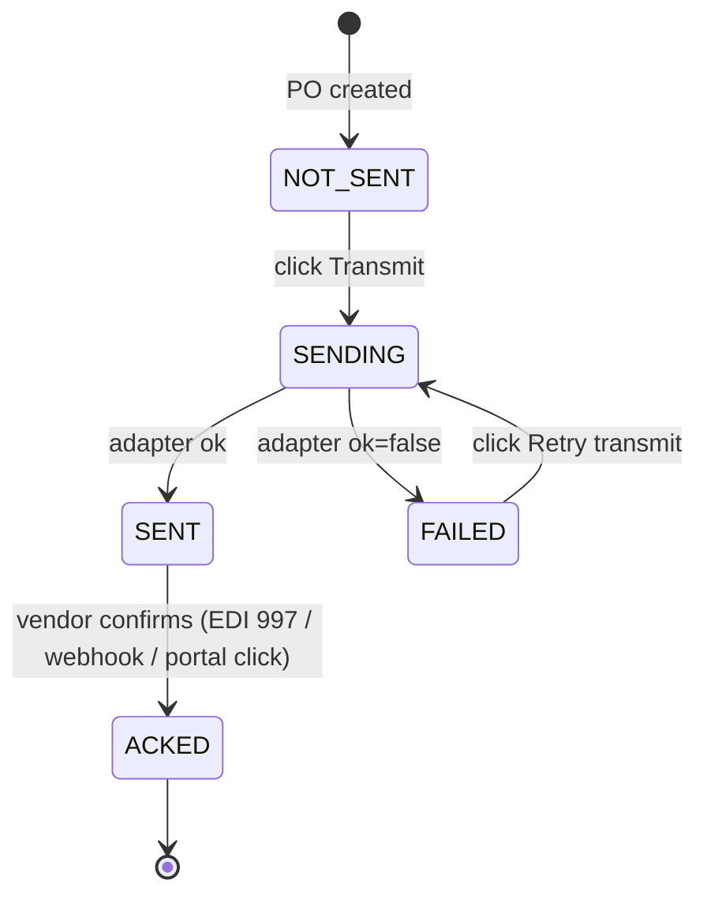
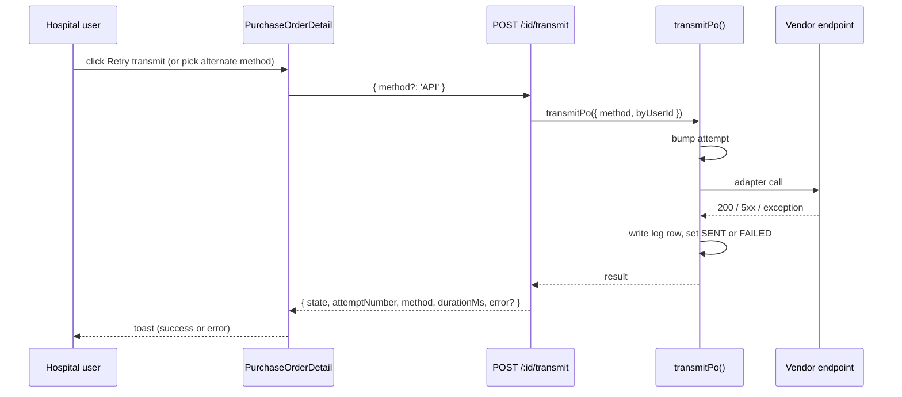

# PO Transmission

## What it does

**PO Transmission** is the layer that gets a purchase order off Curavend's database and onto the vendor's receiving system — by EDI, REST API, cXML PunchOut, email, or self-service portal pickup. The hospital user clicks **Transmit** and the right adapter for that vendor fires, the attempt is logged, and the PO's `transmissionState` advances through a small state machine.

Every successful **first** transmission also posts the encumbrance journal entry to the [GL Ledger](./34-gl-ledger.md) (`PO_COMMIT`). Retries don't re-post.

## Who uses it

| Persona | Why |
|---|---|
| **Hospital** account managers | Click **Transmit** on a converted PO; retry on failure; watch the ACK come back |
| **Vendor** account managers | Receive the PO via whichever channel they configured; click **Mark ACKED** in the portal to confirm receipt |
| **Admin** | Configure vendor delivery preferences, retry failed transmissions for any tenant, audit the log |

## The page

PO transmission controls live on the PO detail page at **`/purchase-orders/:id`**. The component is `PurchaseOrderDetail` (`packages/web/src/features/purchaseOrders/pages/PurchaseOrderDetail.tsx`).

- **Status pill** — colored badge for the current `transmissionState` (see the state machine below).
- **Transmit / Retry transmit** dropdown — primary action. Default click uses the vendor's preferred method; the dropdown menu lets you override per attempt (**EDI**, **API**, **PUNCHOUT**, **EMAIL**, **PORTAL**).
- **Mark ACKED** button — appears once state is `SENT`. Admin or the receiving vendor only.
- **Descriptions panel** — `State`, `Method`, `Attempts`, `Transmitted at`, `ACK at`.
- **Error alert** — when state is `FAILED`, the last `transmissionError` is shown verbatim.
- **Transmission log table** — append-only history of every attempt with `attemptNumber`, `method`, `state`, response status code, error snippet, duration. Pulled from `GET /api/purchase-orders/:id/transmission-log`.

## The 5 adapters

All adapters live in `packages/api/src/services/poTransmissionService.ts` and follow the same contract: `adapter(payload) → { ok, responseStatus?, responseBody?, error? }`.

| Method | What it sends | Endpoint format | Notes |
|---|---|---|---|
| **EDI** | An X12 **EDI 850** envelope built from `ISA*…~ GS*…~ ST*850~ BEG~ PO1~ CTT~ SE~ GE~ IEA~` segments. `POST`s to the vendor's `poTransmissionEndpoint` with `Content-Type: application/EDI-X12`. | URL (VAN bridge / AS2 mailbox) | Stub for MVP — real prod swaps the fetch for a true VAN/AS2 transport |
| **API** | A JSON payload with `poNumber`, `lineItems[]`, totals. `POST`s to the endpoint with optional `Authorization: Bearer <apiKey>` from `poTransmissionCredentials` | URL | Use for vendors that publish a `/purchase-orders/receive` REST endpoint |
| **PUNCHOUT** | A minimal **cXML 1.2 OrderRequest** envelope — Ariba/Coupa/Workday compatible. `POST`s with `Content-Type: application/xml` | URL (procure-to-pay gateway) | Stub assumes the buyer/supplier credentials are fixed on the vendor record |
| **EMAIL** | An HTML body with header info and an items table. Falls back to `vendor.billingEmail` then `vendor.email` if `poTransmissionEndpoint` is blank | email address | MVP renders and reports success; full Resend send is wired through `emailService` |
| **PORTAL** | No outbound transmission. The PO is already visible in the vendor portal; "sending" just records the intent. Always succeeds | n/a | Use for low-volume vendors who log in to pull POs |

## State machine

🛈 *Why isn't SENT terminal?* Lots of integrations confirm receipt asynchronously (an EDI 997 functional ack arrives minutes later; a vendor portal click is even slower). Surfacing `SENT` vs `ACKED` separately lets the buyer know the vendor has actually seen the order, not just that the bytes landed.

## Vendor preference

The transmit endpoint picks the method using this order:

1. **Explicit override** in the request body (`{ method: 'EDI' }`).
2. **Vendor default** — `vendors.preferredPoTransmissionMethod` (`EDI` | `API` | `PUNCHOUT` | `EMAIL` | `PORTAL`).
3. **Fallback** — `EMAIL`.

Two related vendor columns supply adapter-specific config:

| Column | Used by | Format |
|---|---|---|
| `vendors.poTransmissionEndpoint` | EDI / API / PUNCHOUT (URL); EMAIL (recipient) | string |
| `vendors.poTransmissionCredentials` | API (parsed as `{ apiKey }`); cXML / EDI may extend in future | JSON string |

If the chosen adapter requires an endpoint and the vendor hasn't set one, the attempt returns `FAILED` with `"No <method> endpoint configured on vendor"`.

## Audit log

Every attempt — successful or not — writes one row to `po_transmission_log`:

| Column | Meaning |
|---|---|
| `attemptNumber` | Monotonic per-PO counter (`po.transmissionAttempts` post-increment) |
| `method` | Adapter used for this attempt (not necessarily the vendor default) |
| `state` | `SENDING` (in flight) / `SENT` / `FAILED` (terminal) |
| `endpoint` | The URL or address the adapter targeted |
| `requestPayloadSample` | First 500 chars of the rendered payload |
| `responseStatus` | HTTP status from the vendor side, or `null` for adapters that don't make a network call |
| `responseBodySample` | First 500 chars of the response body |
| `errorMessage` | Exception text on `FAILED` |
| `durationMs` | Wall-clock time of the adapter call |
| `startedAt` / `finishedAt` | ISO timestamps |

🛈 *Payloads are truncated.* 500 chars is enough to triage a malformed EDI envelope but won't fill D1 with megabytes of cXML. If you need the full payload for a vendor support ticket, re-transmit with a network capture turned on.

## ACK behavior

The vendor-side acknowledgement is a separate endpoint: `POST /api/purchase-orders/:id/ack`. It flips `SENT → ACKED` and stamps `vendorAckAt`. The route only allows:

- The **receiving vendor** (`user.vendorId === po.vendorId`), or
- An **admin** (any tenant).

Hospital users see the state but cannot ACK their own POs.

In production, you wire ACKs to:

- **EDI 997** functional acknowledgements landing on your EDI ingest endpoint.
- A vendor's webhook on order acceptance.
- A button on the vendor portal page.

## How to retry

A retry simply re-calls the transmit endpoint. No special "retry" path — the state machine moves `FAILED → SENDING → SENT|FAILED` again. Each attempt is an independent log row.

⚠ *Retries do **not** re-post the GL encumbrance.* The check is `if (result.ok && !payload.po.transmittedAt)` — the journal entry posts only when `transmittedAt` is still null, i.e. on the first successful send. A retry that succeeds after a failure also posts (because the failed attempts didn't set `transmittedAt`). A retry of an already-`SENT` PO will **not** double-post.

## Permissions

| Action | Allowed when |
|---|---|
| **Transmit** | Hospital user on a PO for their own hospital, OR admin. Vendor users are blocked (`ForbiddenError`) |
| **Mark ACKED** | The receiving vendor, OR admin |
| **View transmission log** | Anyone with READ on the PO (tenant-scoped) |

## Behind the scenes

- **Service**: `packages/api/src/services/poTransmissionService.ts` — `transmitPo()`, `ackPo()`, plus the 5 adapters.
- **Routes**: `packages/api/src/routes/purchaseOrders.ts` — `POST /:id/transmit`, `POST /:id/ack`, `GET /:id/transmission-log`.
- **PO columns added for transmission**: `transmissionState`, `transmissionMethod`, `transmissionAttempts`, `transmittedAt`, `vendorAckAt`, `transmissionError`.
- **Log table**: `po_transmission_log` — append-only, never edited.
- **GL hook**: on first-time `SENT`, `transmitPo()` calls `postPoCommit(d1, poId, byUserId)`. GL post errors are caught and logged but do not break the transmission result — finance reconciles later.
- **Failure containment**: any thrown adapter error is caught and recorded as `FAILED` with the exception text. The route always returns 200; the body carries the result.

## Related

- [Purchase Orders / Orders](./02-orders.md)
- [Requisitions](./03-requisitions.md) — where POs come from
- [GL Ledger](./34-gl-ledger.md) — the `PO_COMMIT` journal that posts on first send
- [Hospital Budgets](./31-hospital-budgets.md) — the encumbrance that lifts once a GR arrives
