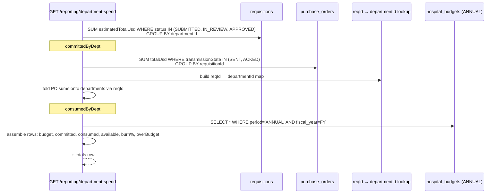

# Department Spend

## What it does

**Department Spend** is the per-department burn-down dashboard. It shows, for each department in a hospital, how much of the annual budget is committed, how much is consumed, and how much room is left — with red flags on anything over budget and orange flags on anything north of 80% burn.

The numbers are derived live at request time from requisitions and POs — there's no separate aggregation table. That makes the page trustworthy (it always reflects whatever the procurement system thinks right now) but a little expensive to load for hospitals with thousands of requisitions per quarter.

## Who uses it

| Persona | Why |
|---|---|
| **Hospital** account managers + materials managers | Daily look at where the year's budget is being burned, by department |
| **Admin** | Audit any hospital's burn; compare departments across the network |

## The page

Department Spend lives at **`/reporting/department-spend`**. The component is `DepartmentSpendPage` (`packages/web/src/features/reporting/pages/DepartmentSpend.tsx`).


- **Header strip** — title, **FY** picker (defaults to current calendar year), **Refresh**.
- **4 KPI tiles**:
  - **Total budget** — sum of `budgetAmountUsd` across all departments.
  - **Committed** — sum of `committedUsd` (blue).
  - **Consumed** — sum of `consumedUsd` (purple).
  - **Total burn** — progress bar `(committed + consumed) / total budget`. Red when over 100%.
- **Table** — one row per department, columns:
  - **Department**, **Cost center**, **Service line**, **GL code** — from `hospital_departments`.
  - **Budget** — annual budget for that dept (or "none" if no budget row exists).
  - **Committed** — sum of requisition `estimatedTotalUsd` in `SUBMITTED` / `IN_REVIEW` / `APPROVED` state.
  - **Consumed** — sum of PO `totalUsd` whose `transmissionState` is `SENT` or `ACKED`, attributed back to the dept through the originating requisition.
  - **Available** — `budget − committed − consumed`. Red with `−` prefix when negative.
  - **Burn** — progress bar of percentage burned. Color: green ≤ 80, blue 81–100, red > 100.
  - **Status** — one of four tags (see below).

## How committed and consumed are computed



Two important nuances:

1. **POs are department-attributed indirectly.** A PO row doesn't carry `departmentId` — it carries `requisitionId`. The endpoint loads the `req → dept` map for the hospital and folds PO totals onto the right department. POs without a `requisitionId` (manual / one-off) are **not** counted toward any department's consumed total.
2. **Only ANNUAL budgets feed the dashboard.** Q-period and M-period budgets are still respected by the requisition-submit encumbrance flow (see [Hospital Budgets](./31-hospital-budgets.md)), but the summary card here is annual-only by design — it's the C-suite view.

## Over-budget flag

```
overBudget = (available != null && available < 0)
```

A department becomes over-budget when the sum of committed + consumed exceeds the annual ceiling. This is **derived**, not stored — it recomputes every page load. Departments with **no annual budget row** are flagged `UNBUDGETED` and never trip the over-budget flag (there's no ceiling to compare against).

## Status tags

| Tag | Color | Condition |
|---|---|---|
| **OVER** | red | `overBudget === true` (available < 0) |
| **HIGH** | orange | `burnPct > 80` and not over |
| **OK** | green | budget exists and `burnPct ≤ 80` |
| **UNBUDGETED** | grey | no annual budget row for this department |

🛈 *Why no yellow `WARN` tier?* The original design had one; in user testing nobody could remember the difference between yellow (warning) and orange (critical). Collapsed to three live colors plus a neutral grey.

## FY scope

`fiscalYear` is a **calendar year integer**. Hospitals with non-calendar fiscal years are on the roadmap — when added, the FY picker will convert to a label like `FY26 (Jul 2025 – Jun 2026)` and the underlying date math will shift.

For now: the FY picker filters which annual budget row is selected (`period='ANNUAL' AND fiscal_year=FY`) but the committed/consumed sums are **not** time-bounded — they include every requisition and PO for the department, irrespective of date. That's fine when most procurement is intra-year; it overstates the burn in early January when last year's stragglers haven't yet posted as consumed.

## Hospital-scoped vs admin

- **Hospital users**: `hospitalId` is forced to `user.hospitalId`. They cannot pass `?hospitalId=...`.
- **Admin users**: must pass `?hospitalId=...` (no implicit hospital). Without it, the endpoint throws `ForbiddenError('hospitalId required (admin) or hospital-scoped user only')`.

The same scoping applies to which departments appear: only departments belonging to the resolved hospital, optionally narrowed by `?departmentId=` or `?costCenter=`.

## Common tasks

- Spot the over-budget departments fast — sort by **Status** descending; **OVER** rows surface to the top.
- Find dead departments — filter by **Status = UNBUDGETED**. Either delete them from the hospital config or assign a budget.
- Reconcile a number you don't trust — click through to [Hospital Budgets](./31-hospital-budgets.md), find the matching row, click **history** to see every COMMIT / RELEASE / CONSUME event with `sourceId`.
- Export — there is no direct CSV export. Use the GL ledger's [CSV export](./34-gl-ledger.md) for the journal-level view and reconcile, or copy the table out manually.

## Permissions

| Action | Role required |
|---|---|
| View own hospital's spend | `FACILITY_ACCOUNT_MANAGER*` |
| View any hospital's spend | Admin (`ACCOUNT_MANAGER*`) with `?hospitalId=` parameter |
| Filter by department / cost center | Same as view; passes through to the SQL filter |

## Behind the scenes

- **Component**: `packages/web/src/features/reporting/pages/DepartmentSpend.tsx`.
- **Route**: `packages/api/src/routes/departmentSpend.ts` — single `GET /` endpoint that returns `{ items, totals, fiscalYear }`.
- **Source tables**:
  - `hospital_departments` — the department list, with `costCenter`, `glCode`, `serviceLine` metadata.
  - `requisitions` — `estimatedTotalUsd` summed by `departmentId` for the three "money is on the hook" statuses.
  - `purchase_orders` — `totalUsd` summed by `requisitionId` for `SENT` / `ACKED` state.
  - `hospital_budgets` — only `ANNUAL` rows for the picked FY.
- **Two-pass SQL**: it's three round-trips (requisitions sum, POs sum, budgets) — not one big join. Easier to reason about and faster on D1 for small department counts; could be folded into a CTE if a hospital's departments climb into the hundreds.
- **No caching**: the page recomputes on every load. If you make this dashboard the homepage for a 500-user hospital, expect to add a 60-second cache.
- **Totals are summed from the items array** — they don't go back to the DB, so they always match what you see.

## Related

- [Hospital Budgets](./31-hospital-budgets.md) — the source of the budget column and the encumbrance counters
- [GL Ledger](./34-gl-ledger.md) — the journal-entry view of the same procurement events
- [Multi-Site Spend](./14-multi-site-spend.md) — cross-facility roll-up at the hospital level
- [Requisitions](./03-requisitions.md) — the event that bumps `committed`
- [PO Transmission](./32-po-transmission.md) — what flips a PO into `SENT` (and thus into the consumed column)
