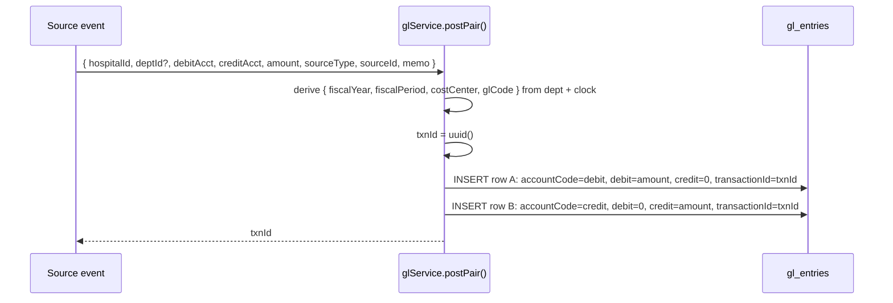
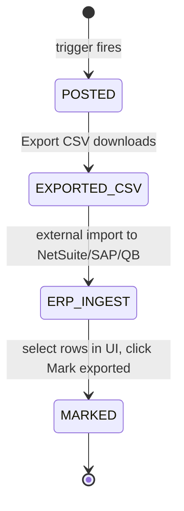

# General Ledger

## What it does

The **General Ledger** is Curavend's append-only finance journal — the bridge between procurement events (POs, receipts, invoices, payments) and a hospital's accounting system. Every time something economically meaningful happens, Curavend writes a balanced pair of journal entries (debit + credit) tagged with the source event, the fiscal period, the department, and the account codes.

Once the entries are written they're **immutable** — there is no edit, no delete, no late-arriving correction. To fix something, you post an `ADJUSTMENT` pair that backs it out. This is the same discipline a real ERP enforces.

The page is the admin's view of the journal: filter, inspect, export to CSV, and mark batches as exported once your ERP has ingested them.

## Who uses it

| Persona | Why |
|---|---|
| **Admin** | Inspect the live journal, run the CSV export, mark batches as exported after a successful ERP import, reconcile any unbalanced day |

This feature is **admin-only**. Hospital users see the upstream views (Budgets, Department Spend) but not the journal itself.

## The page

GL Ledger lives at **`/admin/gl-ledger`**. The component is `GlLedgerPage` (`packages/web/src/features/admin/pages/GlLedger.tsx`).


- **Header strip** — title, **Refresh**, **Export CSV**, **Mark exported (N)** (disabled when nothing is selected).
- **Filter bar** — **FY** number, **Period** (`M01`–`M12` / `Q1`–`Q4` / `ANNUAL`), **Source type** (`PO_COMMIT` / `GR_RECEIPT` / `INVOICE_APPROVE` / `INVOICE_PAY` / `ADJUSTMENT`), and an **Unexported only** toggle.
- **Balance banner** — `N entries · debits $X · credits $Y` with a ✓ when totals match and a ⚠ when they don't.
- **Table** — one row per **leg** (so a balanced transaction shows as two rows sharing the same `transactionId`). Columns: **Posted** (timestamp), **Period** (`FY/MXX`), **Account** (account code in mono), **Cost ctr**, **Debit**, **Credit**, **Source** (type tag), **Source ID** (first 8 chars of the related entity ID), **Memo**, **Exported** (date tag or `pending`).
- **Row selection** — checkboxes on the left; already-exported rows are disabled.

## Append-only journal model

Every economic event posts **two rows** with the same `transactionId`: one with `debitUsd > 0`, one with `creditUsd > 0`. The two amounts are equal. Sum of debits = sum of credits, always, by construction.



🛈 *Why two rows instead of one row with both columns?* This is "double-entry bookkeeping in the table" — the format every ERP expects. Aggregating by `accountCode` across many transactions becomes a simple `SUM(debit_usd) - SUM(credit_usd)` per account, with no row-level joins.

## The 4 auto-post triggers

| Trigger | Fires from | Pair posted | Memo example |
|---|---|---|---|
| `PO_COMMIT` | First successful PO transmission (see [PO Transmission](./32-po-transmission.md)) | DR `4900-COMMIT` / CR `4901-COMMIT-OFFSET` | `PO PO-LKJ1239X committed` |
| `GR_RECEIPT` | Goods receipt posted | DR `1300-INV` / CR `4900-COMMIT` | `Receipt for PO PO-LKJ1239X` |
| `INVOICE_APPROVE` | Invoice approved / sent | DR `<dept.glCode>` (or `5000-EXPENSE`) / CR `2100-AP` | `Invoice 8f2a1c4d approved` |
| `INVOICE_PAY` | Invoice marked paid | DR `2100-AP` / CR `1100-CASH` | `Invoice 8f2a1c4d paid` |

🛈 *PO_COMMIT only posts ONCE.* The transmission service checks `if (result.ok && !payload.po.transmittedAt)` — so retries of a previously-`SENT` PO don't double-post. Manual re-transmits after the first success simply log a new transmission row without touching the GL.

## Account-code convention

Curavend ships with a small, opinionated chart of account codes. They are **conventions**, not enforced against a chart-of-accounts table — there's deliberately no FK. Hospitals can override per-department via `hospital_departments.glCode`.

| Code | Used for |
|---|---|
| `4900-COMMIT` | Encumbrance / commitment account — debited on PO commit, credited on GR receipt |
| `4901-COMMIT-OFFSET` | The contra-account on PO commit — keeps the encumbrance journal balanced without touching real expense |
| `1300-INV` | Inventory asset — debited when goods arrive |
| `2100-AP` | Accounts payable — credited on invoice approve, debited on payment |
| `1100-CASH` | Cash — credited on payment |
| **`<dept.glCode>`** | Per-department expense account — debited on invoice approve. Read from `hospital_departments.glCode`. |
| `5000-EXPENSE` | Fallback expense account when the department has no `glCode` set |
| `ADJUSTMENT` (source) | Manual correction entries — any direction, any account |

⚠ *If a hospital's chart of accounts uses different code numbers* (every hospital has its own), the integration team maps them in the ERP-side connector when ingesting the CSV — Curavend doesn't try to be the system of record for the chart itself.

## Filters

| Filter | Effect |
|---|---|
| **FY** | Restrict to entries posted in the given `fiscal_year` |
| **Period** | Restrict to a fiscal period (`M01`–`M12`, `Q1`–`Q4`, `ANNUAL`) — period is stamped at post time based on the wall clock |
| **Source type** | One of `PO_COMMIT` / `GR_RECEIPT` / `INVOICE_APPROVE` / `INVOICE_PAY` / `ADJUSTMENT` |
| **Unexported only** | Hide rows that already have an `exportedAt` timestamp — your "ready to ship to the ERP" working set |

All filters compose. Admin can additionally pass `?hospitalId=` to narrow to a single tenant (the page hard-codes this when an admin opens it from a hospital drill-down).

## CSV export

The **Export CSV** button calls `GET /api/reporting/gl/export.csv` with the active filters and downloads a file named `gl-export-YYYY-MM-DD.csv` (up to 5 000 rows). The header row is:

```
transactionId,postedAt,fiscalYear,fiscalPeriod,accountCode,costCenter,departmentId,debitUsd,creditUsd,sourceType,sourceId,memo
```

Memos are scrubbed of commas and newlines (replaced with single spaces) so the CSV stays one row per record.

## Mark-exported workflow for ERP integration

The intended flow:



The button:

1. Calls `POST /api/reporting/gl/mark-exported { ids: [...] }`.
2. Stamps `exportedAt = <now>` on each row.
3. Refreshes the table.

Once a row has `exportedAt` set, its checkbox is disabled in the table — you can't accidentally re-export it. The **Unexported only** filter is your daily working queue; flip it on, export, import to the ERP, come back, select all, mark exported, done.

🛈 *Idempotency for ERP imports.* `transactionId` is a stable UUID per pair — use it as the external-reference key on the ERP side so that re-importing the same CSV twice is a no-op. The two legs share the same `transactionId`, which most ERPs accept as a balanced journal entry.

## Common tasks

- Find why a PO's commitment didn't post — filter **Source = PO_COMMIT** and search the memo for the PO number; if nothing shows, check the [PO Transmission log](./32-po-transmission.md) — first-send may have failed.
- Reconcile a department's monthly burn against the journal — filter **Period = Mxx**, **Source = INVOICE_APPROVE**, group by Cost ctr or eyeball the memos.
- Run month-end — set **FY** + **Period**, flip **Unexported only** on, **Export CSV**, ingest to ERP, select all, **Mark exported**.
- Find an unbalanced batch — eyeball the balance banner; a ⚠ here means a manual `ADJUSTMENT` was posted without a matching counter-leg (possible only via a direct DB write; the service refuses to write unbalanced pairs).

## Permissions

| Action | Role required |
|---|---|
| View ledger | `ACCOUNT_MANAGER` / `ACCOUNT_MANAGER_USER` (admin) |
| Export CSV | Admin |
| Mark exported | Admin only — the `POST /mark-exported` route hard-checks `isAdmin(user)` |
| Hospital scoping | Admin must pass `?hospitalId=`; hospital-scoped users (if granted view in a future patch) would always be forced to their own |

## Behind the scenes

- **Component**: `packages/web/src/features/admin/pages/GlLedger.tsx`.
- **Service**: `packages/api/src/services/glService.ts` — `postPoCommit()`, `postGrReceipt()`, `postInvoiceApprove()`, `postInvoicePay()`, and the internal `postPair()` helper that writes both legs atomically.
- **Routes**: `packages/api/src/routes/glReporting.ts` — `GET /entries`, `GET /export.csv`, `POST /mark-exported`.
- **Table**: `gl_entries` — append-only, indexed on `transactionId`, `(hospitalId, fiscalYear, fiscalPeriod)`, `accountCode`, `(sourceType, sourceId)`, and `exportedAt` for fast unexported-only filtering.
- **Fiscal period stamping**: `fiscalPeriodOf(new Date())` — uses the wall clock at post time. Late-arriving events (e.g. a goods receipt posted on the 2nd for goods received on the 30th of last month) land in the **current** period, not the period of the underlying event. Reconcile at the ERP if you need accrual-strict period attribution.
- **Department metadata copy**: `costCenter` and `glCode` are read from `hospital_departments` at post time and **frozen** on the journal row. Renaming a dept later does not change historical postings — by design.
- **No soft-delete**: if you delete a row directly in the DB, you break the doubled-up debit/credit pair and the balance banner will flag the day. Don't do this; post an `ADJUSTMENT` instead.
- **Caps**: list endpoint returns 2 000 rows; CSV endpoint returns 5 000. For larger windows, narrow the filter or call the route in batches by `(fiscalYear, fiscalPeriod)`.

## Related

- [Hospital Budgets](./31-hospital-budgets.md) — the encumbrance counter that moves in parallel with `PO_COMMIT` / `GR_RECEIPT`
- [Department Spend](./33-department-spend.md) — the operator-facing rollup of the same procurement events
- [PO Transmission](./32-po-transmission.md) — what triggers the `PO_COMMIT` post
- [Goods Receipts](./07-goods-receipts.md) — what triggers `GR_RECEIPT`
- [Invoices](./09-invoices.md) — what triggers `INVOICE_APPROVE` and `INVOICE_PAY`
