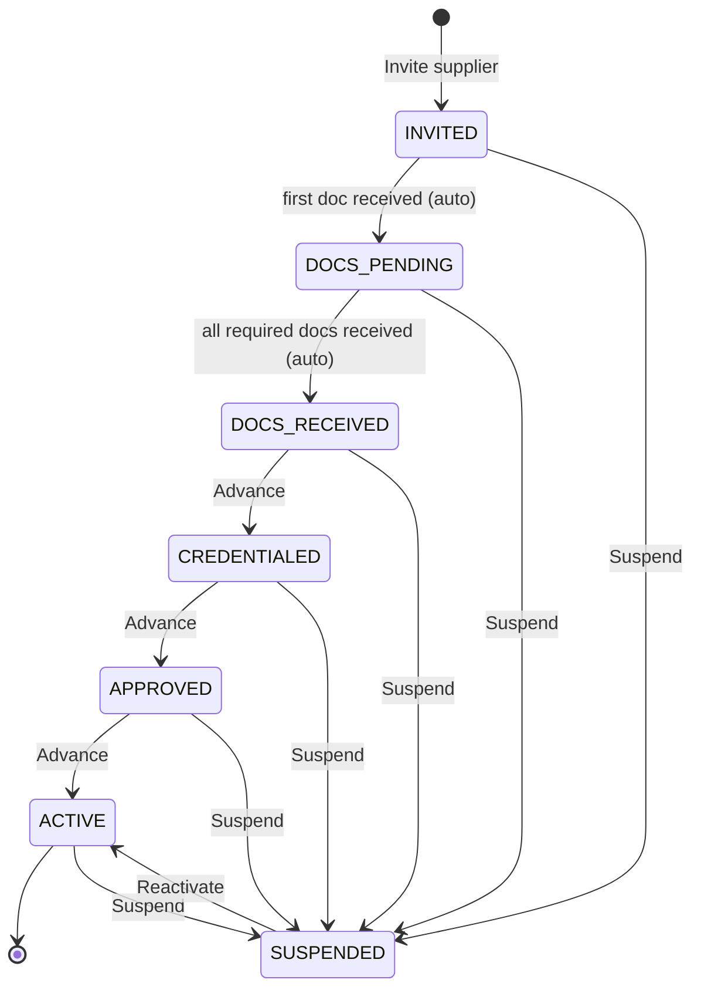
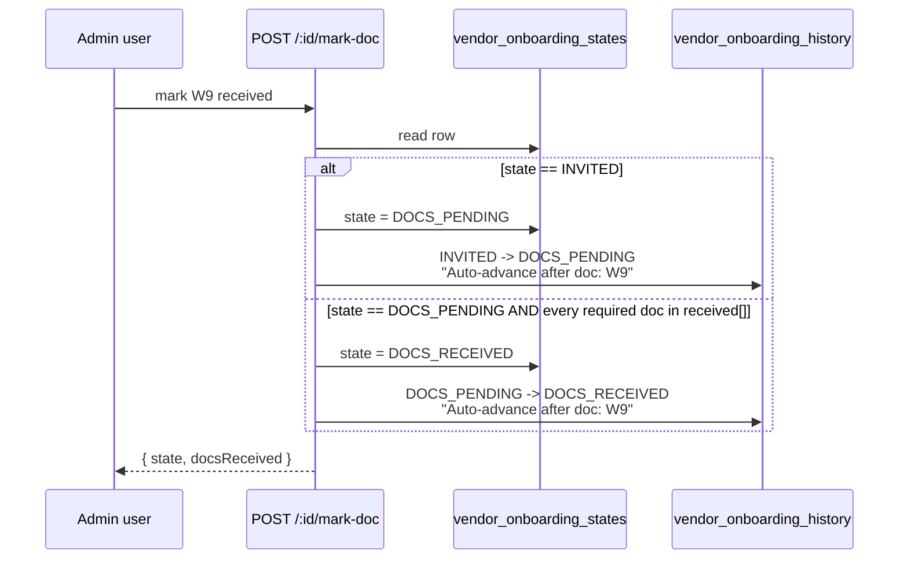

# Supplier Onboarding

## What it does

**Supplier Onboarding** is Curavend's structured intake pipeline for getting a new vendor from "we just signed a master agreement" to "they can transact against this hospital". One row per `(vendorId, hospitalId)` walks through a 7-state machine while the operator collects a checklist of contracting and credentialing documents.

The page is a kanban board: each state is a column, each card is a vendor's onboarding row. Documents arriving in the inbox tick checkboxes; certain checkbox ticks **auto-advance** the row to the next state. Everything is audited in `vendor_onboarding_history`.

## Who uses it

| Persona | Why |
|---|---|
| **Admin** | Invite vendors, walk them through documents, advance state, suspend a non-compliant supplier, reactivate after remediation |
| **Hospital** account managers | View their hospital's pipeline (tenant-scoped); cannot invite cross-hospital |

## The page

The kanban lives at **`/admin/supplier-onboarding`**. The component is `SupplierOnboardingPage` (`packages/web/src/features/admin/pages/SupplierOnboarding.tsx`).

- **Header** — page title, subtitle reminder of the 7-state machine, **Refresh** and **Invite supplier** buttons.
- **Columns** — one per state (`INVITED` / `DOCS_PENDING` / `DOCS_RECEIVED` / `CREDENTIALED` / `APPROVED` / `ACTIVE` / `SUSPENDED`). Card count badge on each.
- **Cards** — show vendor name + invitation date. Click to open the detail drawer.
- **Detail drawer** — action buttons (**Advance state** / **Suspend** / **Reactivate**), the per-vendor document checklist, and a timeline of every state transition.
- **Auto-advance banner** — a permanent `Alert` at the bottom of the page reminds operators that doc check-offs can advance state for them.
- **Invite modal** — pick a vendor, optionally trim or extend the **Required documents** list, jot a note. POSTs to `/api/vendor-onboarding/invite`.

## The 7-state machine

🛈 *Why two terminal states?* `ACTIVE` is the happy path — the vendor can transact normally. `SUSPENDED` is recoverable — onboarding froze for cause (expired insurance, OIG hit, contract dispute) and one **Reactivate** click puts them back to `ACTIVE`. The history rows record both the reason and who flipped the switch.

## The document checklist

The default required list when you invite is `W9`, `COI`, `OIG_ATTESTATION`, `MSA`. The full vocabulary is:

| Doc | What it is | Typical request |
|---|---|---|
| `W9` | IRS tax form establishing the vendor's TIN / EIN | Always |
| `COI` | Certificate of insurance (general liability, workers' comp, professional) | Always |
| `OIG_ATTESTATION` | Vendor attests they're not on the OIG exclusion list | Always |
| `DMEPOS` | Medicare DMEPOS accreditation cert | DME / orthotics / wound-care vendors |
| `MSA` | Master service agreement signed by both parties | Always |
| `BAA` | HIPAA Business Associate Agreement | Any vendor handling PHI |
| `ACCREDITATION` | Joint Commission / ACHC / CHAP / ABC cert (lab + DME) | Accredited classes only |

You can swap the list at invite time — pick `Required documents` in the modal and choose any subset of the 7. Once invited, the list is immutable; admins who need to add a missing doc-type re-invite (kills the old row via the suspend/reinvite pattern).

## Auto-advance on doc receipt

`POST /api/vendor-onboarding/:id/mark-doc` toggles a doc in/out of the received array. Two transitions happen automatically without an operator click:

All other state advances (`DOCS_RECEIVED` → `CREDENTIALED` → `APPROVED` → `ACTIVE`) require an operator click of **Advance state** on the detail drawer. This is intentional — those gates correspond to manual judgment (credentialing review, leadership sign-off, contract activation) that should never auto-flip from a webhook.

## Common tasks

- **Invite a new vendor** — **`/admin/supplier-onboarding`** → **Invite supplier**, pick the vendor, accept the default doc list (or trim), **Send invite**. A row appears in the `INVITED` column.
- **Mark a document received** — open the card, tick the box next to the doc type. Watch the state auto-advance.
- **Advance to the next stage** — click **Advance state** in the drawer. Each manual advance stamps `credentialedAt` / `approvedAt` / `activatedAt` for reporting.
- **Suspend a vendor mid-stream** — open the card → **Suspend**, type a reason (required), confirm. The card moves to the `SUSPENDED` column and `suspendedReason` is stored.
- **Reactivate after remediation** — open the `SUSPENDED` card → **Reactivate**. The card jumps straight to `ACTIVE`.

## Permissions

| Action | Required permission |
|---|---|
| List / view onboarding | `vendors` READ |
| Invite, mark doc, advance | `vendors` WRITE |
| Suspend / reactivate | `vendors` FULL |
| Cross-hospital filter (`?hospitalId=`) | Admin only |

Hospital users always see their own `hospitalId` rows. The `/invite` endpoint forces `hospitalId` to the caller's hospital for non-admins.

## Behind the scenes

- **Routes**: `packages/api/src/routes/vendorOnboarding.ts` — list, invite, detail, advance, mark-doc, suspend, reactivate.
- **DB tables**: `vendor_onboarding_states` (one row per vendor × hospital, unique index enforces it) and `vendor_onboarding_history` (append-only audit of every transition).
- **States enum**: `INVITED`, `DOCS_PENDING`, `DOCS_RECEIVED`, `CREDENTIALED`, `APPROVED`, `ACTIVE`, `SUSPENDED` — exported as `ONBOARDING_STATES` from `@curavend/db`.
- **Docs enum**: `ONBOARDING_DOC_TYPES` — `W9`, `COI`, `OIG_ATTESTATION`, `DMEPOS`, `MSA`, `BAA`, `ACCREDITATION`. Anything outside this set is dropped at invite time.
- **Auto-advance rules**: hard-coded in `POST /:id/mark-doc`. The check is `required.every((d) => filtered.includes(d))` — exact set match, not subset. Removing a doc back-tracks to `DOCS_PENDING` only by an explicit suspend; the state machine does not auto-regress.
- **Timestamps**: `credentialedAt`, `approvedAt`, `activatedAt` are stamped on the transition into that state. Useful for SLA reporting (e.g. "average days from `INVITED` to `ACTIVE`").
- **Tenant scoping**: enforced at every route entry — hospital users cannot read or write rows for other hospitals; admins can pass `?hospitalId=` to filter.
- **No FK to `vendors`**: the `vendorId` is a string reference — onboarding rows survive (with the original vendor ID) even if a vendor record is deleted, so the audit trail remains intact.

## Related

- [DMEPOS Compliance](./26-dmepos-compliance.md) — once `ACTIVE`, the DME accreditation tracker takes over for ongoing expiry monitoring
- [Compliance Dashboard](./41-compliance-dashboard.md) — surfaces expiry alerts on the vendor's accreditation / insurance / license
- [Workflow 01 — Onboard a vendor](../workflows/01-onboard-a-vendor.md) — operator step-by-step that walks the full pipeline
- [User Management](./18-user-management.md) — after `ACTIVE`, you'll usually create the vendor's first portal user
