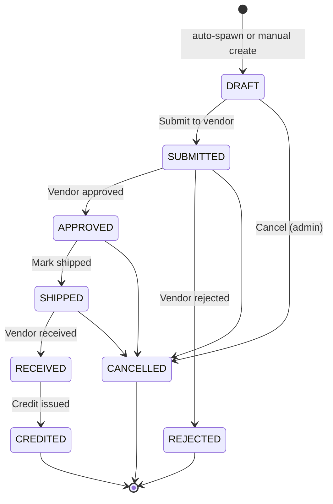
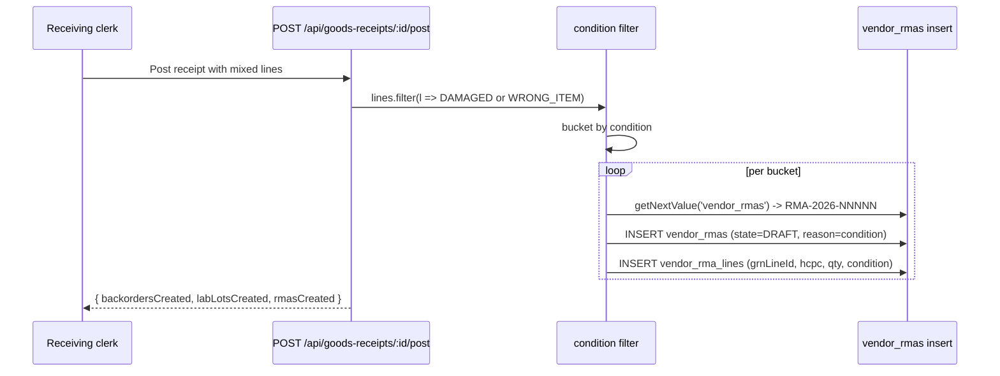

# Returns (RMA Workflow)

## What it does

**RMAs** (Return Material Authorizations) close the loop on goods that arrived broken, wrong, or otherwise unusable. Every shipment posts a goods receipt; receipts that contain `DAMAGED` or `WRONG_ITEM` lines **auto-spawn one DRAFT RMA per (vendor, condition) bucket** — the operator advances each through an 8-state machine, captures the vendor's RMA number and shipping tracking, and ultimately records the credit dollars actually received.

The page is the operator's triage view of every open and recently-closed RMA. The same `vendor_rmas` rows are referenced from goods-receipt details and from the [Damaged Shipment workflow](../workflows/22-handle-damaged-shipment.md).

## Who uses it

| Persona | Why |
|---|---|
| **Hospital** receiving clerks / account managers | Create RMAs manually (or curate auto-spawned ones), submit to vendor, mark received credit |
| **Vendor** account managers | See RMAs filed against them, approve / reject, ship replacement, supply tracking |
| **Admin** | Cross-tenant visibility, cancel stuck RMAs (FULL permission), audit credit reconciliation |

## The page

The list view lives at **`/rmas`**. The component is `RmasPage` (`packages/web/src/features/receiving/pages/Rmas.tsx`).

- **Header** — title, subtitle reminding the operator that auto-spawn happens from receipt posting, **Refresh** button.
- **Table** — one row per RMA with `RMA #`, `State` (colored tag), `Reason`, `Vendor`, `Vendor RMA #`, `Expected credit`, `Actual credit`, `Created`. Click `RMA #` to open the drawer.
- **Detail drawer** — descriptions block with the headline fields, **Lines** table of returned items, and a **Next action** card whose form fields change based on the current state.

## The state machine

🛈 *Why so many terminal states?* `CREDITED` is the happy path. `REJECTED` records vendor pushback that didn't result in money back — useful in vendor scorecards. `CANCELLED` is when the hospital changed its mind (often after finding the "damaged" item was just a packaging tear with the goods intact). All three are auditable separately.

## The 5 reason codes

| Reason | Typical use |
|---|---|
| `DAMAGED` | Goods arrived broken, contaminated, or with packaging compromised. Auto-spawned for any GRN line with `condition=DAMAGED`. |
| `WRONG_ITEM` | Vendor shipped the wrong HCPC / catalog item. Auto-spawned for `condition=WRONG_ITEM`. |
| `SHORT_DATED` | Reagent / DME arrived too close to expiry to be useful. Operator files manually. |
| `DEFECTIVE` | Item works on arrival but fails in clinical use (e.g. swab head detached, sensor drift). Operator files manually after the issue surfaces. |
| `OTHER` | Catch-all with mandatory `reasonDetail` for context. |

Auto-spawn buckets `DAMAGED` and `WRONG_ITEM` separately — a single receipt with 3 damaged + 2 wrong-item lines creates **two** RMAs, because in the real world vendors handle them on different return paths.

## Auto-spawn from goods receipts

The auto-spawn pulls `vendorId` / `hospitalId` from the parent order, so the new RMA inherits tenancy correctly. If the GRN was hand-keyed without a source order, no auto-spawn fires — file manually instead.

## The "Next action" panel

The detail drawer shows a context-aware form for the *next* legal transition:

| Current state | Form field | Endpoint |
|---|---|---|
| `DRAFT` | (none) | `POST /:id/submit` |
| `SUBMITTED` | **Vendor RMA number** (required) | `POST /:id/approve` (or `/reject`) |
| `APPROVED` | **Return tracking number** | `POST /:id/ship` |
| `SHIPPED` | (none) | `POST /:id/receive` |
| `RECEIVED` | **Actual credit (USD)** (required) | `POST /:id/credit` |

🛈 *Why is `actualCreditUsd` required at the credit step?* Vendors often credit less than the original line dollars (restocking fee, partial credit). Forcing the operator to type the real number means the [Vendor Scorecard](./17-vendor-scorecard.md) can compute true return-credit ratios instead of relying on optimistic estimates.

## Expected vs actual credit

Two columns track the dollar journey:

- `expectedCreditUsd` — set at create time, usually = `Σ(line.quantity × line.unitCreditUsd)` from the auto-spawn path or a manual estimate.
- `actualCreditUsd` — set at the `RECEIVED → CREDITED` transition. What the vendor actually paid out.

Delta between the two feeds the **credit-shortfall** KPI in the [Vendor Scorecard](./17-vendor-scorecard.md). A vendor whose `Σ(actual)/Σ(expected)` is consistently below 85% gets called out.

## Common tasks

- **Submit a DRAFT RMA to the vendor** — open the drawer, **Submit to vendor**. State flips to `SUBMITTED`, `submittedAt` stamped.
- **Record vendor approval** — vendor calls back with their RMA number; open the drawer → type **Vendor RMA number** → **Vendor approved**. `approvedAt` stamped.
- **Mark the return shipped** — pop the package on the dock, type the tracking number, **Mark shipped**.
- **Close out with credit dollars** — once vendor confirms the credit on the next statement, **Credit issued** → enter the dollar amount.
- **Reject a vendor's pushback** — `SUBMITTED → REJECTED` if vendor refuses to authorize. RMA closes without further action.
- **Cancel a stuck RMA** — admin opens the drawer → **Cancel RMA**. Available from any non-terminal state.

## Permissions

| Action | Required permission |
|---|---|
| List / view RMAs | `goods-receipts` READ (tenant-scoped) |
| Create / submit / approve / ship / receive / credit | `goods-receipts` WRITE |
| Cancel (any non-terminal) | `goods-receipts` FULL |
| Cross-tenant filtering (`?vendorId=`, `?hospitalId=`) | Admin only |

Vendor users **cannot** file RMAs against themselves — the create endpoint throws `ForbiddenError` if `user.vendorId` is set. Vendors can advance their own RMAs through approve/reject/ship.

## Behind the scenes

- **Routes**: `packages/api/src/routes/rmas.ts` — list, create, detail, plus a transition factory (`makeTransition`) generating the 7 transition endpoints.
- **DB tables**: `vendor_rmas` (header) + `vendor_rma_lines` (per-item detail).
- **States enum**: `RMA_STATES` from `@curavend/db` — `DRAFT`, `SUBMITTED`, `APPROVED`, `SHIPPED`, `RECEIVED`, `CREDITED`, `REJECTED`, `CANCELLED`.
- **Reasons enum**: `RMA_REASONS` — `DAMAGED`, `WRONG_ITEM`, `SHORT_DATED`, `DEFECTIVE`, `OTHER`.
- **Numbering**: `getNextValue(db, 'vendor_rmas')` → `RMA-YYYY-00001`. The sequence is per-year and shared across auto-spawn and manual create.
- **Auto-spawn site**: in `POST /api/goods-receipts/:id/post`, wrapped in a `try/catch` that logs but does not fail the GRN post — a busted RMA insert never blocks the receipt itself.
- **Tenant scoping**: `loadAndAuth()` enforces that a non-admin can only touch RMAs where their `vendorId` or `hospitalId` matches the row.
- **Stamping**: each transition stamps a dedicated timestamp column (`submittedAt`, `approvedAt`, `shippedAt`, `receivedAt`, `creditedAt`) — useful for cycle-time reporting.

## Related

- [Goods Receipts](./07-goods-receipts.md) — the trigger for auto-spawn
- [Workflow 22 — Handle a damaged shipment](../workflows/22-handle-damaged-shipment.md) — end-to-end recipe
- [Vendor Scorecard](./17-vendor-scorecard.md) — credit-shortfall and rejection-rate KPIs
- [Backorder Triage](./42-backorder-triage.md) — sibling page for under-delivered (vs broken) orders
