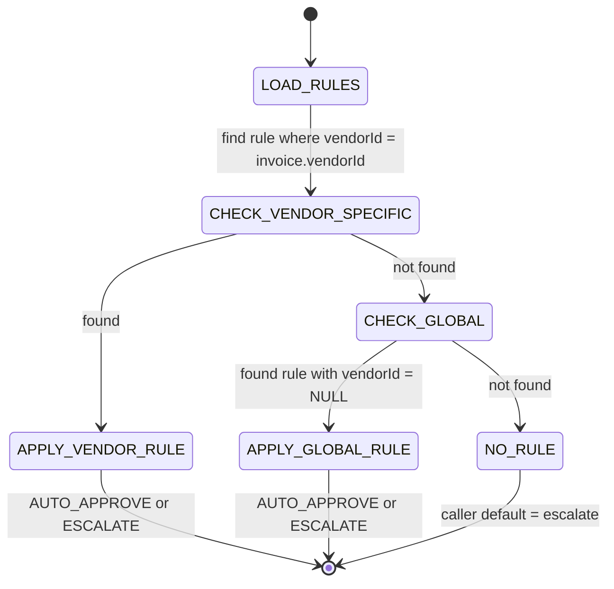

# Invoice Match Auto-Resolution Rules

## What it does

**Invoice Match Rules** are the tolerance band Curavend uses to decide whether a price difference between a PO and a vendor invoice is small enough to auto-approve, or large enough to need a human. Without rules, every penny of variance is a [3-way match](./08-three-way-match.md) exception — buyers drown in trivial freight rounding. With rules, only the meaningful exceptions surface.

A rule combines a **% tolerance** and a **$ absolute cap** — the invoice must pass **both** to auto-approve. Default config is `±2%` and `±$50`, generous enough to catch routine rounding without letting big errors through.

## Who uses it

| Persona | Why |
|---|---|
| **Admin** | Tighten or loosen tolerance globally, override for a specific noisy vendor, dry-run a candidate rule before saving |
| **Hospital** account managers | Read-only visibility (rules are admin-managed in MVP) |

## The page

The rules list is at **`/admin/invoice-match-rules`**. The component is `InvoiceMatchRulesPage` (`packages/web/src/features/admin/pages/InvoiceMatchRules.tsx`).


- **Header** — page title with the dollar icon, subtitle "*Invoices within ±N% and ±$N of the PO total auto-resolve. Vendor-specific rules beat global ones.*"
- **Info alert** — pinned note about the default `±2%` / `±$50`.
- **Table** — columns: **Vendor scope** (vendor name or `ALL VENDORS` tag), **% tolerance**, **$ cap**, **Active** (yes/no), **Notes**, **Actions** (**Edit** / **Delete**).
- **New / Edit drawer** — vendor dropdown (leave blank for the global rule), **% tolerance** input with `%` suffix, **$ absolute cap** with `$` prefix, **Active** switch, free-text notes.

## The tolerance band model

Every rule has exactly two thresholds. A candidate invoice passes the rule if **both** are satisfied:

```
abs(invoiceTotal - poTotal)        <=  toleranceMaxUsd     -- (dollar test)
abs(invoiceTotal - poTotal) / poTotal * 100  <=  tolerancePct  -- (percent test)
```

🛈 *Why both?* A 2% tolerance alone lets a $100,000 PO drift by $2,000 without review — too much. A flat $50 cap alone lets a $200 PO drift by 25% — too much. The pair caps the worst case from each side.

Worked examples against a `±2% / ±$50` rule:

| PO total | Invoice total | Delta $ | Delta % | Decision | Why |
|---|---|---|---|---|---|
| `$1,000` | `$1,010` | `$10` | `1.0%` | AUTO_APPROVE | Both under |
| `$1,000` | `$1,030` | `$30` | `3.0%` | ESCALATE | Pct over |
| `$10,000` | `$10,060` | `$60` | `0.6%` | ESCALATE | $ over |
| `$200` | `$202` | `$2` | `1.0%` | AUTO_APPROVE | Both under |

## Vendor-specific vs global precedence

Rules can target a specific `vendorId` (set in the form) or be global (`vendorId = NULL`, shown as the `ALL VENDORS` tag). When evaluating a candidate invoice:



The service explicitly **prefers vendor-specific** (`rows.find((r) => r.vendorId === args.vendorId)`) and falls back to the most recently updated global rule. Inactive rules (`isActive=0`) are pre-filtered before precedence runs, so a paused vendor-specific rule does not block the global from firing.

## The 3 outcomes

`evaluateMatchRules()` returns one of three decisions:

| Decision | When | Caller action |
|---|---|---|
| `AUTO_APPROVE` | Both tests pass against the most-specific active rule | Flip the match exception to `RESOLVED`, post the invoice |
| `ESCALATE` | A rule was found but at least one test failed | Leave exception `OPEN`; surface in [3-way match](./08-three-way-match.md) queue |
| `NO_RULE` | No active rule exists for this hospital (vendor-specific or global) | Caller's choice; safe default = escalate |

The result payload also includes `ruleId`, `deltaUsd`, `deltaPct`, and (on escalate) a human `reason` string showing exactly which threshold was busted.

## The preview endpoint

`POST /api/invoice-match-rules/preview` lets you dry-run any rule set before going live:

```json
POST /api/invoice-match-rules/preview
{ "vendorId": "VENDOR_UUID", "poTotalUsd": 1000, "invoiceTotalUsd": 1075 }

→ {
  "decision": "ESCALATE",
  "reason": "delta $75.00 (7.5%) exceeds rule (max $50, 2%)",
  "ruleId": "rule-uuid",
  "deltaUsd": 75,
  "deltaPct": 7.5
}
```

Use this when tuning a noisy vendor: spot-check 5-10 of their recent invoices with different tolerance candidates before flipping the live rule.

## Common tasks

- **Create the first global rule** — **`/admin/invoice-match-rules`** → **New rule**, leave vendor blank, accept defaults (`2%` / `$50`), **Create**.
- **Tighten a trusted vendor** — **New rule**, pick the vendor, set `0.5%` / `$10`. Vendor-specific row will win for that vendor's invoices.
- **Loosen a known-noisy vendor** — same flow but `5%` / `$200`.
- **Pause a rule without losing the config** — **Edit** → flip **Active** off. The rule sits dormant; toggling back resumes auto-approval.
- **Sanity-check a rule** — call `POST /preview` with realistic numbers; the JSON `decision` answers it.

## Permissions

| Action | Required permission |
|---|---|
| List rules | `budgets` READ |
| Create / edit | `budgets` WRITE |
| Delete | `budgets` FULL |
| Preview | `budgets` READ |
| Cross-hospital filter | Admin only |

🛈 *Why `budgets` permission?* Match rules sit alongside budget approval thresholds — both are spend-discipline tools. Sharing the resource means the same finance-controls role can manage both without bloat.

## Behind the scenes

- **Service**: `packages/api/src/services/invoiceMatchService.ts` — pure `evaluateMatchRules(d1, args)` returning the `AutoResolveResult`. Caller decides what to do.
- **Routes**: `packages/api/src/routes/invoiceMatchRules.ts` — `GET /`, `POST /`, `PUT /:id`, `DELETE /:id`, `POST /preview`.
- **DB table**: `invoice_match_rules` — one row per `(hospitalId, vendorId | NULL)` permutation, with `tolerancePct`, `toleranceMaxUsd`, `isActive`, `notes`, and audit columns.
- **Selection ordering**: `ORDER BY updatedAt DESC` — among multiple matching global rules, the most recently edited wins. There's no enforced uniqueness, so an admin **can** stack two global rules; only the freshest sees traffic.
- **Tenant scope**: hospital users always pass through `user.hospitalId`; admins can scope with `?hospitalId=`. Cross-tenant rules are not supported.
- **No active integration in MVP**: the auto-resolve invocation site is wired into the [3-way match](./08-three-way-match.md) reconciliation pass. Rule-less hospitals see every variance as a regular exception.
- **Inactive rules are invisible**: `eq(invoiceMatchRules.isActive, 1)` is in the WHERE clause — inactive rows don't even reach precedence sort. Deleting is destructive; pause first to A/B test.

## Related

- [3-Way Matching](./08-three-way-match.md) — where the `AUTO_APPROVE` / `ESCALATE` decision is consumed
- [Invoices](./09-invoices.md) — payable inbox that benefits from auto-resolution
- [GL Ledger](./34-gl-ledger.md) — invoice approval posts the `INVOICE_ACCRUE` journal entry
- [Hospital Budgets](./31-hospital-budgets.md) — sibling spend-control surface under the same `budgets` permission
