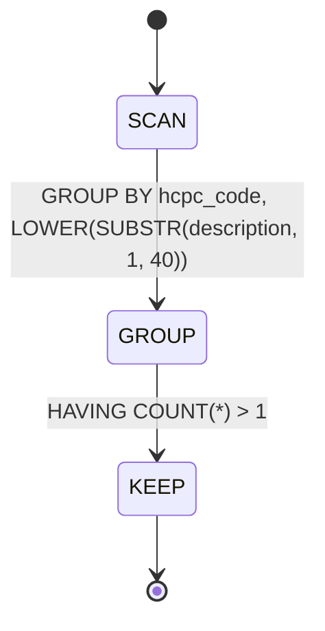
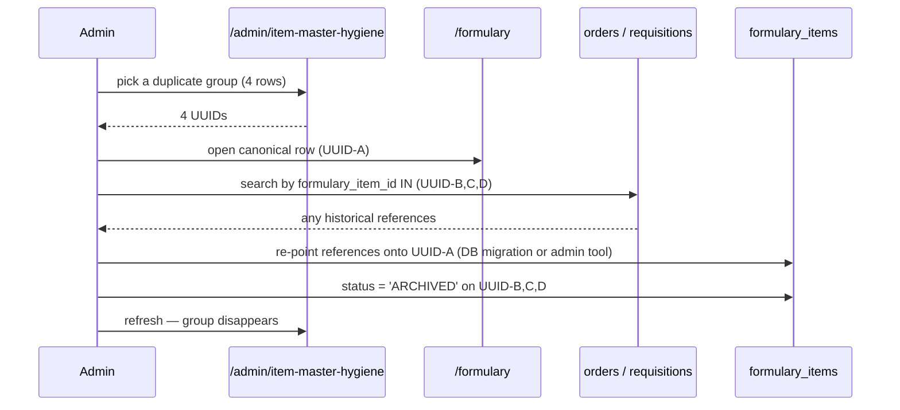

# Item Master Hygiene

## What it does

**Item Master Hygiene** is Curavend's data-quality dashboard for the formulary. Over time, every hospital's catalog accumulates the same three classes of rot: **duplicates** (two rows for the same physical item), **missing fields** (rows with no HCPC or no preferred vendor), and **unmapped** items (formulary rows with no vendor SKU to actually buy from). All three break automation downstream — requisition flow, contract leakage detection, three-way match — but they're easy to ignore because nothing visibly fails until a buyer can't transact.

The page surfaces all three in one place. Click into a tab, look at the rows, fix them in **Formulary** (the page does not edit — it points).

## Who uses it

| Persona | Why |
|---|---|
| **Admin** | Weekly / monthly catalog cleanup, especially after EHR / ERP imports |
| **Hospital** account managers | Visibility into their own facility's catalog rot; act on their items via the formulary page |

## The page

Lives at **`/admin/item-master-hygiene`**. Component is `ItemMasterHygienePage` (`packages/web/src/features/admin/pages/ItemMasterHygiene.tsx`).


- **Header** — warning icon + title **Item Master Hygiene**, subtitle "*Surface duplicates, missing fields, and items not mapped to any vendor SKU.*", **Refresh** button.
- **Tabs** — three tabs, each labeled with its count: **Duplicates (N)**, **Missing fields (N)**, **Unmapped to vendor SKU (N)**.
- Each tab has a contextual alert at the top explaining what action to take, then a table of the offending rows.

## The 3 reports

### Duplicates



Groups formulary items by the pair `(hcpc_code, first 40 chars of lower-cased description)`. Surfaces every group whose row count is > 1. Columns:

| Column | Meaning |
|---|---|
| `HCPC` | Shared HCPCS code |
| `Description key` | The lower-cased, trimmed, 40-char description prefix |
| `Rows` | How many formulary rows fall in this group (always ≥ 2) |
| `IDs` | Comma-separated formulary item UUIDs in the group |

🛈 *Why 40 characters?* Long enough that "*Surgical Mask Level 1 Box of 50*" and "*Surgical Mask Level 2 Box of 50*" are distinct keys, short enough that "*PCR Master Mix 5x — Lot 0823*" and "*PCR Master Mix 5x — Lot 1124*" collapse into one duplicate group. Tunable in `routes/itemMasterHygiene.ts` if false positives become an issue.

The page does **not** auto-merge — that decision needs a human (which row's pricing / vendor / approval history wins?). Take the UUIDs from the IDs column and reconcile them in the [Formulary](./04-formulary.md) page.

### Missing fields

Lists every `ACTIVE` formulary item missing at least one procurement-required field. Annotated server-side with which fields are missing:

| Column | Meaning |
|---|---|
| `HCPC` | The HCPCS (may itself be empty) |
| `Description` | The description (may be `—` in red if absent) |
| `Missing` | Red tags for each null field — any of `hcpcCode` / `description` / `preferredVendorId` |
| `Created` | When the bad row first appeared |

The three required fields are the bare minimum to support an end-to-end purchase: you need a HCPC to price under a [contract](./10-contracts-pricing.md), a description so humans recognize the item, and a preferred vendor so the requisition picks a default supplier. Anything else (manufacturer #, UOM, NDC) is optional.

### Unmapped to vendor SKU

Lists every `ACTIVE` formulary item with **no** matching row in `vendor_item_skus` at any vendor — meaning there is literally no purchase path for the item today.

```sql
LEFT JOIN vendor_item_skus vis ON vis.hcpc_code = fi.hcpc_code
WHERE vis.id IS NULL
```

Columns: `HCPC`, `Description`, `Preferred vendor` (informational — the item *has* a preferred vendor, but that vendor has no SKU row for it).

This is the most operationally painful class of rot: a requisitioner picks the item, the system can't find a SKU, and the order falls back to manual processing. Fix by either:

- Adding a `vendor_item_skus` row at any vendor catalog (most common path).
- Inactivating the formulary item if it's a phantom (`status = ARCHIVED`).

## Reconciliation flow (duplicates)



🛈 *No auto-merge?* Right. The canonical-row decision is irreversible and depends on contract history, vendor pricing, and substitute attachments — judgment the system can't make. The page exposes the symptom; the reconciliation is a human ritual.

## Common tasks

- **Run a fresh scan** — page autoloads; click **Refresh** for a re-query against current data.
- **Reconcile a duplicate group** — copy the IDs from the group, open **`/formulary`** with one of them, decide which row is canonical, move history (orders / substitutes) onto it, archive the others.
- **Fill in a missing HCPC** — open the row in **`/formulary`**, set `hcpcCode`, save. Re-running the report drops it from the missing list.
- **Map an unmapped item to a vendor** — go to that vendor's catalog (**`/admin/vendors/:id/items`**) and add a `vendor_item_skus` row keyed by the formulary HCPC. Re-run — should disappear from unmapped.
- **Bulk export** — three flat JSON endpoints (`/duplicates`, `/missing`, `/unmapped`); spreadsheet-friendly clients can paginate-by-Page.
- **Schedule a monthly hygiene review** — bookmark the page; add it to your end-of-month finance close checklist alongside [GL Ledger](./34-gl-ledger.md) export and contract leakage review.

## Permissions

| Action | Required permission |
|---|---|
| List any of the 3 reports | `formulary` READ |
| Cross-hospital filter (`?hospitalId=`) | Admin only |

The page never mutates anything — all three endpoints are pure reads. Mutations happen in **Formulary** / vendor catalog pages, both of which have their own permission guards.

## Behind the scenes

- **Routes**: `packages/api/src/routes/itemMasterHygiene.ts` — three thin GET endpoints under `/api/item-master-hygiene`.
- **Tables read**: `formulary_items` (all three reports), `vendor_item_skus` (unmapped check).
- **Tenant scope**: forced to `user.hospitalId` for non-admins; admins can pass `?hospitalId=`. Both raw-SQL endpoints use string escaping (`hospitalId.replace(/'/g, "''")`) to defend against unlikely tenant ID injection.
- **`status = 'ACTIVE'` filter**: archived items don't show up in any report — once you fix or sunset an item, it disappears next scan.
- **Raw SQL for duplicates and unmapped**: the `GROUP BY` for duplicates and the `LEFT JOIN ... IS NULL` for unmapped are clearer than Drizzle's builder; the comment in the route explains the choice.
- **Limits**: 200 duplicate groups, 500 missing/unmapped rows. A hospital that breaks these limits has bigger problems than the report — break the scan into multiple `?facilityId=` passes if needed (the duplicate scan is per-hospital today).
- **No cron / no notifications**: this is a pull report, not a push alert. The [Compliance Dashboard](./41-compliance-dashboard.md) is the inverse pattern (cron pushes alerts you triage).

## Related

- [Formulary / Item Master](./04-formulary.md) — where the actual edits happen
- [Workflow 07 — Create formulary with substitutes](../workflows/07-create-formulary-with-substitutes.md) — the upstream creation flow whose rough edges this page catches
- [Contracts & Pricing](./10-contracts-pricing.md) — downstream consumer of clean HCPC mappings
- [Vendor Scorecard](./17-vendor-scorecard.md) — completeness of catalog mapping feeds vendor-quality KPIs
