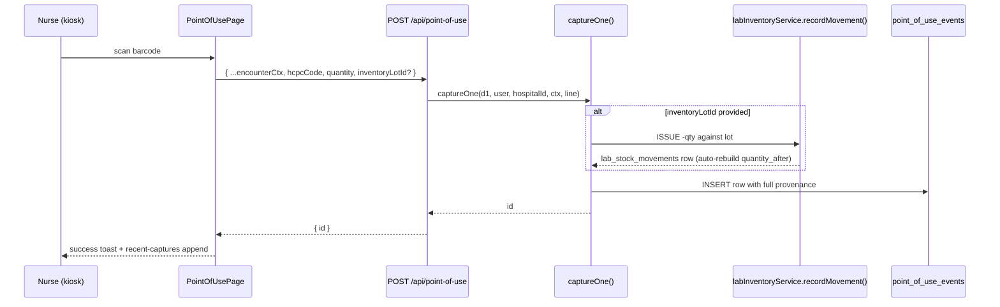

# Point-of-Use Capture

## What it does

**Point-of-Use** (POU) is the bedside / procedure-room data capture layer. A nurse or tech scans an item barcode (or types a HCPC) as it's used on a patient. Each scan writes one row to `point_of_use_events` — append-only, attributable to a patient, encounter, department, and provider. Optionally, if the scanner provides a lab inventory lot ID, the same call decrements the lot through the normal `recordMovement('ISSUE')` path, so on-hand stays accurate without a second touch.

The page is the kiosk / phone UI for that scan. It also supports **batch** capture for tray scans (open a procedure tray, scan everything inside it in one shot) via the `/batch` endpoint.

## Who uses it

| Persona | Why |
|---|---|
| **Hospital** clinical staff (nurses, surgical techs, perfusionists) | Quick bedside attribution of supplies to a patient — no detour through the MAR / EHR |
| **Hospital** charge-capture / billing | Pull events by `encounterId` / `patientMrn` for cost attribution and revenue cycle |
| **Admin** | Cross-hospital diagnostics, troubleshoot a missing decrement |

## The page

Lives at **`/inventory/point-of-use`**. Component is `PointOfUsePage` (`packages/web/src/features/inventory/pages/PointOfUse.tsx`).


- **Header** — scan icon + title **Point-of-Use Capture**, subtitle reminder that decrement requires a lot ID.
- **Encounter context card** (left, 10 cols) — sticky form: **Patient MRN**, **Encounter ID**, **Department ID**, **Room ID**, **Device ID** (defaults to `kiosk-1`). Fill once at the start of a shift; values persist for every subsequent scan.
- **Scan / enter item card** (right, 14 cols) — per-scan form: **HCPC code**, **Description**, **Quantity** (default 1), **Lot #**, **Serial #**, **Lab Inventory lot ID** (optional — provides the decrement hook), large **Capture** button.
- **Recent captures table** — bottom card; last 50 scans this browser session with `When`, `HCPC`, `Description`, `Qty`, `Lot`.

## The capture flow



🛈 *Why optional decrement?* Not every clinical area runs full lab-style inventory. A med-surg floor may scan a Foley catheter for charge capture without a lot ID — POU still attributes the use; the decrement just doesn't fire. Areas that **do** run inventory (the OR, the cath lab, the pharmacy fridge) include the lot ID and get accurate on-hand for free.

## Sticky encounter context

Filling **Encounter context** once means each subsequent **Capture** click reuses the same patient + encounter + department. Curavend stores nothing server-side between scans — the persistence is purely the form's React state. To switch patients:

1. Edit the **Patient MRN** field (and **Encounter ID** if it changed).
2. Continue scanning items for the new patient.

The context form has no save button — it's debounced into the next captured event automatically.

## Batch capture (tray scans)

`POST /api/point-of-use/batch` accepts `{ ...encounterCtx, lines: [...] }` and captures all lines under the same encounter:

```json
POST /api/point-of-use/batch
{
  "patientMrn": "MRN-12345",
  "encounterId": "ENC-7788",
  "departmentId": "OR-3",
  "lines": [
    { "hcpcCode": "A4253", "quantity": 1, "inventoryLotId": "lot-uuid-1" },
    { "hcpcCode": "A4256", "quantity": 2 },
    { "hcpcCode": "L8499", "quantity": 1, "inventoryLotId": "lot-uuid-3" }
  ]
}

→ { "captured": 3, "ids": ["...","...","..."], "errors": [] }
```

Errors are **per-line** — a batch of 5 with one bad lot ID returns `{ captured: 4, errors: [{ index: 2, error: "Lot ... not found" }] }`. The 4 good lines are committed; the 1 bad one is reported back so the operator can fix and retry just it.

## Query patterns

The list endpoint accepts narrow filters for the common questions:

| Use case | Query |
|---|---|
| What did we use on this encounter? | `GET /?encounterId=ENC-7788` |
| Show every supply touch for this patient this month | `GET /?patientMrn=MRN-12345&fromDate=2026-05-01` |
| Department spend feed | `GET /?departmentId=OR-3` |
| All encounters in date range | `GET /?fromDate=...&toDate=...` |
| One encounter, shortcut | `GET /by-encounter/ENC-7788` |

Limit defaults to 500, max 2000. Tenant scoping is forced server-side — hospital users only see their `hospitalId`'s events.

## Common tasks

- **Start a shift** — open **`/inventory/point-of-use`** on the kiosk, fill **Patient MRN** + **Encounter ID** (often piped from EHR or barcode wristband), leave other fields blank.
- **Capture a single-item use** — scan the barcode → form auto-populates HCPC → **Capture**. Confirm row appears in **Recent captures**.
- **Capture a procedure tray (batch)** — scan every item one after another (the **Capture** button stays on the **Scan** card; **Encounter context** stays sticky). Or hit the `/batch` endpoint from an integration.
- **Decrement inventory at the same time** — paste / scan the **Lab Inventory lot ID** field; the same call writes the POU event AND a lab `ISSUE` movement.
- **Audit one patient's encounter** — operator opens the order / encounter page; the POU panel queries `GET /by-encounter/:id`.

## Permissions

| Action | Required permission |
|---|---|
| Capture (single / batch) | `orders` WRITE |
| List / by-encounter | `orders` READ |
| Cross-hospital filter | Admin only |

Capture is **bound to the calling user** — `capturedByUserId` is always `user.id` regardless of payload; the optional `providerUserId` field lets a clerk capture on behalf of a physician without losing the original-capturer chain of custody.

## Behind the scenes

- **Routes**: `packages/api/src/routes/pointOfUse.ts` — single capture, batch, list, by-encounter.
- **DB table**: `point_of_use_events` — one row per scan; never updated, never deleted (append-only). Indexed on `(hospitalId)`, `(departmentId)`, `(encounterId)`, `(patientMrn)`, `(capturedAt)` for the common query patterns.
- **Lot decrement path**: when `inventoryLotId` is set, calls `recordMovement(d1, { lotId, movementType: 'ISSUE', quantity: -qty, reason: 'POU: enc=... mrn=...' })`. Quantity validation (`if (lot.quantityOnHand < qty) throw ValidationError`) happens before the row is inserted, so a POU event is never written without a successful decrement.
- **Why no auto-FEFO?** POU intentionally takes an *explicit* lot ID — the operator scanned a specific physical lot. FEFO is for cases where the operator doesn't care which lot (see [Lab Auto-Consumption](./30-lab-auto-consumption.md)).
- **Tenant scope**: forced to `user.hospitalId` for non-admins on list; capture errors with `ValidationError('hospitalId required')` if neither the user nor body supplies one.
- **Provenance fields**: `facilityId`, `departmentId`, `roomId`, `patientMrn`, `encounterId`, `providerUserId`, `capturedByUserId`, `deviceId` — every dimension the analytics team is likely to ever group by.
- **Compliance angle**: append-only design plus user/device attribution is the same audit-evidence pattern as [lab stock movements](../workflows/21-audit-stock-movements.md) — pulls clean for an inspector.

## Related

- [Lab Auto-Consumption](./30-lab-auto-consumption.md) — sibling path for FEFO-driven (no-lot-id) consumption
- [Lab Inventory](./27-lab-inventory.md) — where the lots being decremented live
- [Department Spend](./33-department-spend.md) — downstream consumer of `departmentId` attribution
- [Workflow 21 — Audit stock movements](../workflows/21-audit-stock-movements.md) — POU decrements appear in the lab audit log as `ISSUE` rows with `POU:` reason text
