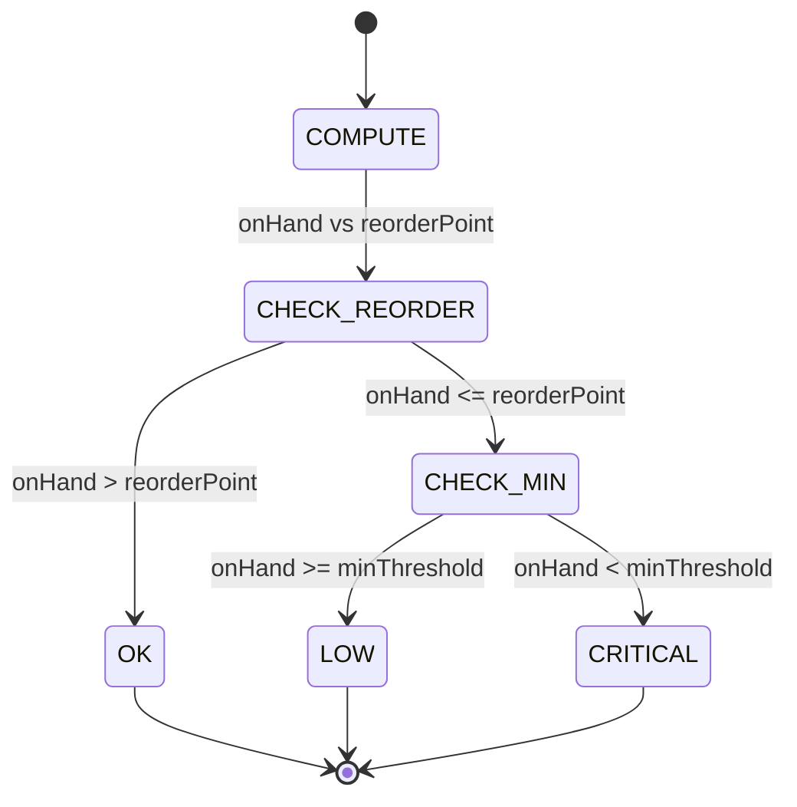
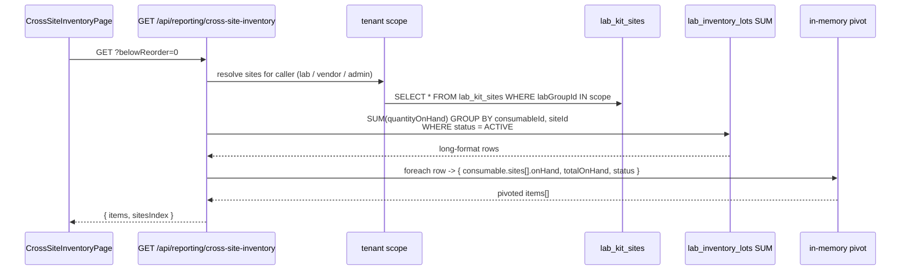

# Cross-Site Inventory

## What it does

**Cross-Site Inventory** is the pivoted matrix view of every consumable across every site in a tenant. One row per consumable. Columns per site. Cells show on-hand with a status tag (**OK** / **LOW** / **CRITICAL**) based on each site's reorder and minimum thresholds. A toggle filters to "only items LOW or CRITICAL **anywhere**" so the operator can ignore the steady-state and act on the at-risk.

It's the one page that answers "where in my network is this reagent right now, and which site needs a top-up?" without bouncing between per-site inventory pages.

## Who uses it

| Persona | Why |
|---|---|
| **Lab** managers | Spot-balance reagents between sites before a courier run |
| **Hospital** materials managers | Multi-facility hospitals balancing trays between OR locations |
| **Vendor** account managers | See in-network stock for the labs / hospitals they serve (vendor-scoped) |
| **Admin** | Global troubleshoot, cross-tenant audits |

## The page

Lives at **`/reporting/cross-site-inventory`**. Component is `CrossSiteInventoryPage` (`packages/web/src/features/reporting/pages/CrossSiteInventory.tsx`).

- **Header** — globe icon + title **Cross-Site Inventory**, subtitle "*Per-consumable stock across every site in your tenant. LOW = below reorder point, CRITICAL = below min.*"
- **Filter strip** — **Only show items LOW/CRITICAL anywhere** toggle; **Refresh** button.
- **Matrix table** — fixed-left columns: **Item** (HCPC / code), **Description**, **Cat** (category tag); then **Total** (sum across all sites, bold); then a dynamic column per site name from the `sitesIndex`.
- **Cell** — bare number `12` for OK status; number + colored tag for LOW (`12 LOW`) or CRITICAL (`3 CRITICAL`); em-dash for sites with no on-hand row for this consumable.

## The status ladder

For each `(consumable, site)` cell:

| Status | Rule | Operator action |
|---|---|---|
| `OK` | `onHand > reorderPoint` (or thresholds not set) | None |
| `LOW` | `onHand <= reorderPoint` AND `onHand >= minThreshold` | Plan reorder soon |
| `CRITICAL` | `onHand < minThreshold` | Act today — either internal transfer from a high-stock site, or expedite vendor reorder |

Thresholds live on `lab_consumables.reorderPoint` and `lab_consumables.minThreshold` — one set per consumable, applied uniformly across sites. If a particular site needs a different threshold, override at the site level (out of scope for this page).

## The pivot

The SQL aggregation keeps long-format (per-site rows); the pivot to wide-format (per-consumable rows with sites[] arrays) happens in JS for clarity. `sitesIndex` ships separately so the UI knows the full column set (including sites with zero stock of this item, which won't appear in the long-format SQL output).

## Tenant resolution

The page's hardest bit is "what counts as 'my sites'?". Resolution by persona:

| Persona | Scope rule | Notes |
|---|---|---|
| **Admin** | Every site, every tenant | `siteRows = SELECT * FROM lab_kit_sites LIMIT 1000` |
| **Lab** user | Sites under `user.labGroupId` | Most common case |
| **Vendor** user | Sites under any `lab_groups.vendorId = user.vendorId` | Multi-hop: vendor → groups → sites |
| **Hospital** user | (Currently inherits the lab-group path if the hospital owns a lab; otherwise empty) | |

🛈 *Why the vendor path?* A vendor servicing 3 labs needs to see what those labs are sitting on (without seeing other vendors' customers). The two-step lookup — `vendorId → labGroups → kitSites` — keeps the boundary tight.

If the resolution yields zero sites, the endpoint returns `{ items: [], sitesIndex: [] }` immediately — no work and an empty matrix.

## Below-reorder filter

Toggling **Only show items LOW/CRITICAL anywhere** appends `?belowReorder=1`. The server applies `items.filter(c => c.sites.some(s => s.status !== 'OK'))` — any item with at least one at-risk site stays; items where every site is `OK` drop out.

Use this view as the daily action list. Use the unfiltered view when looking at the totals column for procurement planning.

## Common tasks

- **Daily inventory huddle** — flip the toggle on; sort by **Total** ascending; work top-down.
- **Find which site has stock to transfer** — pick a row showing CRITICAL at site A; scan the same row for a site with healthy on-hand; initiate a transfer via the [Lab Inventory](./27-lab-inventory.md) page's transfer flow.
- **Identify consumables to discontinue** — unfiltered view, sort **Total** descending — items with massive aggregate on-hand and no recent consumption are candidates for catalog cleanup.
- **Vendor: scope your own customers** — log in with a vendor user, page automatically filters to the labs under your `vendorId`.
- **Category drill** — pass `?category=REAGENT` (or `CONTROL`, `CONSUMABLE`, etc.) on the API endpoint; the UI doesn't expose this filter yet but the backend supports it.

## Permissions

| Action | Required permission |
|---|---|
| View matrix | `orders` READ AND one of `labGroupId` / `vendorId` / admin |
| Cross-tenant view | Admin only |

🛈 *Why `orders`?* The page is about supply visibility — same conceptual surface as the order/receipt flow. Reusing `orders` as the permission resource avoids creating yet another fine-grained permission for a read-only report.

## Behind the scenes

- **Route**: `packages/api/src/routes/crossSiteInventory.ts` — single `GET /api/reporting/cross-site-inventory` returning `{ items, sitesIndex }`.
- **Tables read**: `lab_consumables` (catalog + thresholds), `lab_inventory_lots` (on-hand source of truth), `lab_kit_sites` (site list + names), `lab_groups` (vendor → groups join for vendor scope).
- **Aggregation key**: `(consumableId, siteId)`. Multiple ACTIVE lots at one site collapse to one cell sum. Quarantined / Recalled / Expired lots are excluded by the `status = 'ACTIVE'` clause.
- **Status compute**: pure JS in the route — `onHand <= reorderPoint` first, then `onHand < minThreshold` for CRITICAL. Sites without thresholds set always show OK.
- **Sort**: alphabetical by description. Pagination at 100 per page in the UI.
- **Performance**: one round-trip to D1 plus the pivot; for typical lab networks (< 50 sites × < 5000 consumables) the response is sub-200ms.
- **No write paths**: pure read-only. Transfers happen in [Lab Inventory](./27-lab-inventory.md); restock orders go through normal requisitions.

## Related

- [Lab Inventory](./27-lab-inventory.md) — per-site detail and the transfer / receive flows
- [Lab Forecasting + Auto-Replen](./28-lab-forecasting.md) — proactive restock based on consumption, complementing this reactive view
- [Backorder Triage](./42-backorder-triage.md) — what to do when restock POs haven't fully delivered
- [Workflow 19 — Receive a lab shipment](../workflows/19-receive-lab-shipment.md) — how incoming stock lands in the per-site cells
