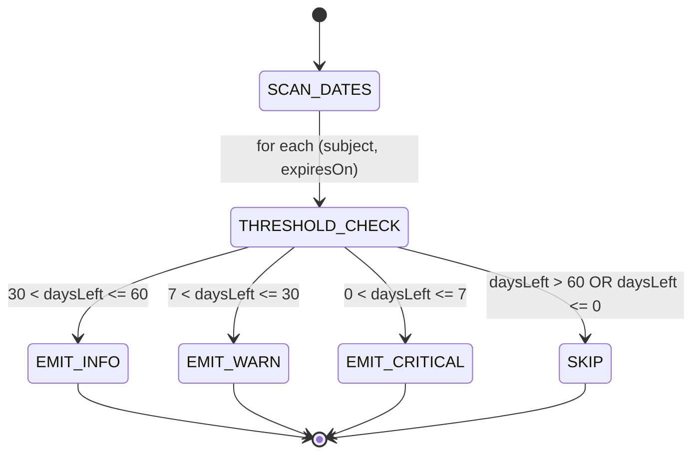
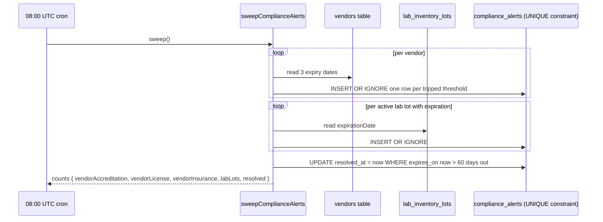

# Compliance Dashboard

## What it does

**Compliance Dashboard** is the single triage view for every credential, certification, and lot expiry that's about to bite. A daily 08:00 UTC cron sweeps four sources (vendor accreditation / license / insurance, lab inventory lots), compares each expiry date against three thresholds (60 / 30 / 7 days), and writes one row per `(subject, threshold)` into `compliance_alerts`. The dashboard reads those rows, sorted by severity, and lets the admin acknowledge alerts as they're worked.

The page replaces the "scattered spreadsheet of when things expire" workflow that most healthcare orgs run today. Everything that has a renewal date funnels here.

## Who uses it

| Persona | Why |
|---|---|
| **Admin** | Daily triage queue; ack alerts as they're routed; manually trigger sweep after data fixes |

## The page

Lives at **`/admin/compliance`**. Component is `ComplianceDashboardPage` (`packages/web/src/features/admin/pages/ComplianceDashboard.tsx`).

- **Header** — safety-cert icon + title **Compliance Dashboard**, subtitle "*Pre-expiry alerts for DMEPOS, vendor accreditation/license/insurance, and lab lot expiry. Daily cron at 08:00 UTC.*", **Refresh** and **Run sweep now** buttons.
- **Stat strip** — four counter cards: **CRITICAL**, **WARN**, **INFO**, **Unacknowledged**.
- **Filter card** — **All severities** dropdown, **All subjects** dropdown.
- **Alerts table** — `Severity` tag, `Subject` type (humanized), short `Subject ID`, `Expires` date, `In` (days, tag), `Message`, `Status` (New / Acknowledged), `Action` (**Ack** button when new).
- **Auto-resolution note** — info alert at the bottom explaining the renewal-detection behavior.

## The 6 subject types

| Subject type | Source field | Why it matters |
|---|---|---|
| `VENDOR_DMEPOS` | `vendor_dmepos_compliance.accreditation_expiry_date` | Lapsed DMEPOS = vendor can't supply DME for Medicare claims |
| `VENDOR_ACCREDITATION` | `vendors.accreditation_expiry_date` | Joint Commission / ACHC / CHAP — required for many hospital contracts |
| `VENDOR_LICENSE` | `vendors.state_level_license_expiry_date` | State business license / pharmacy license / device license |
| `VENDOR_INSURANCE` | `vendors.liability_insurance_expiry_date` | Lapsed COI = MSA likely auto-suspends |
| `LAB_LOT` | `lab_inventory_lots.expiration_date` (ACTIVE only) | Expired reagent ruins clinical results |
| `USER_MFA` | (planned — user MFA enrollment past grace period) | Security posture / cyber-insurance compliance |

The first 5 are wired in MVP; `USER_MFA` is enumerated for forward compatibility — the cron does not emit it yet.

## The threshold + severity ladder

The cron iterates thresholds tightest-first (`7 → 30 → 60`) and **breaks** at the first match — so a cert with 5 days to go gets exactly one `CRITICAL` row (not three of `INFO` + `WARN` + `CRITICAL`).

| Threshold | Severity | Subject of internal SLA |
|---|---|---|
| `≤ 7 days` | `CRITICAL` | Same-day escalation, possibly suspend vendor in [Onboarding](./35-supplier-onboarding.md) |
| `≤ 30 days` | `WARN` | This-week action — email vendor, kick off renewal |
| `≤ 60 days` | `INFO` | Heads-up; track passively |

## Idempotent sweep + auto-resolve

**Idempotency**: the `compliance_alerts_uk` UNIQUE index on `(subjectType, subjectId, alertKind, thresholdDays)` plus `INSERT OR IGNORE` means re-running the sweep multiple times the same day produces zero new rows. Operationally safe to hit **Run sweep now** repeatedly.

**Auto-resolve**: when a renewal pushes the underlying expiry past 60 days out, the next sweep's `UPDATE compliance_alerts SET resolved_at = now WHERE expires_on > date('now', '+60 days')` clears the alert. Acknowledged-but-not-resolved alerts also clear — the underlying date moving past the horizon is the source of truth, not the operator's button click.

## Ack vs resolve

| Action | What it changes | When to use |
|---|---|---|
| **Ack** (operator click) | Stamps `acknowledgedAt` + `acknowledgedByUserId` | "I've seen it; it's in my work queue" |
| **Resolve** (cron auto) | Stamps `resolvedAt` | The underlying date renewed past 60 days |

The two are intentionally separate. Acknowledgement is human triage tracking; resolution is the actual cure. A spreadsheet-only org tends to conflate the two — Curavend forces the distinction so an "ack and forget" doesn't hide a still-lapsing cert.

## Common tasks

- **Daily triage** — open **`/admin/compliance`**, sort by **Severity** (CRITICAL at top), work the list, **Ack** each as you route it.
- **Filter to one class** — pick **VENDOR_INSURANCE** in the subject dropdown to do a one-pass review of insurance renewals.
- **Trigger a re-sweep after a fix** — vendor uploaded new accreditation cert, you bumped `vendors.accreditation_expiry_date` — click **Run sweep now**. The toast shows `resolved: N` count.
- **Pull the open alert count** — `GET /api/compliance-alerts?includeResolved=0` returns open rows; useful for dashboard widgets or external monitoring.

## Permissions

| Action | Required permission |
|---|---|
| List alerts | `vendors` READ |
| Acknowledge | `vendors` WRITE |
| Run manual sweep | Admin only |

Non-admin hospital users see only alerts where `hospitalId = user.hospitalId`. For now, the sweep emits alerts with `hospitalId = NULL` (platform-level cert expiry doesn't belong to any one hospital) — so hospital users will see an empty list until per-hospital subjects are added.

## Behind the scenes

- **Service**: `packages/api/src/services/complianceAlertService.ts` — `sweepComplianceAlerts(d1)` returning the count breakdown.
- **Routes**: `packages/api/src/routes/complianceAlerts.ts` — list, acknowledge, sweep trigger.
- **DB table**: `compliance_alerts` — `(subjectType, subjectId, alertKind, thresholdDays)` UNIQUE; `severity` (`INFO`/`WARN`/`CRITICAL`); `acknowledgedAt`, `resolvedAt`; indexed on subject, hospital, resolved.
- **Enums**: `COMPLIANCE_SUBJECT_TYPES`, `COMPLIANCE_ALERT_KINDS` (`EXPIRY`, `MISSING`, `OIG_HIT`), `COMPLIANCE_SEVERITIES` from `@curavend/db`.
- **Cron wiring**: registered in the Worker's `[triggers]` config as `0 8 * * *`; the handler imports `sweepComplianceAlerts` and runs once. Failure surfaces in the worker logs — sweep is idempotent, so a missed day is corrected the next morning.
- **Performance**: the lab-lot query is bounded — only active lots with `expirationDate <= today + 60d`. Vendors scan in one SELECT. Typical sweep is sub-second.
- **No notifications layer in MVP**: alerts only surface on the dashboard. Hooking the [Notifications](./20-notifications.md) system to email CRITICAL alerts is a planned extension.

## Related

- [DMEPOS Compliance](./26-dmepos-compliance.md) — the cert detail page; alerts deep-link here for `VENDOR_DMEPOS` rows
- [Supplier Onboarding](./35-supplier-onboarding.md) — the `Suspend` action is the natural response to a CRITICAL alert
- [Lab Inventory](./27-lab-inventory.md) — the `Quarantine` / `Recall` actions handle imminent lab lot expiry
- [Vendor Scorecard](./17-vendor-scorecard.md) — credential-lapse frequency is a scorecard component
