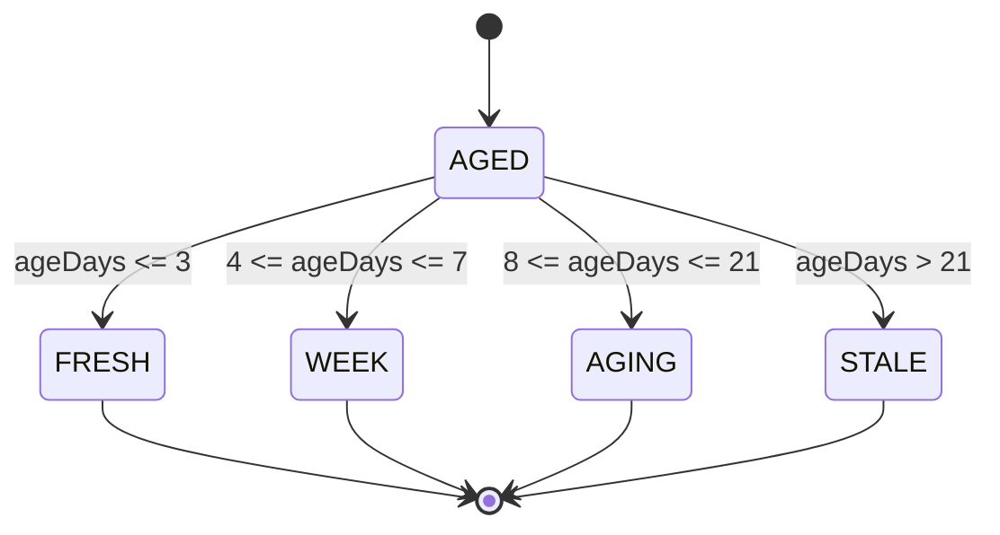
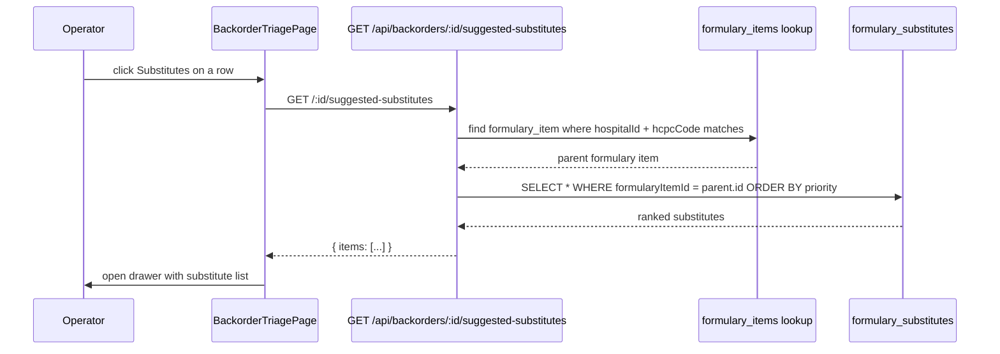

# Backorder Triage

## What it does

**Backorder Triage** is the aged-backorder management view. Open backorders (auto-spawned by goods receipts that under-delivered) accumulate as the vendor takes time to fulfill the missing units. Triage groups them by age, surfaces formulary substitutes for items the vendor can't deliver, and gives the operator quick buttons to fulfill / cancel without leaving the page.

Where the [Backorders feature doc](./29-backorders.md) is the data model and per-order view, this page is the **action queue** — "what's old, what's substitutable, what can I close out today".

## Who uses it

| Persona | Why |
|---|---|
| **Hospital** receiving / materials managers | Daily action queue for stuck supply lines |
| **Vendor** account managers | See their own backorders aging out; intervene before escalation |
| **Admin** | Cross-tenant queue, troubleshoot stale rows |

## The page

Lives at **`/receiving/backorder-triage`**. Component is `BackorderTriagePage` (`packages/web/src/features/receiving/pages/BackorderTriage.tsx`).

- **Header** — clock icon + title **Backorder Triage**, subtitle "*Open backorders with aging buckets and substitute suggestions.*", **Refresh** button.
- **Bucket strip** — 4 stat cards: **FRESH** (`≤3d`, green), **WEEK** (`4-7d`, cyan), **AGING** (`8-21d`, orange), **STALE** (`>21d`, red). Each shows the count.
- **Action table** — columns: **Age** (bucket tag + days), **HCPC**, **Description**, **Remaining** (quantity still owed), **Expected** (fulfillment date or "none" tag), **Vendor** (short ID), **Actions** (**Substitutes** / **Fulfill all** / **Cancel** buttons).
- **Substitutes drawer** — opens from the **Substitutes** button; shows formulary alternates ranked by `priority`.

## Age buckets

| Bucket | Range | Why this band | Operator action |
|---|---|---|---|
| `FRESH` | `≤ 3 days` | Normal vendor lead time; no action needed | Monitor |
| `WEEK` | `4-7 days` | Still within typical vendor restocking SLA | Quick vendor ping if critical SKU |
| `AGING` | `8-21 days` | Past most contractual fulfillment windows | Email vendor, look for substitute |
| `STALE` | `> 21 days` | Almost certainly never coming; vendor likely abandoned the line | Cancel + reorder elsewhere, or accept substitute |

The buckets compute server-side from `(now - createdAt) / 24h`, ceiling. Refreshing the page re-buckets — a row at exactly 3 days flips into `WEEK` on day 4.

## Inline substitute suggestions

The drawer shows columns: **Priority** (tag), **HCPC**, **Description**, **Notes**. From here the operator typically copy/pastes the substitute HCPC into a new requisition (the page does not auto-create a replacement order in MVP).

🛈 *Why no auto-replacement order?* A substitute may have different clinical / reimbursement implications. Curavend surfaces the options but keeps the decision (and the audit trail) on the human placing the new requisition.

## Quick actions

| Button | Endpoint | Behavior |
|---|---|---|
| **Substitutes** | `GET /:id/suggested-substitutes` | Opens drawer with formulary alternates ranked by priority |
| **Fulfill all** | `POST /:id/fulfill { quantity: <remaining> }` | Marks the entire `quantityRemaining` as received; status → `FULFILLED` |
| **Cancel** | `POST /:id/cancel` | Status → `CANCELLED`; backorder closes without further fulfillment |

Partial fulfills (less than the remaining) are also supported but require hitting the underlying [Backorders feature doc](./29-backorders.md) detail page — the triage view's **Fulfill all** is one-click for "vendor finally delivered the missing units in full".

## Common tasks

- **Daily clear of STALE rows** — sort table by **Age** descending; for each `STALE` row, decide between **Cancel** (give up on the vendor) and **Substitutes** (find an alternative). Either action closes the row.
- **Catch-up after a vendor make-good shipment** — vendor confirms 10 backordered SKUs arrived in a special shipment; click **Fulfill all** on each. They drop off the queue.
- **Source a substitute from formulary** — click **Substitutes** on a STALE row; the drawer shows pre-approved alternatives — copy the top-priority HCPC into a new requisition.
- **Get the queue counts for dashboards** — `GET /api/backorders/triage` returns `{ items, counts: { FRESH, WEEK, AGING, STALE }, total }`.

## Permissions

| Action | Required permission |
|---|---|
| View triage queue | Implicit via authed user (tenant-scoped) |
| Fulfill / cancel | Tenant ownership of the backorder's parent order |
| Get substitutes | Tenant ownership |
| Cross-tenant view | Admin only |

Hospital users see backorders where the parent order's `hospitalId` matches. Vendor users see ones where the parent order's `vendorId` matches. Admins see everything.

## Behind the scenes

- **Routes**: `packages/api/src/routes/backorders.ts` — `/triage` (this page), `/:id/suggested-substitutes`, `/:id/fulfill`, `/:id/cancel`.
- **Tenant guard**: `assertOwnsBackorder()` runs before every write — joins `order_backorders` to `orders` and checks the caller's `hospitalId` / `vendorId` against the row's parent order.
- **Bucketing**: pure JS in the `/triage` endpoint; `ageOf(createdAt)` returns whole days, then a ladder of `<= 3 / 7 / 21` assigns the bucket.
- **Substitute lookup**: scoped to the parent order's `hospitalId` (so a multi-hospital admin sees the correct hospital's substitute list, not a global one).
- **Fulfill validation**: `POST /:id/fulfill` rejects with `ConflictError` if status is already terminal (`FULFILLED` / `CANCELLED`) or if the cumulative fill would exceed `quantityOrdered`. Status flips to `FULFILLED` when `quantityRemaining` hits zero, otherwise `PARTIALLY_FULFILLED`.
- **No notifications**: aging is purely a pull report. The [Compliance Dashboard](./41-compliance-dashboard.md) pattern (cron + alerts) is not used here; the triage queue itself is the watcher.
- **Performance**: one JOIN-ed query bounded to 500 rows; for a typical hospital with < 100 open backorders the response is sub-100ms.

## Related

- [Order Backorders](./29-backorders.md) — feature reference with the data model and per-order detail
- [Goods Receipts](./07-goods-receipts.md) — the trigger that spawns backorders on under-delivery
- [Returns (RMA Workflow)](./36-rma-workflow.md) — sibling page for broken-on-arrival (vs not-yet-delivered)
- [Formulary / Item Master](./04-formulary.md) — where the substitute mappings are configured
