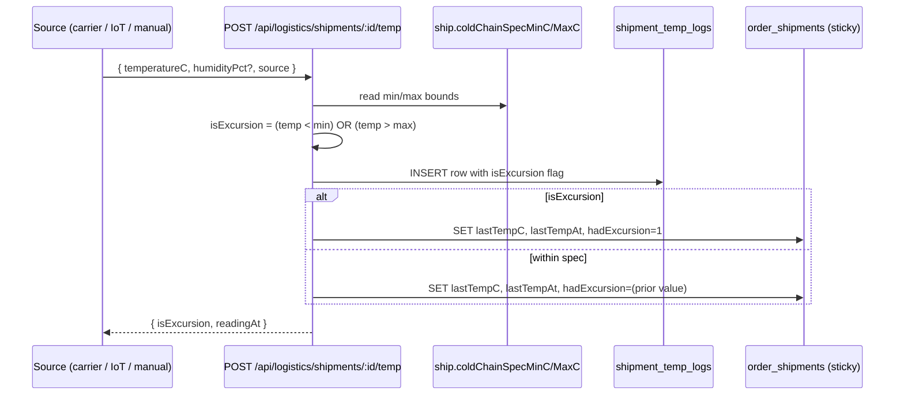

# Logistics & Cold Chain

## What it does

**Logistics & Cold Chain** is the in-transit visibility layer for every shipment Curavend tracks. It shows ETA, last reported temperature, and an excursion flag for shipments that ever went out of spec. Carrier APIs (UPS / FedEx), IoT temperature loggers (Sensitech / TempTale), and manual operator entries all feed the same `shipment_temp_logs` time-series; the page is the operator's quick-glance triage of what's flying right now and what got too warm or too cold along the way.

For cold-chain-sensitive deliveries (biologics, reagents, vaccines), an excursion is a clinical-acceptability event, not just an FYI — the **sticky excursion flag** on `order_shipments` survives subsequent good readings so QC can see "this shipment had an excursion at some point" without having to scan every reading.

## Who uses it

| Persona | Why |
|---|---|
| **Hospital** receiving / pharmacy | Reject a cold-chain-violated shipment at the dock before it enters inventory |
| **Vendor** account managers | See their own shipments' status; coordinate replacements for excursions |
| **Admin** | Cross-tenant view; troubleshoot stuck shipments |

## The page

Lives at **`/logistics`**. Component is `LogisticsPage` (`packages/web/src/features/logistics/pages/Logistics.tsx`).


- **Header** — rocket icon + title **Logistics & Cold Chain**, subtitle "*Shipment ETAs, last temperature, excursion flags.*", **Refresh** button.
- **Stat strip** — 3 stat cards: **In transit** (count of shipments without `actualDeliveryDate`), **Cold-chain** (count of `coldChainRequired=1`), **Excursions** (count of `hadExcursion=1`, red text if > 0).
- **Shipment table** — columns: **Tracking** (link), **Carrier** tag, **Status** tag, **Shipped** date, **ETA** time, **Cold chain** (flame + EXCURSION tag if any, else OK / em-dash), **Last temp** (value + when), **POD** (link to proof-of-delivery doc).
- **Detail drawer** — opens on row click; shows excursion alert if applicable, a **Quick temp reading** card to manually log a value, and a recent-readings table (last 200 rows).

## Cold-chain spec & excursion flagging



🛈 *Why sticky?* A vaccine shipment that hit 12°C at hour 6 is no longer cold-chain-acceptable, even if it cools back to 4°C by hour 10. The persistent flag on `order_shipments.had_excursion` ensures the receiving clerk sees the violation regardless of the *current* reading. Resetting is intentional — only happens via direct DB action (a deliberate "we're OK to accept this batch" override).

## The 3 ingestion sources

`shipment_temp_logs.source` captures provenance:

| Source | Typical writer | How it lands |
|---|---|---|
| `CARRIER_API` | UPS Track 2.0, FedEx SenseAware webhooks | Webhook endpoint translates carrier payload → temp POST |
| `IOT_SENSOR` | Sensitech / TempTale Bluetooth loggers via gateway app | Mobile / gateway batch-uploads readings on dock scan |
| `MANUAL` | Receiving clerk eyeballs a packaging thermometer | The drawer's **Quick temp reading** form |

The route accepts any source string but the UI special-cases these three for tagging. Unknown sources still record; just show as the raw string.

## Shipment columns at a glance

| Column | Source | Notes |
|---|---|---|
| `carrierCode` | `order_shipments.carrierCode` | `UPS`, `FEDEX`, `USPS`, `DHL`, etc. |
| `trackingNumber` | `order_shipments.trackingNumber` | Carrier's tracking ID |
| `etaAt` | `order_shipments.etaAt` | Bumped by carrier webhook via `POST /:id/eta` |
| `lastTempC` | `order_shipments.lastTempC` | Most recent reading; updated on every temp POST |
| `lastTempAt` | `order_shipments.lastTempAt` | Timestamp of that reading |
| `hadExcursion` | `order_shipments.hadExcursion` | **Sticky**; once 1, stays 1 |
| `coldChainRequired` | `order_shipments.coldChainRequired` | Set when the order has cold-chain items |
| `coldChainSpecMinC` / `_MaxC` | `order_shipments.coldChainSpecMinC` / `MaxC` | Per-shipment bounds; usually `2.0 / 8.0` for refrigerated biologics |
| `latestStatus` | `order_shipments.latestStatus` | `IN_TRANSIT`, `OUT_FOR_DELIVERY`, `DELIVERED`, `EXCEPTION`, `RETURNED` |
| `podAttachment` | `order_shipments.podAttachment` | R2 URL to PDF or signed image |

## Carrier webhook contract

The temp ingestion path is designed to be hit by automation, not just operators. A carrier webhook adapter normalizes the vendor payload to:

```json
POST /api/logistics/shipments/{shipmentId}/temp
{
  "temperatureC": 5.2,
  "humidityPct": 42.0,
  "readingAt": "2026-05-23T14:30:00Z",
  "source": "CARRIER_API",
  "deviceId": "ups-trk-12345"
}
```

| Field | Required | Notes |
|---|---|---|
| `temperatureC` | Yes | The only mandatory value |
| `readingAt` | No | Defaults to `now()` if omitted |
| `humidityPct` | No | Some sensors don't report it |
| `source` | No | Defaults to `CARRIER_API`; valid: `CARRIER_API`, `IOT_SENSOR`, `MANUAL` |
| `deviceId` | No | Free-text; useful for tracing a specific logger |

Excursion detection is computed server-side from the shipment's cold-chain spec — the caller does not need to know the bounds.

## Common tasks

- **Daily cold-chain check** — sort the table by **Cold chain** column or eyeball the **Excursions** stat tile; click any row with the red `EXCURSION` tag to see the offending reading in the drawer.
- **Record a manual temp at receiving** — open the drawer for the shipment → enter the value in **Quick temp reading** → **Record**. Source auto-tags `MANUAL`.
- **Update ETA after a carrier change** — typically called by a carrier webhook (`POST /:id/eta { etaAt }`), but admins can hit the endpoint manually.
- **Get the temp history for a shipment** — `GET /api/logistics/shipments/:id/temp-log` returns up to 2000 readings, newest first.
- **Filter to in-transit only** — visible at a glance via the **In transit** stat card; for API consumers, filter on `actualDeliveryDate IS NULL`.
- **Trigger the damaged-shipment workflow on an excursion** — opening the receipt for an `EXCURSION`-flagged shipment and using `condition=DAMAGED` on the lines automatically routes the goods to an [RMA](./36-rma-workflow.md). See [Workflow 22](../workflows/22-handle-damaged-shipment.md).

## Permissions

| Action | Allowed when |
|---|---|
| List shipments | Authed user (tenant-scoped); admins see all |
| View detail / temp log | Tenant ownership via parent order's `hospitalId` / `vendorId` |
| Record temp reading | Same (any authed party on the shipment) |
| Update ETA | Same |

Notably, the temp POST is **not gated** to a specific role — carrier webhooks and on-dock IoT gateways need to write freely. The tenant check via `loadAndAuth()` is the security boundary.

## Behind the scenes

- **Routes**: `packages/api/src/routes/logistics.ts` — list, detail, ETA update, temp POST, temp log.
- **DB tables**: `order_shipments` (header + sticky flags), `shipment_temp_logs` (append-only time-series).
- **Cold-chain columns on `order_shipments`** (from the schema): `coldChainRequired`, `coldChainSpecMinC`, `coldChainSpecMaxC`, `lastTempC`, `lastTempAt`, `hadExcursion` — all populated by the temp POST path.
- **Excursion math**: `(min != null && temp < min) || (max != null && temp > max)`. If neither bound is set, no reading is flagged — `coldChainRequired=0` shipments don't excursions even with extreme temps.
- **Sticky write**: in the update, `hadExcursion: isExcursion ? 1 : (ship.hadExcursion ?? 0)` — only overrides to 1; never resets to 0 via this path.
- **Indexed for fast triage**: `shipment_temp_logs` has indexes on `shipmentId`, `isExcursion`, `readingAt` — even a high-frequency IoT logger with thousands of readings per shipment queries fast.
- **Carrier webhooks**: not yet shipped as packaged adapters; expect to wire one route per carrier (`/api/webhooks/ups/track`, `/api/webhooks/fedex/sense`) that normalizes payloads to `POST /:id/temp` and `POST /:id/eta`.
- **Auto-resolution**: none. Excursion stays until manually overridden — this is intentional QC behavior.

## Related

- [Goods Receipts](./07-goods-receipts.md) — receiving an excursion-flagged shipment usually means rejecting it with a DAMAGED condition, which spawns an [RMA](./36-rma-workflow.md)
- [Workflow 22 — Handle a damaged shipment](../workflows/22-handle-damaged-shipment.md) — what to do when a cold-chain shipment arrives with an excursion
- [Lab Inventory](./27-lab-inventory.md) — destination for reagent shipments; excursion-acceptance decisions feed quarantine status
- [Compliance Dashboard](./41-compliance-dashboard.md) — excursion-rate-by-vendor is a planned scorecard input
