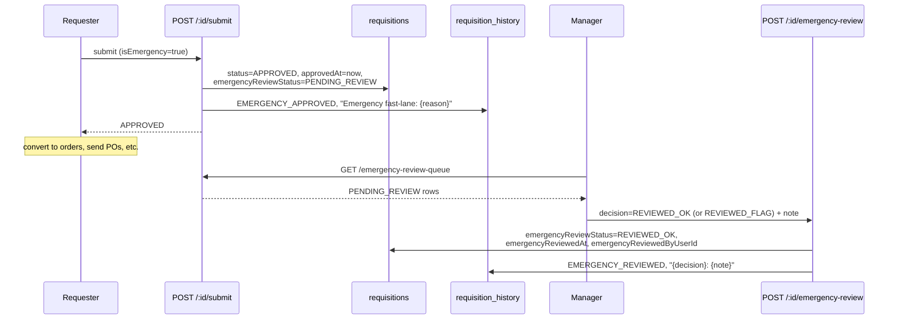
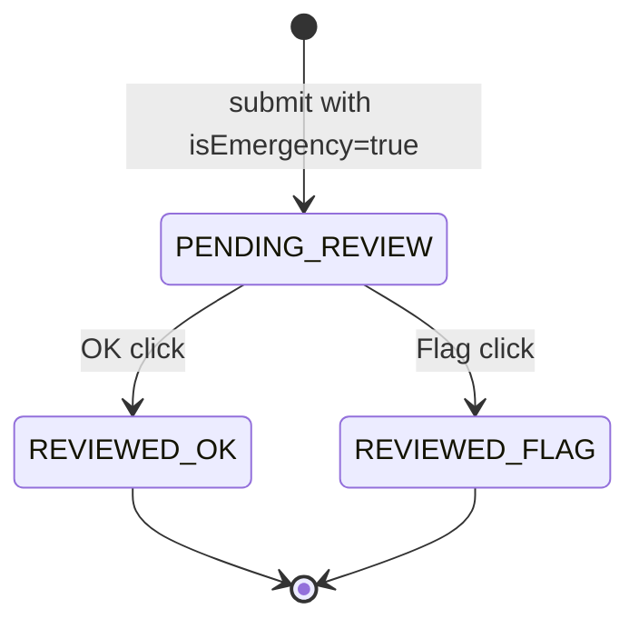

# Emergency Purchasing

## What it does

**Emergency Purchasing** is the requisition fast-lane for situations where waiting for the normal approval cycle would harm patient care or risk a clinical stockout. A requesting user marks the requisition as `isEmergency=true`, supplies a free-text **Emergency reason**, and on submit the system bypasses the [Approval Rules engine](./05-approvals.md) entirely and stamps the requisition `APPROVED` immediately. The same submit call also flags the row `emergencyReviewStatus=PENDING_REVIEW` so a manager can audit the decision after the fact.

The promise: **clinicians never wait on procurement** during an emergency. The trade-off: **every emergency requisition gets a manager's eyes on it within 24-48 hours**, marked either `REVIEWED_OK` or `REVIEWED_FLAG`.

## Who uses it

| Persona | Why |
|---|---|
| **Hospital** clinical / supply chain users | Submit fast-lane requisitions when a normal approval would delay critical care |
| **Hospital** materials managers / department directors | Triage the [Emergency Review Queue](#the-page-review-queue) post-hoc, mark OK or FLAG |
| **Admin** | Cross-tenant visibility; investigate `REVIEWED_FLAG` patterns for policy violations |

## The page (creation)

Emergency requisitions are filed from the standard [Requisitions](./03-requisitions.md) page (**`/requisitions`** → **New requisition**). On the create form, tick the **Emergency** checkbox and a required **Emergency reason** field appears.

- **Emergency** — boolean flag. When set, the requisition's `isEmergency` column is `1`.
- **Emergency reason** — free text, required when `isEmergency` is true. Stored in `requisitions.emergencyReason` and surfaced on the review queue.

Everything else on the create form (items, vendor preference, justification, needed-by date) works the same as a normal requisition.

## The page (review queue)

The triage view lives at **`/admin/emergency-review-queue`**. Component is `EmergencyReviewQueuePage` (`packages/web/src/features/admin/pages/EmergencyReviewQueue.tsx`).

- **Header** — lightning-bolt icon + title **Emergency Review Queue**, subtitle "*Requisitions that bypassed normal approval. Review post-hoc.*", **Refresh** button.
- **Pending banner** — orange `Alert` showing the queue count and a reminder *"Use FLAG when the emergency justification seems insufficient — flagged items are audited monthly."*
- **Table columns** — **Req #**, **Title**, **Approved at**, **Total** (USD), **Reason** (the operator's free text), **Action** (**OK** / **Flag** buttons).
- **Action buttons** — click **OK** to mark `REVIEWED_OK`, **Flag** to mark `REVIEWED_FLAG`. Both open a confirm modal with an optional **Note** textarea.

The queue is hospital-scoped for non-admins; admins see every hospital's pending rows.

## The fast-lane flow

The fast-lane skips three things a normal requisition does on submit:
1. **No approver lookup** — `pickPrimaryApprover()` is not called; `approverUserId` is set to the requester themselves.
2. **No notification fan-out** to an approver (there is no approver to notify).
3. **No `SUBMITTED → IN_REVIEW → APPROVED` ladder** — straight to `APPROVED` with `approvedAt` stamped.

What it does NOT skip: **budget encumbrance** (the same `resolveBudget()` + `commitBudget()` runs, so departments still see the spend committed against their budget); **history audit** (the `EMERGENCY_APPROVED` row in `requisition_history` includes the operator's reason); **off-formulary justification** (off-formulary items still require a per-line justification or the submit is rejected with a `ValidationError`).

## The post-hoc review

| Decision | When to use | Downstream effect |
|---|---|---|
| `REVIEWED_OK` | Emergency was real and the requisition was the right response | Row clears the review queue; appears in monthly fast-lane report as "appropriate use". |
| `REVIEWED_FLAG` | Emergency justification thin or absent; non-emergency situation pressured through the fast-lane | Row clears the queue but feeds the monthly compliance audit. Patterns of flagged users get a policy conversation. |

A flagged requisition is **not** reversed — the orders it spawned remain. The flag is an audit signal, not an operational rollback.

## Common tasks

- **File an emergency requisition** — **`/requisitions`** → **New requisition** → tick **Emergency**, type the reason (*"Trauma case in OR 3 — need 6× chest tube kits, ETA from regular vendor is 4 hours"*), add items, **Submit**. Requisition lands at `APPROVED` immediately.
- **Convert the emergency req to orders** — same as any approved req: open the detail, **Convert to orders** → POs (or **Convert to PO**), send via [PO Transmission](./32-po-transmission.md). Vendors see the orders within minutes.
- **Triage today's queue** — **`/admin/emergency-review-queue`** → for each pending row, read the **Reason**, decide **OK** or **Flag**, type a 1-sentence note, confirm. Aim for same-day or next-business-day triage.
- **Investigate a flagged pattern** — `GET /api/requisitions?status=APPROVED` with hospital filter, scan for repeat `emergencyReviewStatus=REVIEWED_FLAG` entries by the same `requestedByUserId`.

## Permissions

| Action | Required permission |
|---|---|
| File a requisition with `isEmergency=true` | `requisitions` WRITE (same as any requisition) |
| View **Emergency Review Queue** | `requisitions` READ |
| Mark `REVIEWED_OK` / `REVIEWED_FLAG` | `requisitions` FULL |

Non-admins always see their own hospital's queue only. The `/emergency-review-queue` endpoint enforces `hospitalId` from the JWT and throws `ForbiddenError` if it's missing.

## Behind the scenes

- **Route**: `packages/api/src/routes/requisitions.ts` — `POST /:id/submit` (fast-lane branch), `POST /:id/emergency-review`, `GET /emergency-review-queue`.
- **Schema** — three columns on `requisitions`: `isEmergency` (0/1), `emergencyReason` (text), `emergencyReviewStatus` (one of `PENDING_REVIEW` / `REVIEWED_OK` / `REVIEWED_FLAG` / null). The review timestamps are `emergencyReviewedAt` + `emergencyReviewedByUserId`.
- **Fast-lane gate** — `const isEmergency = row.isEmergency === 1` controls the branch. If true: `finalStatus='APPROVED'`, `finalApprover=user.id`, `approvedAt=now`, `emergencyReviewStatus='PENDING_REVIEW'`. The notification to the approver is skipped because there is no third-party approver.
- **History row** — `appendHistory(action='EMERGENCY_APPROVED', comment=\`Emergency fast-lane: ${reason}\`)` instead of the normal `SUBMITTED` action. Makes audit replay trivial — every fast-lane requisition has the same history signature.
- **Review enforcement** — `POST /:id/emergency-review` throws `ConflictError` if `emergencyReviewStatus !== 'PENDING_REVIEW'`. So once OK'd or flagged, the decision sticks; you can't re-review.
- **Budget interplay** — emergency requisitions still call `commitBudget()`. Departments that fast-lane heavily will see budget pressure even though the requisition skipped approval. This is by design — emergencies cost money like normal requisitions do.
- **No notification** to the reviewer pool — the queue is a pull dashboard; the monthly audit cron (separate concern, not part of this feature) is what nudges managers to keep the queue empty.

## Related

- [Requisitions](./03-requisitions.md) — the base feature; this doc covers the `isEmergency=true` branch only
- [Approvals queue](./05-approvals.md) — what emergencies bypass
- [Approval Rules](../workflows/06-set-up-approval-rules.md) — the workflow recipe for normal approver routing
- [Workflow 23 — Handle an emergency purchase](../workflows/23-handle-emergency-purchase.md) — end-to-end recipe walking the create → fast-lane → review flow
