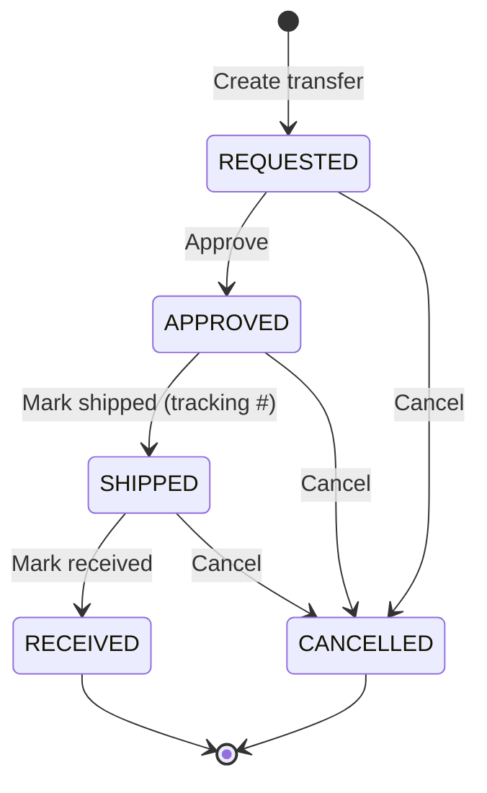
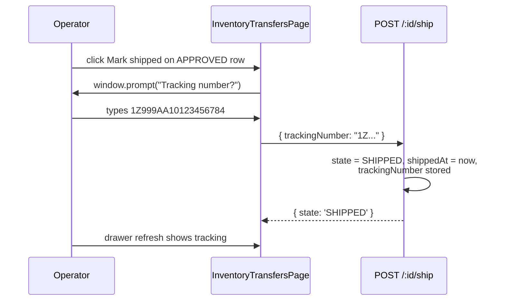

# Cross-Facility Inventory Transfers

## What it does

**Cross-Facility Inventory Transfers** move stock between two facilities of the *same hospital* — for example, main campus → satellite clinic, or warehouse → emergency cache. Each transfer is one row in `inventory_transfers` walking a 5-state machine, with one or more `inventory_transfer_lines` carrying the items. Tracking-number capture happens at the **ship** step; receipt is the terminal state.

This is **distinct from lab kit-site-to-kit-site moves** (the lab `TRANSFER_OUT` / `TRANSFER_IN` movements in [Lab Inventory](./27-lab-inventory.md)). Those happen inside a `labGroupId` and write to `lab_stock_movements`. Cross-facility transfers happen inside a `hospitalId` and write to `inventory_transfers`.

## Who uses it

| Persona | Why |
|---|---|
| **Hospital** materials managers / central supply | Initiate a transfer when one facility is short and a sister facility has excess |
| **Hospital** facility-side receiving | Mark **Received** when the truck arrives |
| **Admin** | Cross-tenant view; troubleshoot stuck transfers |

## The page

Lives at **`/inventory/transfers`**. Component is `InventoryTransfersPage` (`packages/web/src/features/inventory/pages/InventoryTransfers.tsx`).

- **Header** — swap-arrows icon + title **Cross-Facility Transfers**, subtitle "*Move stock between facilities. REQUESTED → APPROVED → SHIPPED → RECEIVED.*", **Refresh** + **New transfer** buttons.
- **Table columns** — **Transfer #**, **State** (color-coded tag), **Priority** (tag), **From** (facility name), **To** (facility name), **Reason**, **Created** (date).
- **Detail drawer** — opens on click of a transfer number. Shows the state badge, from/to facilities, **Tracking** number, line table (**HCPC**, **Description**, **Qty**), and the **Advance** button for the next state transition.
- **New transfer modal** — pick from/to facilities (must differ), priority, reason, then add one or more lines (HCPC + description + quantity). POSTs to `/api/transfers`.

## The 5-state machine

| State | Color | What it means | Who can advance |
|---|---|---|---|
| `REQUESTED` | default grey | Originator filed it; waiting for an authorizer to OK the move | Any user with `orders` WRITE |
| `APPROVED` | blue | Source facility has agreed to release the stock; ready to physically pull and ship | Same |
| `SHIPPED` | cyan | On a truck / handed to a courier; **tracking number captured** | Same |
| `RECEIVED` | green | Destination facility logged it in; terminal | Same |
| `CANCELLED` | red | Cancelled from any pre-terminal state; no stock moved | Same |

The transition factory `transition(from[], to, stampField)` in `inventoryTransfers.ts` enforces the legal moves — calling `/ship` on a `REQUESTED` row throws `ConflictError("Can't transition from REQUESTED to SHIPPED")`.

## Priority levels

| Priority | When to use |
|---|---|
| `LOW` | Catch-up balancing; non-time-sensitive |
| `NORMAL` | Default; standard restocking move |
| `HIGH` | Department running low; truck within 24h |
| `URGENT` | Active shortage at the destination; expedited freight or courier |

Priority is informational — it does not change the state machine or auto-bump anything. Receiving teams use it to prioritize their dock work.

## Tracking number capture

The tracking number is a **free-text** field. There is no carrier validation in MVP — paste whatever the source facility's shipping desk gives you. The receiving facility uses it to chase the carrier if the transfer goes silent.

## Reading the table

The list view is grouped by no default — pure recency order, newest first. Useful slicing patterns:

| Query | When to use |
|---|---|
| `?state=REQUESTED` | Source-facility worklist: what needs approval today |
| `?state=APPROVED` | Source-facility shipping desk: what's ready to pull and ship |
| `?state=SHIPPED` | Destination-facility receiving dock: what to expect in the next few days |
| `?fromFacilityId=<id>` | All outbound from this facility, regardless of state |
| `?toFacilityId=<id>` | All inbound to this facility (often what receiving staff want as their landing page) |

🛈 *Tracking number is the join key with the carrier.* Once captured at the **ship** step, it's the receiving team's only line back to the courier if the truck never shows. Keep the field accurate.

## Common tasks

- **Request a transfer** — **`/inventory/transfers`** → **New transfer** → pick source + destination, set priority + reason, add HCPC + description + quantity lines, **Request**. Row lands in `REQUESTED`.
- **Approve at the source** — open the card → **Approve**. Source facility staff now know to pull the stock.
- **Ship + capture tracking** — once pulled and on a truck: open the card → **Mark shipped**, paste the tracking number into the prompt, confirm.
- **Receive at the destination** — when the box arrives: open the card → **Mark received**. State terminal.
- **Cancel a stuck transfer** — open the card (any non-terminal state) → use the API `POST /transfers/:id/cancel` (UI button not always wired) — state goes `CANCELLED`. Stock stays where it was.

## Permissions

| Action | Required permission |
|---|---|
| List / view transfers | `orders` READ |
| Create / approve / ship / receive / cancel | `orders` WRITE |
| Cross-tenant filter (`?hospitalId=`) | Admin only |

Hospital users always see their own `hospitalId` rows. The route's `loadAndAuth()` throws `ForbiddenError` if a hospital user tries to touch another tenant's transfer.

## Behind the scenes

- **Route**: `packages/api/src/routes/inventoryTransfers.ts` — `GET /`, `POST /`, `GET /:id`, plus four transition endpoints (`/approve`, `/ship`, `/receive`, `/cancel`) all generated by the `transition()` factory.
- **Schema**: `packages/db/src/schema/inventoryTransfers.ts` — header table `inventory_transfers` (one row per transfer, indexed on hospital + state + from/to facility), lines table `inventory_transfer_lines` (FK to header, indexed on transfer ID).
- **Transfer number**: `getNextValue(db, 'inventory_transfers')` → `TR-YYYY-NNNNN`, monotonic per year.
- **State transitions** — `transition([from], to, stampField)` returns a Hono handler that (1) loads + tenant-checks the row, (2) validates the `from` state, (3) updates `state` + `updatedAt` + optional stamp column (`shippedAt` on ship, `receivedAt` on receive), (4) for `/ship` also persists the `trackingNumber` from the body.
- **No stock decrement**: the transfer model does *not* automatically debit source inventory or credit destination inventory. MVP treats inventory accounting as a separate concern (handled by [Cross-Site Inventory](./40-cross-site-inventory.md) physical counts). Future enhancement may auto-decrement on `SHIPPED` and auto-credit on `RECEIVED`.
- **No FK to facilities**: `from_facility_id` / `to_facility_id` are string refs into `hospital_facilities`. Renaming a facility doesn't break historical transfers; deleting a facility leaves an orphan ID — the UI falls back to showing the first 8 chars of the ID.
- **No FK to formulary**: lines carry `hcpc_code` + `description` as denormalized text. This keeps the lines table self-describing for historical audit even if the formulary item is later renamed or retired.
- **Single hospital**: `from_facility_id` and `to_facility_id` must both belong to the row's `hospital_id` — enforcement is implicit (no cross-hospital UI; admins who set hospital and facility mismatched will get nonsense results).

## Related

- [Cross-Site Inventory](./40-cross-site-inventory.md) — see the pivot of on-hand by site → use this feature to rebalance LOW / CRITICAL cells
- [Lab Inventory](./27-lab-inventory.md) — lab-side kit-site transfers (different table, different state machine)
- [Workflow 04 — Record a goods receipt](../workflows/04-record-goods-receipt.md) — comparable destination-side acceptance flow for vendor shipments
