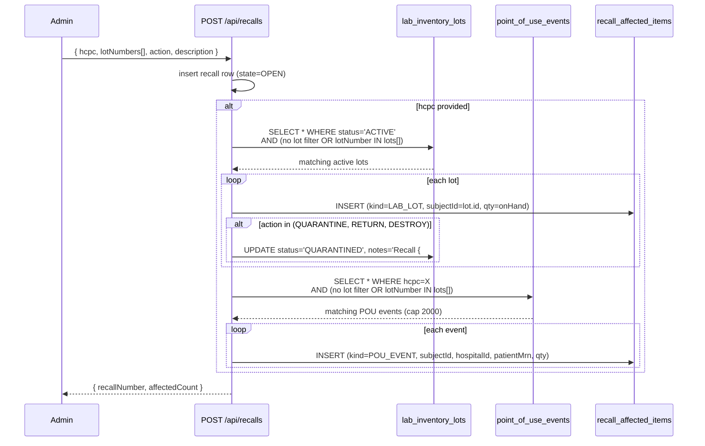
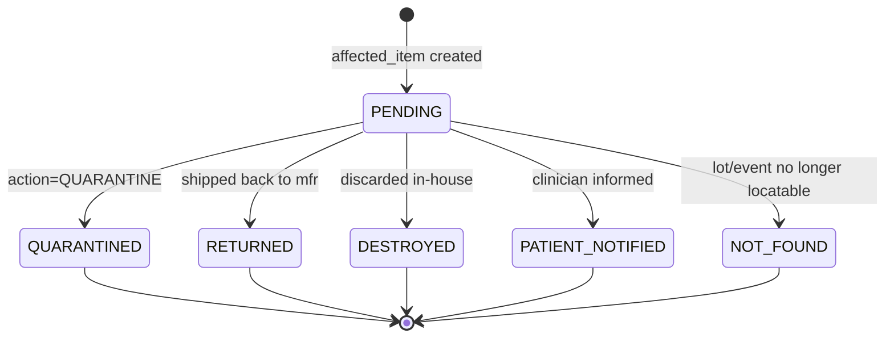

# Recalls

## What it does

**Recalls** is Curavend's manufacturer-recall intake and triage tool. An operator pastes the salient fields from a recall notice (FDA classification, HCPC, manufacturer number, affected lot numbers, description, required action), the system **auto-scans active lab lots and historical point-of-use events**, writes one `recall_affected_items` row per match, and (depending on the action) auto-quarantines lab lots on the spot. Each affected item is then dispositioned individually; the recall closes only when **every** affected item has a disposition.

The whole record is permanent — it's the system of record for FDA inspector questions like *"What did you do about Class I recall 2025-12345?"*

## Who uses it

| Persona | Why |
|---|---|
| **Admin** | Sole filer + closer. Operates the queue, communicates with manufacturers, sets dispositions |
| **Hospital** materials managers | Read-only — see what's been recalled at their hospital via `compliance-alerts` READ |
| **Lab** managers | See QUARANTINED lots in lab inventory; consult the recall record for return-shipping details |

## The page

Lives at **`/admin/recalls`**. Component is `RecallsPage` (`packages/web/src/features/admin/pages/Recalls.tsx`).

- **Header** — warning-triangle icon + title **Recalls**, subtitle "*Intake a manufacturer recall notice. Auto-scans inventory + POU events for affected items.*", **Refresh** + **File recall** buttons.
- **Table columns** — **Recall #**, **Severity** (INFO/WARN/CRITICAL tag), **State** (OPEN/INVESTIGATING/CLOSED), **Class** (CLASS_I / II / III tag), **HCPC**, **Action** (purple tag — QUARANTINE/RETURN/DESTROY/NOTIFY_PATIENT), **Description**, **Created**.
- **File recall modal** — required **Description**, optional **HCPC**, **Mfr #**, comma-separated **Lot numbers**, **Class** (FDA classification), **Action** (required), **Manufacturer**, **Manufacturer recall ID**.
- **Detail drawer** — two-column descriptions block + per-item action: **Affected items** table (**Kind**, **Lot**, **Qty**, **Patient MRN**, **Disposition**, **Set** button when pending). Includes a danger **Close recall** button that's enabled only when every item has a disposition set.

## FDA classifications

```mermaid
stateDiagram-v2
  state Severity {
    [*] --> CLASS_I: Reasonable probability of<br/>serious adverse health consequences<br/>or death
    [*] --> CLASS_II: May cause temporary or medically<br/>reversible adverse health consequences;<br/>remote probability of serious harm
    [*] --> CLASS_III: Not likely to cause adverse<br/>health consequences
  }
```

| Classification | FDA definition | Default severity | Typical action |
|---|---|---|---|
| `CLASS_I` | Serious health hazard or death | `CRITICAL` (auto-derived if not set) | QUARANTINE + RETURN + NOTIFY_PATIENT |
| `CLASS_II` | Temporary / reversible health effects | `WARN` | QUARANTINE + RETURN |
| `CLASS_III` | Unlikely to cause adverse health effects | `WARN` | QUARANTINE + DESTROY (often just discard) |

If you leave **Class** blank, severity defaults to `WARN`. Filling `CLASS_I` auto-sets severity to `CRITICAL` — the route does this in `POST /api/recalls` body normalization.

## The intake → auto-scan flow

Two important behaviours:

1. **Auto-quarantine** fires only when `actionRequired` is `QUARANTINE`, `RETURN`, or `DESTROY`. `NOTIFY_PATIENT`-only recalls leave lab lots active (the harm has already occurred — no point in pulling stock).
2. **POU scan is for patient notification candidates**. Every historical bedside event using the recalled HCPC/lot is row-stamped so the operator can disposition it as `PATIENT_NOTIFIED`.

## Dispositions

| Disposition | When to set |
|---|---|
| `QUARANTINED` | Lot is physically separated; will be returned or destroyed later |
| `RETURNED` | Lot has shipped back to the manufacturer (RMA out the door) |
| `DESTROYED` | Lot destroyed in-house (often Class III where the manufacturer doesn't want it back) |
| `PATIENT_NOTIFIED` | The clinician or hospital has reached out to the patient who received this unit |
| `NOT_FOUND` | Lot was already issued, lost, or otherwise unaccounted for — documented so the recall can still close |

The disposition is set per-item from the drawer: pick from the dropdown, optional **notes**, confirm. The route stamps `dispositionedAt` + `dispositionedByUserId`.

## Closing the recall

`POST /api/recalls/:id/close` runs a `SELECT COUNT(*) WHERE recall_id=? AND disposition IS NULL`. If the count is non-zero, the request throws `ConflictError("N affected items still need a disposition")`. Otherwise the recall flips to `CLOSED`, stamps `closedAt` + `closedByUserId`, and disappears from open queues.

The danger-red **Close recall** button in the drawer is wired to this endpoint; it's only worth clicking once the orange `N items need disposition` alert clears.

## Common tasks

- **File a manufacturer recall** — **`/admin/recalls`** → **File recall**. Paste the FDA Class, HCPC, manufacturer number, comma-separated lot numbers, description, choose **Action** (`QUARANTINE` is the safe default). Toast confirms the recall number and *affectedCount*.
- **Disposition affected items** — open the recall → for each row with disposition `PENDING`, click **Set** → pick from the dropdown.
- **Investigate patient notification** — filter affected items by `kind=POU_EVENT` → each row carries a `patientMrn`; cross-reference your EHR / patient outreach tool.
- **Close out a fully-dispositioned recall** — open detail → click **Close recall**. State flips to `CLOSED`, terminal.
- **Pull all open recalls for a daily standup** — `GET /api/recalls?state=OPEN` (sort by severity desc).

## Permissions

| Action | Required permission |
|---|---|
| List / view recalls + affected items | `compliance-alerts` READ |
| Disposition an affected item | `compliance-alerts` WRITE |
| File a new recall | `compliance-alerts` WRITE + admin role |
| Close a recall | `compliance-alerts` FULL + admin role |

Non-admins cannot file or close recalls (the route throws `ForbiddenError('Admin-only')`).

## Behind the scenes

- **Route**: `packages/api/src/routes/recalls.ts` — list, create (with auto-scan), detail (with affected items), per-item disposition, close.
- **Schema**: `packages/db/src/schema/recalls.ts` — header table `recalls` with FDA enums (`RECALL_CLASSIFICATIONS`, `RECALL_STATES`, `RECALL_ACTIONS`), child table `recall_affected_items` (kind = `LAB_LOT` / `INVENTORY` / `POU_EVENT`, FK back via `recall_id`).
- **Recall number**: `getNextValue(db, 'recalls')` → `REC-YYYY-NNNNN`.
- **Auto-scan scope**: wrapped in try/catch so a failed scan doesn't fail the recall creation. The recall row exists either way; affected items can be added manually after the fact if needed.
- **Lot filter logic**: if `lotNumbers` is non-empty array, scan is `IN (...)`; if empty/null, the scan matches **every active lot** with the recall's HCPC (used when the manufacturer recalls all production from a date range).
- **POU cap**: 2000 events to avoid blowing memory on a wide recall. For HCPCs with > 2000 historical POUs, manually expand via the API with date filters.
- **Hospital scope on affected items**: `LAB_LOT` rows carry no hospital (lab lots are lab-group scoped); `POU_EVENT` rows preserve the POU's `hospitalId` so multi-hospital reporting can roll up correctly.
- **Severity vs. classification**: severity is the display/alert color; classification is the FDA category. Severity is auto-derived from classification on create but can be overridden in the body.
- **No re-open**: `state=CLOSED` is terminal — there is no API to re-open. A correction would be a new recall with a back-reference in the description.

## Related

- [Lab Inventory](./27-lab-inventory.md) — where auto-quarantined lots show up (status filter = `QUARANTINED`)
- [Point-of-Use Capture](./39-point-of-use-capture.md) — feeds the POU side of the auto-scan
- [Compliance Dashboard](./41-compliance-dashboard.md) — sister surface for expiry-window alerts (not recalls)
