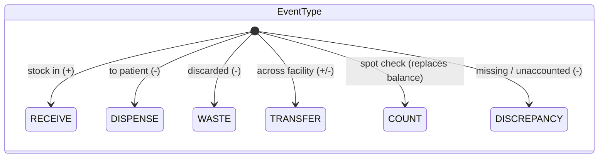
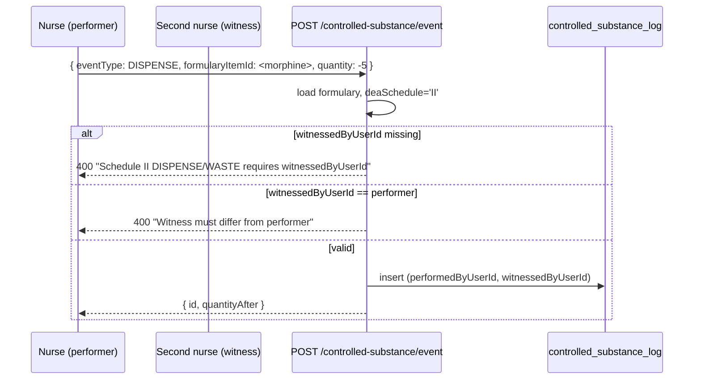
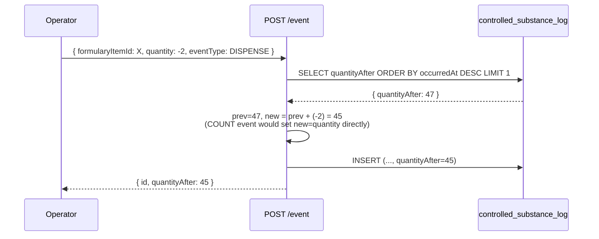

# Controlled Substance Log

## What it does

**Controlled Substance Log** is the append-only chain-of-custody ledger for DEA Schedule II–V items. Any formulary item flagged with a `deaSchedule` value generates a log row on every receipt, dispense, waste, transfer, count, and discrepancy event. Schedule II events have a **witness-required** gate enforced at the API layer; other schedules are witness-suggested.

Each row carries a **signed quantity** (positive for additions, negative for removals) and a running **`quantityAfter`** snapshot computed server-side. The result is a tamper-evident record that satisfies 21 CFR §1304 (DEA recordkeeping) and feeds your annual DEA inventory.

## Who uses it

| Persona | Why |
|---|---|
| **Admin** | Records events, reviews the log, investigates discrepancies, prints the annual DEA inventory |
| **Hospital** pharmacy / nursing managers | Record dispense + waste events; sign as witness for Schedule II |
| **Auditor / DEA inspector** | Reads via export; verifies chain of custody on demand |

## The page

Lives at **`/admin/controlled-substance`**. Component is `ControlledSubstancePage` (`packages/web/src/features/admin/pages/ControlledSubstance.tsx`).

- **Header** — padlock icon + title **Controlled Substances**, subtitle "*Chain-of-custody log for DEA Schedule II–V items. Schedule II DISPENSE / WASTE require a witness.*", **Refresh** + **Record event** buttons.
- **Info banner** — "*Append-only log. Use COUNT events to spot-check; record DISCREPANCY for missing units.*"
- **Table columns** — **When**, **Event** (color-coded tag), **Sched** (II/III/IV/V tag), **HCPC**, **Qty** (signed, green for positive, red for negative), **After** (running balance), **Patient** (MRN — DISPENSE only), **By** (performer user ID), **Witness** (witness user ID — Schedule II required).
- **Record event modal** — picker for **Event type** (6 options), **Formulary item ID** or **HCPC code**, **DEA Schedule** (if no formulary item), **Quantity** (signed), **Lot #**, **Patient MRN** (DISPENSE only), **Witness user ID**, **Notes**.

## DEA scheduling on the formulary

A formulary item is "controlled" iff its `deaSchedule` is one of `II`, `III`, `IV`, `V`. The column lives at `formulary_items.dea_schedule` (text, nullable). When the controlled-substance event endpoint sees a `formularyItemId`, it reads the schedule from that item and rejects with `ValidationError('Referenced formulary item has no DEA Schedule — not a controlled substance')` if the column is null.

| Schedule | Examples | Witness required? |
|---|---|---|
| `II` | Morphine, fentanyl, oxycodone, methylphenidate | **Yes** — DISPENSE and WASTE both throw `ValidationError` without `witnessedByUserId` |
| `III` | Ketamine, buprenorphine, codeine combos | Suggested (warning, not blocked) |
| `IV` | Diazepam, lorazepam, midazolam, tramadol | Suggested |
| `V` | Pregabalin, low-strength codeine | Suggested |

Note: Schedule I substances are not legal for prescription use; the system does not model them.

## The 6 event types

| Event | Sign | When to use | Quantity-after effect |
|---|---|---|---|
| `RECEIVE` | `+` | New shipment arrived, vault stocked | `prev + qty` |
| `DISPENSE` | `−` | Administered to a patient | `prev + qty` (negative qty subtracts) |
| `WASTE` | `−` | Partial vial discarded after dispense, expired stock destroyed | `prev + qty` |
| `TRANSFER` | `+` or `−` | Moved to / from another facility's vault | `prev + qty` |
| `COUNT` | absolute | Periodic physical inventory; `quantity` is the **new balance**, not a delta | **REPLACES**: `quantityAfter = quantity` |
| `DISCREPANCY` | `−` | Manual correction; vault count < ledger count, unaccounted loss | `prev + qty` (negative) |

The `COUNT` semantics matter: a count entered as `quantity=50` sets the running balance to `50` regardless of what the ledger said before. To net out a count error, file a `DISCREPANCY` event with the negative delta and a note explaining the cause.

## Schedule II witness enforcement

Two rules:
1. `witnessedByUserId` is **required** on Schedule II `DISPENSE` and `WASTE`.
2. `witnessedByUserId` **must not equal** `performedByUserId` (the JWT user filing the event). Self-witness is rejected.

Other schedules accept the event without a witness, but operators are encouraged to capture one for high-value items (the **Witness** column is empty when not provided).

## Running balance computation

The balance is **per `(hospitalId, formularyItemId)` pair**. Reading the balance via `GET /controlled-substance/balance/:formularyItemId` returns the most-recent row's `quantityAfter`, defaulting to 0 if the item has no log rows yet.

## Common tasks

- **Record a receipt** — **`/admin/controlled-substance`** → **Record event** → **Event type** = `RECEIVE`, paste formulary item ID, positive **Quantity**, **Lot #**, **Save**.
- **Record a Schedule II dispense (with witness)** — **Record event** → `DISPENSE`, formulary item, **Quantity** = negative units, **Patient MRN**, **Witness user ID** (different person, looks up in [User Management](./18-user-management.md)). Without the witness ID the API rejects.
- **Spot-check the vault** — **Record event** → `COUNT`, paste the actual vault count as **Quantity**. The next list refresh shows the running balance set to that number.
- **Reconcile a count discrepancy** — after a `COUNT` that differs from the ledger, file a `DISCREPANCY` with `quantity = (count - ledger)` and a note explaining cause.
- **Filter the log for a single item** — `GET /controlled-substance/log?formularyItemId=<id>` (UI's table doesn't expose the filter; admins hit the API directly).
- **Read the running balance** — `GET /controlled-substance/balance/<formularyItemId>` returns `{ balance, lastEventAt }`.

## Permissions

| Action | Required permission |
|---|---|
| Read log / balance | `compliance-alerts` READ |
| Record an event | `compliance-alerts` WRITE |
| Read across hospitals | Admin only |

Non-admins are auto-scoped to their `hospitalId` on every list and event. Admins can pass `?hospitalId=` to slice by tenant.

## Behind the scenes

- **Route**: `packages/api/src/routes/controlledSubstance.ts` — `GET /log`, `POST /event`, `GET /balance/:formularyItemId`.
- **Schema**: `packages/db/src/schema/controlledSubstanceLog.ts` — append-only table indexed on hospital, item, event, occurredAt. `CONTROLLED_EVENT_TYPES` and `DEA_SCHEDULES` exported as const-tuples for shared typing.
- **DEA column on formulary**: `formularyItems.deaSchedule` (text). When set, downstream issuance flows (POU capture, etc.) are expected to write a paired controlled-substance event.
- **Append-only by convention**: there is no UPDATE or DELETE endpoint. Corrections are new `DISCREPANCY` rows, not edits — preserves DEA tamper-evident requirement.
- **Witness rule**: enforced at line 82-89 of `controlledSubstance.ts`. Schedule II + `DISPENSE`/`WASTE` triggers the check; everything else is permissive (intentional — over-strict witness rules drive workarounds).
- **Balance compute**: O(1) per write (SELECT last row), O(1) per read (SELECT last row). The `quantityAfter` snapshot is the source of truth — no rolling sum at read time.
- **Tenant**: every event row carries `hospitalId` (required). Performer + witness are user IDs from the JWT/lookup; no cross-hospital witnesses (UI does not surface them, API does not validate it).
- **No physical lot decrement**: a `WASTE` event records the loss in the controlled-substance ledger but does NOT auto-decrement the matching lab/inventory lot. That's a separate concern (the lab `lab_stock_movements` table for lab consumables; manual cycle count for non-lab vault stock).

## Related

- [Formulary / Item Master](./04-formulary.md) — where the `deaSchedule` column is set on an item
- [Recalls](./46-recalls.md) — sister compliance surface for manufacturer-issued action items
- [Compliance Dashboard](./41-compliance-dashboard.md) — daily-cron expiry alerts (different table, same persona)
- [Lab Inventory](./27-lab-inventory.md) — where controlled lab consumables additionally write `lab_stock_movements`
