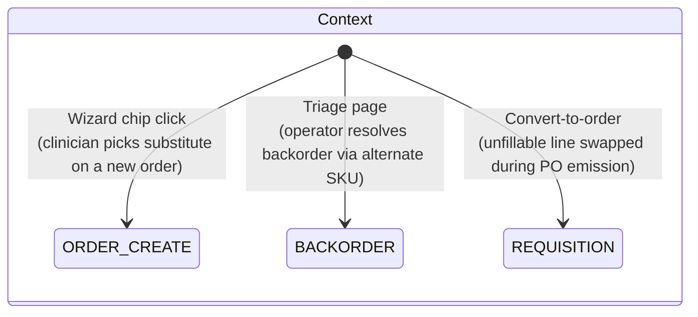
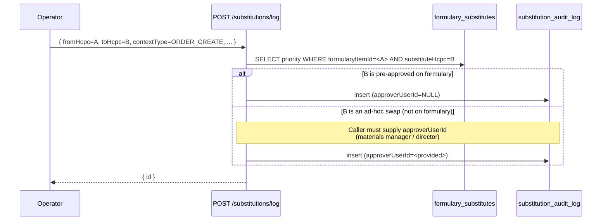

# Substitution Audit Log

## What it does

**Substitution Audit Log** is the append-only record of every time a Curavend operator swapped one HCPC for another mid-workflow — e.g., a clinician picked a substitute on the order create wizard because the preferred SKU was out of stock, or a backorder triage operator routed a request to an alternate vendor, or a requisition convert step swapped an unfillable line.

Every swap captures the *from* HCPC, *to* HCPC, the **context** (which workflow), an optional **reason** string, who did it, and (when the swap is *outside* the pre-approved [formulary substitutes](./04-formulary.md) list) an **approver** user ID. Three contexts are tracked: `ORDER_CREATE`, `BACKORDER`, `REQUISITION`.

## Who uses it

| Persona | Why |
|---|---|
| **Admin** | Cross-tenant view of all swaps; investigate clinical preference drift or vendor-bias patterns |
| **Hospital** materials managers | Per-hospital view to spot operators routinely deviating from formulary |
| **Hospital** clinicians | Implicit — they trigger most rows by picking substitutes on order create |

The page itself is read-mostly: writes happen automatically as side effects of other workflows, not from a dedicated entry form.

## The page

There is no standalone "Substitutions" page in MVP — the log is exposed via:

- **API**: `GET /api/substitutions` (filterable by context, source HCPC, context ID)
- **Reporting embed**: future. Inline detail panels for individual contexts (the requisition detail drawer, the backorder detail page, the order create wizard's history strip) consume the same endpoint.

For now the canonical surface is the API. A typical admin investigation looks like:

```
GET /api/substitutions?contextType=BACKORDER&fromHcpcCode=A4253
```

Returns up to 500 swap rows for that HCPC in backorder context, newest first.


## The 3 contexts



| Context | Where the row is written | Typical reason text |
|---|---|---|
| `ORDER_CREATE` | DME / supply create wizard, via `POST /api/substitutions/log` after the user clicks a substitute chip | *"Preferred SKU out of stock at preferred vendor"* |
| `BACKORDER` | [Backorder Triage](./42-backorder-triage.md) page, when the operator accepts a formulary substitute to resolve an aged backorder | *"Vendor abandoned line; substitute pre-approved on formulary"* |
| `REQUISITION` | Requisition convert-to-order step, when a line's preferred vendor cannot fulfill and the system suggests a swap | *"Vendor returned no-bid; routed to secondary"* |

The `contextId` column carries the corresponding parent ID (the order ID, the backorder ID, the requisition ID), so a single click on a parent record can show every substitution attached to it.

## The approver gate



Two patterns:

1. **Pre-approved formulary substitution** — `to_hcpc_code` exists in `formulary_substitutes` for the source item. No `approver_user_id` needed; the formulary itself is the standing approval.
2. **Ad-hoc swap** — `to_hcpc_code` does **not** exist in the formulary substitute mapping. The caller MUST supply `approverUserId` (a department director, materials manager, or whoever has standing authority for the deviation). MVP enforces this at the calling-workflow layer (each context decides what's "ad-hoc"); the `/log` endpoint itself accepts both shapes.

The `approverUserId` field on the row is what makes the audit trail useful: when a clinician picks a non-formulary substitute, the **person who blessed the deviation** is captured. Patterns of one person approving many ad-hoc swaps are an audit signal.

## Why this table exists

Three audit questions this log answers cleanly:

| Question | Query |
|---|---|
| *"Did clinician X swap off-formulary often last month?"* | Filter by `substituted_by_user_id` + date range; count rows where `approver_user_id` is not null |
| *"What's the most-substituted HCPC, and what is it being swapped to?"* | Group by `from_hcpc_code` + `to_hcpc_code`; rank by row count |
| *"For this requisition, what swaps happened during convert?"* | `?contextType=REQUISITION&contextId=<req-id>` returns every line swap during that convert |

Without this log, the swap decisions are buried in workflow context — the requisition shows the final shipped HCPC, the order shows the final shipped HCPC, but neither remembers what was originally asked for. The audit log preserves the original intent.

🛈 *Why log even pre-approved swaps?* Because patterns matter. A swap that's individually fine (it's on the formulary substitute list) becomes a clinical-preference signal at volume — *"clinicians prefer HCPC B over HCPC A 4:1 even when A is preferred"* should prompt a formulary refresh, not be invisible.

## Common tasks

- **List recent swaps for a hospital** — `GET /api/substitutions?hospitalId=<id>` (admin) or just `GET /api/substitutions` (auto-scopes for hospital users).
- **Investigate substitutions for a specific HCPC** — `GET /api/substitutions?fromHcpcCode=A4253` shows every time `A4253` was swapped out, across contexts.
- **Find all swaps tied to one backorder** — `GET /api/substitutions?contextType=BACKORDER&contextId=<bo-id>`.
- **Spot ad-hoc swaps for compliance review** — pull the full list, filter client-side for rows where `approverUserId` is not null (those are the ones outside the formulary mapping).
- **Spot swap-heavy operators** — group the response client-side by `substituted_by_user_id`; operators with > N swaps/month may need a refresher on formulary selection.

## Permissions

| Action | Required permission |
|---|---|
| List swaps | `formulary` READ |
| Log a new swap (called by workflows) | `formulary` WRITE |
| Read across hospitals | Admin only |

Hospital users see their own `hospitalId` rows. Admins can pass `?hospitalId=` to filter, or omit it for the cross-tenant view.

## Behind the scenes

- **Route**: `packages/api/src/routes/substitutions.ts` — `GET /` (list, 500-row cap), `POST /log` (insert).
- **Schema**: `packages/db/src/schema/substitutionAuditLog.ts` — `substitution_audit_log` table; indexes on hospital, `(contextType, contextId)`, and `fromHcpcCode` for the common query shapes.
- **Context enum**: `SUBSTITUTION_CONTEXTS = ['ORDER_CREATE', 'BACKORDER', 'REQUISITION']` — exported as const-tuple from `@curavend/db`.
- **No DELETE**: append-only by convention; corrections are new rows with notes (not edits).
- **Hospital-nullable**: `hospitalId` is nullable on the schema so admin-side cross-tenant operations (rare) can still log. In practice every row created via the supported workflows carries a hospital.
- **`substitutedByUserId` is the actor**: always set to the JWT user filing the log row. Even if the operator is acting on a clinician's behalf, the audit captures who clicked.
- **`approverUserId` is the standing-authority figure**: only set when the swap is ad-hoc (off-formulary). The calling workflow is responsible for collecting it; the `/log` endpoint does not auto-derive.
- **No referential integrity to HCPC**: `fromHcpcCode` / `toHcpcCode` are denormalized text — the log row survives a formulary item rename or retirement, preserving the historical audit.

## Related

- [Formulary / Item Master](./04-formulary.md) — where the substitute mappings live; pre-approved substitutions skip the approver gate
- [Backorder Triage](./42-backorder-triage.md) — one of the three contexts that auto-writes rows here
- [Requisitions](./03-requisitions.md) — another auto-writer (on convert-to-order)
- [DME Order Wizard](./21-dme-order-wizard.md) — `ORDER_CREATE` context source
- [Workflow 07 — Build a formulary with substitutes](../workflows/07-create-formulary-with-substitutes.md) — how to seed the pre-approved substitute mappings
