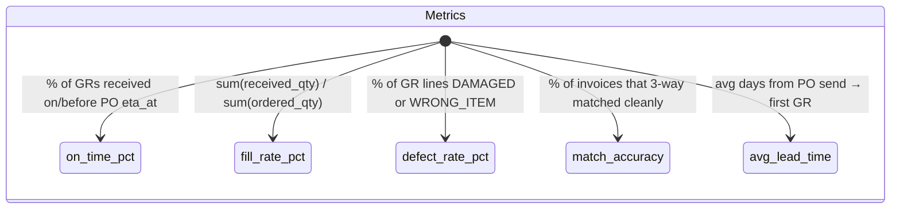
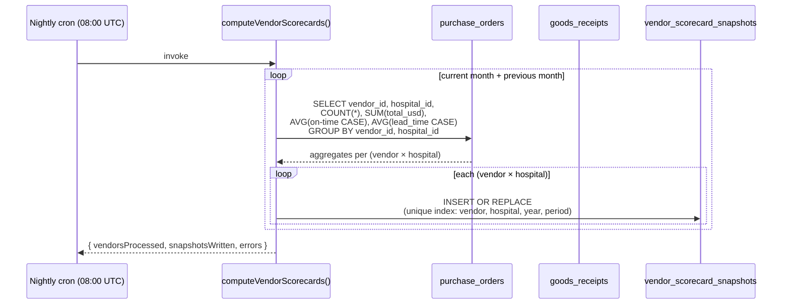
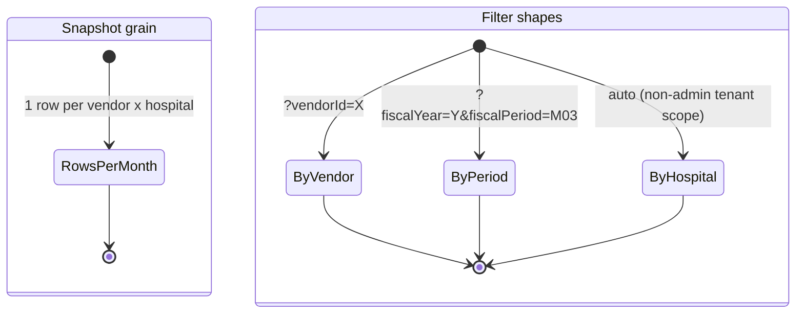

# Vendor Scorecard Snapshots

## What it does

**Vendor Scorecard Snapshots** is the monthly performance rollup for every vendor a hospital transacts with. A nightly cron walks `purchase_orders`, `goods_receipts`, `invoices`, and the 3-way-match results from the trailing 1–2 months and upserts one row per `(vendor × hospital × fiscal_year × fiscal_period)` into `vendor_scorecard_snapshots`. Each row carries five performance metrics plus total spend, suitable for a sortable dashboard, a vendor business review, or feeding the [Vendor Scorecard](./17-vendor-scorecard.md) summary page.

Where [Vendor Scorecard](./17-vendor-scorecard.md) is the at-a-glance grade view, this feature is the **historical time series** — every prior month is kept, so trends ("on-time slipping for vendor X?") and YoY comparisons are one filter away.

## Who uses it

| Persona | Why |
|---|---|
| **Admin** | Quarterly vendor QBRs; cross-hospital aggregate ("which hospital does this vendor underperform in?") |
| **Hospital** procurement leads / contract managers | Annual vendor scorecards for renewal negotiations; SLA enforcement evidence |
| **Vendor** account managers | View their own row (vendor-scoped); see where they stand on the hospital's metrics |

## The page

Lives at **`/reporting/vendor-scorecards`**. Component is `VendorScorecardsPage` (`packages/web/src/features/reporting/pages/VendorScorecards.tsx`).

- **Header** — trophy icon + title **Vendor Scorecards**, subtitle "*Monthly snapshots auto-computed at 08:00 UTC. Metrics: on-time, fill rate, defect rate, match accuracy, lead time.*", **FY** selector, **Refresh**, **Compute now** buttons.
- **FY filter** — `?fiscalYear=YYYY` query param. Defaults to current year.
- **Table columns** — **Vendor** (name resolved from `/vendors`), **Period** (`{YYYY}/M{MM}` tag), **POs** (total), **Received** (count), **On-time %** (green ≥95, orange ≥85, red below), **Fill %**, **Defect %** (red >2%), **Lead (d)** (avg days from PO → first GR), **Spend** (USD), **Computed** (timestamp).
- **Compute now** — admin-only manual trigger. Re-runs the cron over the current + previous month and upserts via `INSERT OR REPLACE` on the unique index.

## The 5 metrics

| Metric | What it measures | Target | Sources |
|---|---|---|---|
| `on_time_pct` | Of all received POs, what % arrived on or before the promised `eta_at` | ≥ 95 % | `purchase_orders.eta_at`, `goods_receipts.posted_at` |
| `fill_rate_pct` | Of units ordered, what % were actually delivered | ≥ 98 % | `goods_receipts_lines.quantity_received`, `purchase_order_items.quantity` |
| `defect_rate_pct` | Of received lines, what % were marked `DAMAGED` or `WRONG_ITEM` | ≤ 2 % | `goods_receipts_lines.condition` |
| `invoice_match_accuracy_pct` | Of invoices for this vendor, what % 3-way matched without exception | ≥ 95 % | `three_way_matches.status` |
| `avg_lead_time_days` | Mean days from PO `created_at` to first `goods_receipts.posted_at` | Vendor-specific | `purchase_orders.created_at`, `goods_receipts.posted_at` |

`total_spend_usd` is the dollar volume the vendor moved with this hospital in the period — useful for size-weighting metrics.

> **MVP scope.** The nightly cron currently computes `on_time_pct`, `avg_lead_time_days`, `total_spend_usd`, plus the PO counts. The remaining three metrics (`fill_rate`, `defect_rate`, `invoice_match_accuracy`) have columns reserved on the schema and dashboard but are not yet populated — they appear as `—` in the table. Filling them is a planned follow-up.

## The compute cycle

Two months are computed every run so a late-arriving GR (posted in the new month for a PO sent at end of prior month) updates the prior month's snapshot. The `INSERT OR REPLACE` upsert means re-running is safe — same row, fresh numbers.

## Per-(vendor × hospital × month) granularity

The unique index is `(vendor_id, hospital_id, fiscal_year, fiscal_period)`. So for a vendor that sells to 5 hospitals, you get 5 rows per month, plus optionally 1 platform-wide rollup row (where `hospital_id IS NULL` — populated by future cron paths, not by the MVP compute).

This lets a hospital ask *"how does vendor X perform on MY business?"* (filter by hospital), and an admin ask *"how does vendor X perform overall?"* (sum rows across hospitals).

## Common tasks

- **View this year's snapshots** — **`/reporting/vendor-scorecards`** → defaults to current FY → table shows every vendor × period × hospital row, newest period first.
- **Drill into one vendor** — `GET /api/reporting/vendor-scorecard?vendorId=<id>&fiscalYear=2026` returns just that vendor's monthly history.
- **Manually trigger a recompute** — click **Compute now** (admin-only). Useful after fixing a data bug or back-dated GR post.
- **Annual rollup** — page through 12 monthly rows for a vendor; sum spend, average the percentages for the FY summary.
- **Spot a deteriorating vendor** — sort by **On-time %** ascending within current period; red tags surface first.

## Permissions

| Action | Required permission |
|---|---|
| List / view snapshots | `vendors` READ |
| Manual recompute (`/compute`) | Admin only |
| Cross-tenant view | Admin only (non-admins auto-scoped to `hospitalId`) |

Vendor users see snapshots where `vendor_id` matches their JWT vendor ID (limited columns). Hospital users see their own hospital's rows. Admins see everything.

## Behind the scenes

- **Routes**: `packages/api/src/routes/procurementAnalytics.ts` — `GET /vendor-scorecard`, `POST /vendor-scorecard/compute`.
- **Service**: `packages/api/src/services/vendorScorecardService.ts` — `computeVendorScorecards(d1)`. Iterates two months (current + previous), runs one `GROUP BY vendor_id, hospital_id` aggregate per month, upserts via raw SQL `INSERT OR REPLACE`.
- **Schema**: `packages/db/src/schema/vendorScorecardSnapshots.ts` — `vendor_scorecard_snapshots`; unique index `(vendor_id, hospital_id, fiscal_year, fiscal_period)` ensures idempotent upsert.
- **Period encoding**: `fiscal_period = 'M' + zero-padded month`, e.g. `M03` for March, `M11` for November. `fiscal_year` is the calendar year. Future fiscal calendars (non-calendar fiscal years) would extend this.
- **Hospital-null rollup**: the schema permits `hospital_id IS NULL` for a platform-wide aggregate; the MVP cron groups by `(vendor, hospital)` so it never writes the null row. A follow-up cron pass can add it.
- **Idempotency**: re-running the cron in the same calendar minute will overwrite-with-same-values (no harm); re-running after a late GR post will overwrite-with-better-values (intended).
- **Cron schedule**: 08:00 UTC, set in `wrangler.toml` cron triggers. Use `compute` button for ad-hoc runs.
- **Performance**: one `GROUP BY` query per month, bounded; for a tenant with ~50 vendors × 5 hospitals = 250 aggregates per month, total compute is sub-2-seconds.

## Related

- [Vendor Scorecard](./17-vendor-scorecard.md) — at-a-glance grade card; consumes the latest snapshot row per vendor
- [3-Way Matching](./08-three-way-match.md) — source for the `invoice_match_accuracy_pct` metric (when populated)
- [Goods Receipts](./07-goods-receipts.md) — source for `on_time_pct`, `defect_rate_pct`, `fill_rate_pct`
- [PO Transmission](./32-po-transmission.md) — source for `avg_lead_time_days` (uses PO created → first GR posted)
