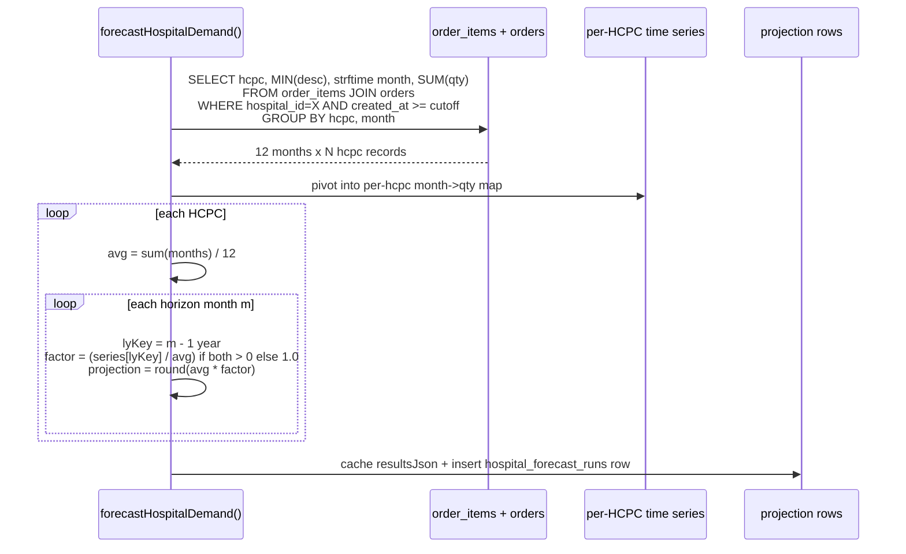
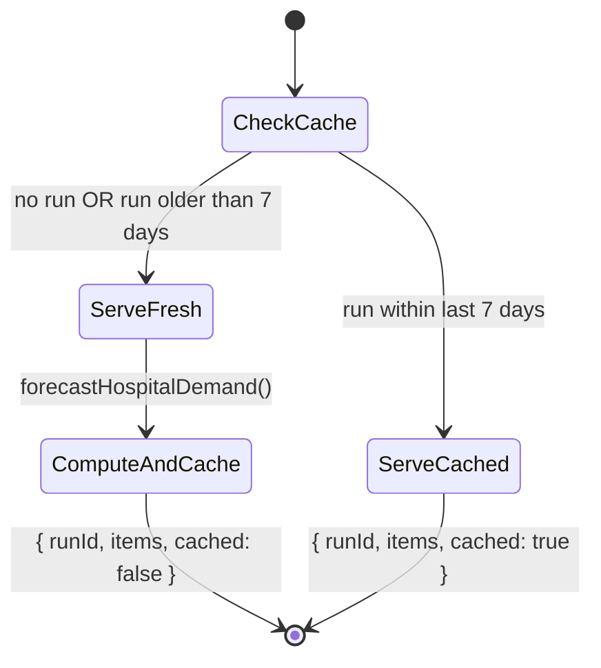

# Hospital Demand Forecast

## What it does

**Hospital Demand Forecast** is the supply-side projection for what a hospital is likely to need over the next N months. The service walks every `order_items` row joined to `orders` for the trailing 12 months, groups by `(hcpcCode × calendar month)`, computes a **12-month trailing average**, applies a **same-month-last-year seasonality factor**, and outputs a per-HCPC projection table for the next 3 months by default.

Where the lab-side [Lab Forecasting](./28-lab-forecasting.md) feature is about test-kit consumables on a 60/30-day window, this is hospital-wide supply demand on a monthly cadence. The result is cached for 7 days — the page is read-mostly, and admins force a recompute when the underlying order data has changed materially.

## Who uses it

| Persona | Why |
|---|---|
| **Hospital** procurement / materials planners | Anticipate next-quarter demand; place blanket POs ahead of time |
| **Hospital** finance | Budget validation — does projected demand fit the period budget? |
| **Admin** | Cross-tenant ops; force recompute after data corrections |
| **Vendor** account managers | Use shared exports of the projection to plan supply for their customer hospitals |

## The page

Lives at **`/reporting/hospital-forecast`**. Component is `HospitalForecastPage` (`packages/web/src/features/reporting/pages/HospitalForecast.tsx`).


- **Header** — line-chart icon + title **Hospital Demand Forecast**, subtitle "*12-month trailing average × month-of-year seasonality factor. Cached daily.*", **Reload** + **Recompute** buttons.
- **Run meta card** — shows **Run at** timestamp, `cached` (grey) or `fresh` (green) tag, count of HCPCs in the projection.
- **Forecast table** — **HCPC** (fixed-left), **Description** (fixed-left), **12mo total**, **12mo avg**, plus one **dynamic column per projected month** (e.g. `2026-06`, `2026-07`, `2026-08`). Cells show the projected quantity in bold.
- **Recompute** button — POSTs `/api/reporting/hospital-forecast/run`, writes a new `hospital_forecast_runs` row, returns fresh data, ignores cache.

## The forecasting model



For each HCPC the model:
1. Sums every order quantity in the trailing 12 months → `trailing12Total`.
2. Divides by 12 → `trailing12Avg`.
3. For each horizon month `m` (1, 2, 3 by default), looks up the **same month last year** in the series. If that month exists and has volume, computes `factor = lyQty / avg`. Otherwise `factor = 1.0`.
4. Outputs `projection[m] = round(avg * factor)`.

Result: HCPCs with strong seasonal patterns (flu-season supplies, summer trauma gear) get boosted/decremented for the right month. HCPCs without prior-year data fall back to flat trailing-average projection.

## Caching policy



`GET /hospital-forecast` returns the most recent `hospital_forecast_runs` row for the hospital if it's within 7 days; otherwise re-computes and caches. The 7-day TTL is hard-coded — set in `procurementAnalytics.ts`:

```
const stale = !latest || (Date.now() - new Date(latest.runAt).getTime()) > 7 * 24 * 60 * 60 * 1000;
```

The **Recompute** button (`POST /hospital-forecast/run`) ignores the cache entirely and writes a new row. Use it after backfilling orders, fixing a data bug, or before a major planning meeting.

## What the model does NOT account for

| Factor | Effect on projection |
|---|---|
| **Service-line changes** (e.g. new procedure added at the hospital) | Forecast lags by ~12 months — until a full year of new-service orders accumulates |
| **One-time bulk buys** | Inflates trailing12Total for the next 12 months → projections high for one year |
| **Vendor switch mid-year** | The model is HCPC-keyed, not vendor-keyed; swapping vendors does not skew the demand projection |
| **Price changes** | Model is quantity-only; price changes don't move projections (use [Hospital Budgets](./31-hospital-budgets.md) for $-side planning) |
| **External seasonality** (flu year severity, weather events) | Only year-over-year same-month is used; broader seasonal effects across calendar quarters are not modelled |

The model is intentionally simple — readable, debuggable, and good enough for *what should I blanket-PO next month?* For high-stakes planning, treat the projection as a starting point and overlay your own judgment.

🛈 *Why no smoothing / ARIMA / ML?* The trailing-average + seasonality model fits in 30 lines of TypeScript and explains itself when a procurement planner asks why a number is what it is. A more sophisticated model would be more accurate at the margin but less transparent. Curavend optimizes for "operator can trust and override".

## Common tasks

- **See current 3-month forecast** — **`/reporting/hospital-forecast`**. The table shows trailing total + average + per-month projection.
- **Force a fresh computation** — click **Recompute**. The meta card flips to `fresh` and the table updates with the new numbers.
- **Inspect a specific HCPC's history** — find the row in the table, note the `12mo total` and `12mo avg`, then cross-reference [Orders](./02-orders.md) filtered to that HCPC for the granular order log.
- **Plan a blanket PO** — sort the table by `12mo total` descending; top 20 SKUs cover ~80% of dollar volume → use the next-3-month projection as the blanket PO quantity.
- **Export for vendor planning** — copy the table to a spreadsheet (browser copy/paste works; CSV export is a planned enhancement).

## Permissions

| Action | Required permission |
|---|---|
| View forecast (cached or fresh) | `orders` READ |
| Recompute (POST `/run`) | `orders` WRITE |
| Cross-tenant view (`?hospitalId=`) | Admin only |

Non-admins are auto-scoped to their `hospitalId` and cannot pass `?hospitalId=` to peek at other tenants.

## Behind the scenes

- **Routes**: `packages/api/src/routes/procurementAnalytics.ts` — `GET /hospital-forecast` (read-with-fallback-compute), `POST /hospital-forecast/run` (force compute).
- **Service**: `packages/api/src/services/hospitalForecastService.ts` — `forecastHospitalDemand(d1, hospitalId, byUserId?, horizonMonths=3, lookbackMonths=12)`.
- **Schema**: `hospital_forecast_runs` (one row per compute), columns include `hospitalId`, `runAt`, `horizonMonths`, `lookbackMonths`, `resultsJson` (the materialized projection rows), `createdByUserId`.
- **Cutoff math**: `lookbackMonths * 30 days` (approximation — month lengths vary). Fine for 12-month lookback; would be off for very short windows.
- **Source query**: joins `order_items` to `orders`, filters by hospital + cutoff, groups by `(code, month)`. Month is `strftime('%Y-%m', o.created_at)` — month of the *order* date, not delivery date.
- **HCPC nullable**: rows where `order_items.code IS NULL` are filtered out (`AND oi.code IS NOT NULL`). Items without HCPCs don't contribute to the forecast.
- **Description**: `MIN(description)` per HCPC — picks any one description; assumes HCPCs are uniquely described enough that this is good enough.
- **Sort**: results sorted by `trailing12Total` descending → highest-volume SKUs at the top of the page.
- **Cap**: no explicit row cap; for a hospital with thousands of HCPCs, the table paginates client-side at 100/page.
- **Cron-less**: there is no background cron — the cache is **demand-loaded** by the first page view after a 7-day window expires. This keeps the compute cost on the hospital that needs the data.

## Related

- [Lab Forecasting + Auto-Replen](./28-lab-forecasting.md) — sibling forecast for lab-side consumables (different model, different cadence)
- [Forecasting (generic)](./13-forecasting.md) — the older trailing-12-month tool, less seasonality-aware
- [Hospital Budgets](./31-hospital-budgets.md) — pair forecast with budgets to spot department over-allocations
- [Department Spend](./33-department-spend.md) — actuals to validate forecast accuracy retroactively
