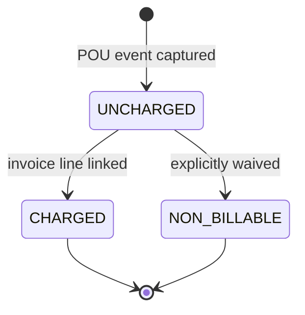
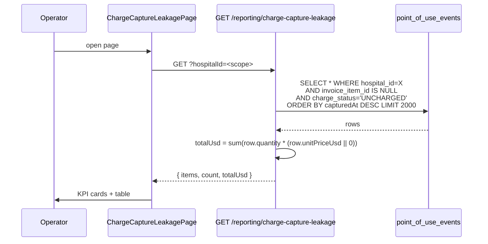

# Charge Capture Leakage

## What it does

**Charge Capture Leakage** is the dollars-at-risk report for items consumed at the bedside but never billed to the patient or payor. Every [Point-of-Use](./39-point-of-use-capture.md) event carries an `invoice_item_id` that's `NULL` until a charge is posted, plus a `charge_status` column (`UNCHARGED`, `CHARGED`, or `NON_BILLABLE`). This report selects every POU row where `invoice_item_id IS NULL` AND `charge_status = 'UNCHARGED'`, multiplies `quantity × unitPriceUsd` per row, and surfaces the rollup.

The headline is **estimated leakage in dollars** — the revenue the hospital should have captured but didn't (yet). Clearing the report means either billing the line (POU now references an invoice item) or marking it `NON_BILLABLE` (consumable absorbed into a global facility fee, for instance).

## Who uses it

| Persona | Why |
|---|---|
| **Hospital** revenue cycle / billing teams | Daily / weekly action queue; chase missing charges |
| **Hospital** clinical informatics | Investigate patterns of uncaught consumption (one department always leaking?) |
| **Hospital** finance / CFO | Monthly leakage rollup as a revenue-cycle KPI |
| **Admin** | Cross-tenant; investigate platform-wide POU → invoice integration gaps |

## The page

Lives at **`/reporting/charge-capture-leakage`**. Component is `ChargeCaptureLeakagePage` (`packages/web/src/features/reporting/pages/ChargeCaptureLeakage.tsx`).

- **Header** — dollar icon + title **Charge Capture Leakage**, subtitle "*Point-of-use events without a matching invoice_item_id — revenue at risk.*", **Refresh** button.
- **KPI cards** — **Uncharged events** (count) and **Estimated leakage** (USD, red when > 0).
- **Warning banner** — "*Bill or mark as NON_BILLABLE to clear from this report.*"
- **Table columns** — **When** (capturedAt), **HCPC**, **Patient** (MRN), **Encounter** (ID), **Qty**, **Unit $**, **Line $** (quantity × unitPrice, red when set), **Status** (`UNCHARGED` tag).

## Three charge states

| Status | What it means | On this report? |
|---|---|---|
| `UNCHARGED` | Default for every captured POU event; no invoice line linked yet | **Yes** — every row on this page is `UNCHARGED` |
| `CHARGED` | An invoice item has been generated and linked via `invoice_item_id` | No |
| `NON_BILLABLE` | Intentionally not billed (covered by facility fee, bundled into procedure, charity care) | No |

The report filter is `invoice_item_id IS NULL AND charge_status = 'UNCHARGED'` — both conditions must be true. Marking a row `NON_BILLABLE` (separate workflow) is the way to remove a row from the report **without** posting a charge.

## The leakage compute

The page also computes per-row `Line $` client-side for the table display: `quantity * unitPriceUsd` (or `—` when `unitPriceUsd` is null). The headline `Estimated leakage` value is server-side `totalUsd`, summed across all 2000 rows in the response.

`unitPriceUsd` is captured at POU time (from the formulary's `maxUnitPriceUsd` or the operator's typed value). Rows with `unitPriceUsd = null` contribute 0 to the rollup but still count toward the event count.

## Workflow integration

POU events generate UNCHARGED rows automatically. To clear a row:

1. **Bill it** — a downstream service (typically the EHR or billing system, via integration) generates an invoice line and writes the FK back to `point_of_use_events.invoice_item_id`. The POU row's `charge_status` flips to `CHARGED` and it disappears from the report.
2. **Mark non-billable** — the billing team explicitly marks the row `NON_BILLABLE` (covered by facility fee or other bundled charge). The row leaves the report.
3. **Cancel the POU** — if the event was captured in error (wrong patient, duplicate scan), delete the POU row. (See [Point-of-Use Capture](./39-point-of-use-capture.md) for the cancellation flow.)

Until one of these three happens, the row keeps accruing on the leakage report.

## Reading a single row

A typical leakage row looks like:

| Column | Value | Meaning |
|---|---|---|
| `When` | 2026-05-22 14:33 | When the bedside scanner captured the use |
| `HCPC` | `A4253` | What was scanned (blood-glucose test strip example) |
| `Patient` | `MRN-00012345` | Patient who received the consumable |
| `Encounter` | `enc-abc123` | EHR encounter ID — billing's join key |
| `Qty` | `1` | Units consumed |
| `Unit $` | `$12.50` | Unit price from formulary or operator entry |
| `Line $` | `$12.50` | qty × unit price — the leakage amount for this row |
| `Status` | `UNCHARGED` | Default until billed or marked non-billable |

Multi-unit rows multiply: 3 units × $12.50 = $37.50 leakage on one row. The headline KPI is the sum across all visible rows (cap 2000).

🛈 *Why isn't this auto-closed?* Charge posting depends on the hospital's billing system — Curavend can't post charges directly to the EHR / billing platform (those vary by tenant). The leakage report names the gap; closing it is a billing-system action.

## Common tasks

- **Daily AM clearance** — **`/reporting/charge-capture-leakage`** → sort by **When** desc → for each row, look up the patient encounter in the EHR, post the charge, refresh.
- **Investigate a stuck week** — filter the underlying API with `?fromDate=2026-05-01` (parameter supported on the endpoint but not yet exposed in UI) to scope the report to a window.
- **Spot a HCPC with no price** — sort by `Unit $` ascending; rows with `—` are likely formulary items missing `maxUnitPriceUsd` (fix at the formulary).
- **Monthly leakage summary** — open the page on the 1st of the month; **Estimated leakage** KPI is the prior month's running leakage (capped at 2000 rows).
- **Spot-check a single encounter** — filter the response (or the underlying POU list) by `encounterId` to see all uncharged items for one patient visit.

## Permissions

| Action | Required permission |
|---|---|
| View leakage report | `orders` READ |
| Bill / non-billable a POU event (downstream) | Separate; varies by integration |
| Cross-tenant view (`?hospitalId=`) | Admin only |

The endpoint calls `scopeHospital()` — if the caller is admin AND `?hospitalId=` is in the query, that's used; otherwise the JWT's `hospitalId` wins. Non-admins without a `hospitalId` get `ForbiddenError('hospitalId required')`.

## Behind the scenes

- **Route**: `packages/api/src/routes/procurementAnalytics.ts` — `GET /charge-capture-leakage`.
- **Filter**: three predicates ANDed:
  - `eq(pointOfUseEvents.hospitalId, hospitalId)`
  - `isNull(pointOfUseEvents.invoiceItemId)`
  - `eq(pointOfUseEvents.chargeStatus, 'UNCHARGED')`
- **Date filter**: `?fromDate=YYYY-MM-DD` is supported on the endpoint via `gte(pointOfUseEvents.capturedAt, fromDate)`; no `?toDate` in MVP.
- **Schema**: `packages/db/src/schema/pointOfUseEvents.ts` — the `invoice_item_id` and `charge_status` columns are the PV3-D charge-capture additions; both default values (`null` and `'UNCHARGED'`) are what flag a row as leakage.
- **Cap**: 2000 rows per response. For a high-volume hospital, paginate by date range to scan beyond the cap.
- **Rollup math**: server-side `rows.reduce((s, r) => s + (r.quantity * (r.unitPriceUsd ?? 0)), 0)`. Pure JS; trivial cost.
- **No write endpoints**: the leakage report is read-only. State transitions (mark CHARGED, mark NON_BILLABLE) happen on the POU event itself, owned by the [Point-of-Use Capture](./39-point-of-use-capture.md) routes and downstream billing integration.
- **Tenant safety**: the `scopeHospital()` helper means a hospital user can never see another hospital's leakage rows even by URL manipulation.

## Related

- [Point-of-Use Capture](./39-point-of-use-capture.md) — source of the rows; describes the scan / kiosk flows that create UNCHARGED events
- [Invoices](./09-invoices.md) — the destination — once an invoice line FK is set on a POU event, the leakage clears
- [Department Spend](./33-department-spend.md) — sibling spend-side report (actual spend, not unrealized revenue)
- [Price Variance](./52-price-variance.md) — sister revenue-cycle report (PO price vs contract price)
