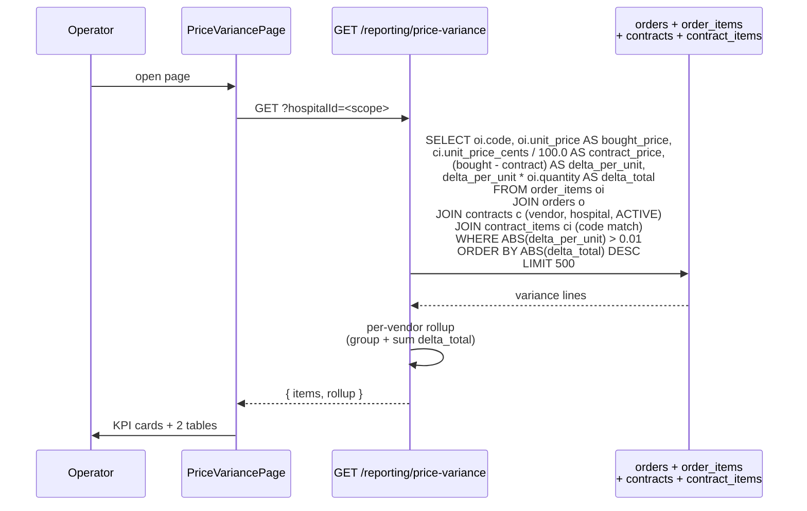

# Price Variance

## What it does

**Price Variance** is the dollars-leaked report for orders bought at a price that differs from the active contract price. For every `order_items` row, the service joins to the matching `contract_items` row (by vendor, hospital, HCPC, `ACTIVE` contract), computes `delta_per_unit = bought_price - contract_price` and `delta_total = delta_per_unit × quantity`, and surfaces every line where the absolute delta is > $0.01. Per-vendor rollups sum the per-line deltas so you can spot which vendors are routinely off-contract.

A **positive delta** means the hospital **overpaid** (bought above contract price — leakage). A **negative delta** means the hospital **underpaid** (bought below contract — savings, often from a discount the vendor honored ad-hoc).

## Who uses it

| Persona | Why |
|---|---|
| **Hospital** procurement / contract managers | Catch contract violations; renegotiate at the next QBR |
| **Hospital** finance | Quantify overpayment-vs-savings net for the period |
| **Admin** | Cross-tenant; investigate platform-wide pricing data quality |
| **Vendor** account managers | Ideally pre-emptively — see their own variance and self-correct |

## The page

Lives at **`/reporting/price-variance`**. Component is `PriceVariancePage` (`packages/web/src/features/reporting/pages/PriceVariance.tsx`).


- **Header** — dollar icon + title **Price Variance**, subtitle "*PO line unit price vs active contract unit price. Positive = overpaid.*", **Refresh** button.
- **3 KPI cards** — **Variance lines** (count), **Total overpaid** (red sum of positive deltas), **Total underpaid (savings)** (green absolute sum of negative deltas).
- **Per-vendor rollup card** — table with **Vendor** (first 8 chars of ID), **Lines**, **Total delta** (signed, red for over, green for under). Sorted by absolute delta descending.
- **Top variance lines card** — main table: **HCPC**, **Description**, **Vendor**, **Bought** ($), **Contract** ($), **Δ/unit** (signed tag), **Qty**, **Δ total** (signed strong-color $). Sorted by absolute total delta descending. Capped at 500 rows.

## The variance SQL



The join hits **only `ACTIVE` contracts** — expired / draft contracts are ignored. Lines without a matching `contract_items` row (off-contract buys) are also ignored — those are a separate concern (contract leakage, covered by [Contract Leakage](./15-contract-leakage.md)).

The threshold `> $0.01` filters out floating-point noise from the cents-to-dollars conversion.

## Per-line vs per-vendor view

```mermaid
stateDiagram-v2
  state Views {
    [*] --> PerLine: One row per order line where bought != contract
    PerLine --> Decisions: read context-by-context;<br/>cancel & re-order; absorb;<br/>fix the contract; renegotiate
    [*] --> PerVendor: SUM(delta_total) GROUP BY vendor_id
    PerVendor --> Patterns: spot vendors who routinely deviate;<br/>queue for QBR / renegotiation
    Decisions --> [*]
    Patterns --> [*]
  }
```

| Surface | When to use |
|---|---|
| **Per-line table** | Tactical: triage individual orders; decide to fight or absorb each |
| **Per-vendor rollup** | Strategic: which vendor relationships are bleeding the most $; renegotiation candidates |

A vendor with 1 huge negative delta (a one-time discount) and 50 small positive deltas (routine overpayment) will net out near zero in the rollup but the per-line view reveals the pattern.

## Currency units

The schema stores contract prices as **integer cents** (`contract_items.unit_price_cents`), but `order_items.unit_price` is stored as a **dollar real** (USD). The SQL converts contract cents to dollars with `ci.unit_price_cents / 100.0` to align units before subtracting.

This mismatch is historical (contracts came in as PV2; orders pre-dated). All downstream math is dollar-denominated.

## Reading a variance row

A typical overpayment row:

| Column | Value | Meaning |
|---|---|---|
| `HCPC` | `A4253` | The HCPC on the order line and the contract item |
| `Description` | "Blood-glucose test strips, 50ct" | From the order line |
| `Vendor` | `vend-abc1` | Short ID of the vendor; full ID in the underlying API |
| `Bought` | `$13.50` | What the order line was priced at |
| `Contract` | `$12.50` | Active contract price (converted from `unit_price_cents`) |
| `Δ/unit` | `+$1.00` (red tag) | Per-unit overpayment |
| `Qty` | `200` | Units on the order line |
| `Δ total` | `+$200.00` (red) | Total dollars overpaid on this line |

A negative-delta row is the same shape but with green coloring — the hospital paid below contract (vendor honored a discount).

🛈 *Why surface savings (negative deltas) too?* Two reasons. First, **transparency** — the same report shape covers both directions, no hidden columns. Second, savings rows often pair with overpayment rows for the same vendor (one HCPC got a discount; another quietly went up); seeing both lets you net.

## Common tasks

- **Daily / weekly leak triage** — **`/reporting/price-variance`** → sort by **Δ total** desc → for top 10 rows, investigate why the bought price diverged; correct invoice, file a vendor credit request, or accept and update the contract.
- **Per-vendor renegotiation prep** — open the **Per-vendor rollup** card → sort by `Total delta` desc → top vendors are the renegotiation candidates.
- **Spot savings (negative deltas)** — KPI card **Total underpaid (savings)** shows the green-side. Per-line, find them by sorting `Δ total` ascending.
- **Validate a contract amendment** — after updating a `contract_items.unit_price_cents`, refresh the report — those HCPC lines should clear (or land much smaller).
- **Audit one vendor's history** — drill into the per-vendor rollup row → cross-reference [Vendor Scorecard Snapshots](./49-vendor-scorecard-snapshots.md) for the same period to see if there's a pattern.

## Permissions

| Action | Required permission |
|---|---|
| View price variance | `contracts` READ |
| Cross-tenant view (`?hospitalId=`) | Admin only |

Non-admins are auto-scoped via `scopeHospital()` and throw `ForbiddenError('hospitalId required')` if no `hospitalId` is on the JWT.

## Behind the scenes

- **Route**: `packages/api/src/routes/procurementAnalytics.ts` — `GET /price-variance`.
- **Source tables**: `orders` (vendor + hospital), `order_items` (HCPC + bought price + quantity), `contracts` (must be `status='ACTIVE'`), `contract_items` (HCPC match + unit_price_cents).
- **Threshold**: `ABS(oi.unit_price - ci.unit_price_cents / 100.0) > 0.01` — float-noise filter.
- **Sort**: `ORDER BY ABS(delta_total) DESC` — biggest absolute dollar impact first (regardless of sign).
- **Cap**: 500 rows per response. For a high-volume hospital, narrow scope via vendor or date (parameters planned but not yet on this endpoint).
- **Per-vendor rollup**: pure JS server-side; `Object.values(byVendor).sort((a, b) => Math.abs(b.totalDelta) - Math.abs(a.totalDelta))`. Cap not explicitly set; usually < 50 vendors per hospital.
- **No write endpoint**: the report is purely diagnostic. Fixes happen in the underlying systems — update the contract (raises contract price → variance shrinks), correct the order (writes a credit memo), or absorb and leave for the next renegotiation.
- **Off-contract lines excluded**: rows where no `contract_items` match exist are dropped by the INNER JOIN. The [Contract Leakage](./15-contract-leakage.md) feature covers those.
- **No tenant guard on the JOIN**: the JOIN itself filters `c.hospital_id = o.hospital_id`, so cross-tenant data can't leak via SQL even if the `hospitalId` parameter is malformed.

## Related

- [Contract Leakage](./15-contract-leakage.md) — sister report for lines where there's *no* matching contract (a different leak source)
- [Contracts & Pricing](./10-contracts-pricing.md) — where the `unit_price_cents` source-of-truth lives; fix the variance by updating the contract
- [Charge Capture Leakage](./51-charge-capture-leakage.md) — sister revenue-cycle report (uncaptured patient charges, not vendor overpayment)
- [Vendor Scorecard Snapshots](./49-vendor-scorecard-snapshots.md) — vendor-level performance; variance correlates loosely with poor contract discipline
- [Invoices](./09-invoices.md) — where the line-level bought price ultimately gets paid
